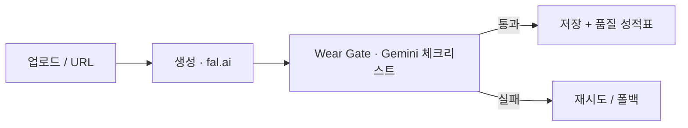

# Carret 🥕

*[English](Readme.md)*

**대충 찍은 중고 사진을 정직한 상품 사진으로.**

Carret은 대충 찍은 중고 물품 사진을 깔끔한 스튜디오 스타일 상품 사진으로
바꿔주는 AI 파이프라인입니다 — 단, **모든 하자(얼룩, 찢김, 색바램, 보풀)는
그대로 보존**합니다. 중고 거래에서는 **아름다움보다 신뢰가 먼저**니까요.

## 🎯 왜 만들었나

- 사진이 별로면 안 팔립니다. 그렇다고 "AI로 새것처럼 복원"한 사진은 거짓말이고
  → 반품, 분쟁, 신뢰 붕괴로 이어집니다.
- 원칙: **배경만 바꾸고, 진실은 절대 바꾸지 않는다.**

## 🏗️ 동작 방식



1. 판매자가 대충 찍은 사진을 업로드 (드래그앤드롭 또는 URL)
2. 생성형 편집 모델이 배경을 교체 (프리셋: 화이트 스튜디오, 우든 테이블,
   미니멀 그레이)
3. `SECONDHAND_LOCK` 프롬프트가 물건 자체의 복원을 금지
4. VLM **Wear Gate**가 알려진 모든 하자가 그대로 살아있는지 검증
5. UI가 품질 성적표(충실성/현실감/신뢰)와 함께 결과를 보여주고,
   사진 위에 하자 말풍선을 오버레이
6. 판매자는 결과에 별점(1~5★) + 코멘트를 남길 수 있음 — 피드백은
   `file_id` + 프리셋 단위로 저장되고, 같은 결과를 다시 보면 재사용됨

## ✨ 주요 기능

- 🔒 **정직성 우선 프롬프트** — "복원/보정 금지"를 명시적으로 잠금
- 🛡️ **Wear Gate** — 체크리스트 기반 하자 보존 검증
  ("문제를 찾아라"가 아니라 "이 하자들이 살아있는지 확인해라")
- 🧾 **품질 성적표** — VLM 저지가 작성해 UI에 표시
- 💬 **하자 말풍선 + 줌** — 검출된 하자를 실제 (레터박스/확대 반영) 결과
  이미지 위에 말풍선으로 표시
- ⭐ **피드백 루프** — 결과별 별점+코멘트, `POST/GET /api/feedback`,
  SQLite 기반, `file_id`+프리셋으로 upsert
- 🗂️ **스토리지 전환 가능** — 로컬 디스크 또는 S3, 환경변수 하나로 전환
- 🧪 **평가 스위트** — 실사진 + AI 주입 하자를 섞은 하이브리드 데이터셋,
  고정된 정답(GT) + 정량 지표

## 🧪 평가

| 지표 | 측정 내용 | 범위 |
|---|---|---|
| `wear_ratio` | 보존된 기존 하자 비율 | 0–1 |
| `text_recall` | 인쇄된 텍스트 생존율 (VLM OCR) | 0–1 |
| `product_sim` | 물건 마스크 내부 픽셀 보존도 | 0–1 |
| `bg_whiteness` | 배경이 프리셋 의도와 맞는 정도 | 0–1 |
| `latency` | 이미지당 처리 시간 | s |

데이터셋 철학: **하이브리드** — 실사진으로 분포적 사실성을 담보하고,
합성 하자 주입으로 완벽한 정답(GT)을 확보합니다.
정답(GT)은 모델 실행 *이전에* 고정됩니다.

```bash
python test.py     # 데이터셋 실행 → storage/dataset/after/ 에 결과 저장
```

## 🚀 시작하기

```bash
cd backend
python -m venv venv && source venv1/bin/activate
pip install -r requirements.txt
cp .env.example .env        # FAL_KEY, VLM_KEY (Gemini)
uvicorn main:app --reload
```

스토리지 백엔드는 기본적으로 로컬 디스크입니다 (`STORAGE_DIR=./storage`).
S3를 쓰려면 `.env`에 `STORAGE_BACKEND=s3`, `S3_BUCKET`, `S3_PREFIX`,
`AWS_REGION`을 설정하세요 (AWS 자격증명은 boto3의 기본 체인을 따름) —
단, dev 도구와 변환 파이프라인은 아직 로컬 경로로 읽고 쓰기 때문에
완전한 S3 지원은 진행 중입니다 (아래 `study/` 참고).

```bash
cd backend && pytest test/software/unit -q   # 무료 유닛 테스트 (CI와 동일)
```

### 개발 워크플로: 서브에이전트 + study 로그
- `.claude/agents/tester.md` / `reviewer.md` — Claude Code 서브에이전트.
  코드 변경 후 실행하면 해당 변경에 대한 pytest 커버리지(`tester`)와
  읽기 전용 보안/성능/가독성 리뷰(`reviewer`)를 받을 수 있음
- `study/` — 발견한 비직관적인 버그와 큰 정리 작업의 판단 근거를
  날짜별로 기록한 개발 로그

## 🧠 설계 결정

- **개방형 판단보다 체크리스트** — 알려진 하자 목록으로 검증하는 게
  VLM에게 "문제를 찾아라"라고 시키는 것보다 훨씬 일관적임
- **하이브리드 평가 데이터셋** — 합성 데이터는 완벽한 GT를, 실사진은
  현실성을 담보
- **pydantic Settings** — 비밀값은 절대 코드나 git에 닿지 않음
- **스키마가 곧 보안** — `file_id` 정규식이 경로 순회(path traversal)를 방지
- **경로는 단일 진실원(Single Source of Truth) 하나만** — 스토리지 계층의
  `BASE`만이 디스크 구조를 아는 유일한 곳이며, 라우트/파이프라인/dev 도구는
  직접 경로를 조립하지 않고 전부 이걸 통해서만 접근
- **오버레이 좌표는 레터박스를 알아야 함** — `object-fit: contain` 이미지
  위에 좌표를 그리는 UI는 컨테이너가 아니라 실제로 렌더링된 이미지 박스를
  기준으로 계산해야 함

## 🩸 실패와 교훈

| 버그 | 교훈 |
|---|---|
| dict에 `await` → TypeError | 동기/비동기는 호출자와 피호출자 사이의 계약이다 |
| 503 UNAVAILABLE | 일시적 오류는 지수 백오프 재시도가 필요하다 |
| `file_id` 패턴 불일치 | 생산자가 스키마를 따라야지, 그 반대가 아니다 |
| `max_bytes` 누락 | 새 코드는 새 설정과 함께 배포되어야 한다 — 따로가 아니라 |
| S3 마이그레이션 중 `storage.py`에 두 구현이 이어붙여짐 (`BASE` 중복 정의, 이미지 정규화 누락) | 마이그레이션 도중엔 새 구현을 넣기 전에 옛 구현부터 지워라 — "혹시 몰라서" 둘 다 남겨두지 마라 |
| `Settings`가 모르는 `.env` 키 때문에 앱이 부팅 시 죽음 | 외부 입력(환경변수)은 기본적으로 관대하게 실패해야 한다 (`extra="ignore"`) — 새로운 값에 무조건 하드 실패하면 안 된다 |
| CI의 pip install 목록이 `requirements.txt`와 조용히 어긋남; `storage.py`가 `boto3`를 무조건 import해서 CI가 확인 전까지 조용히 깨져 있었음 | CI의 의존성 목록은 수동으로 동기화해야 하는 "제2의 소스"다 — 실제 CI 설치를 깨끗한 venv에서 재현해서 검증하고, 가정하지 마라 |
| 결함 말풍선을 캔버스 전체 기준 %로 배치했는데, `object-fit: contain`이 정사각형이 아닌 이미지를 레터박스 처리함 | 오버레이 좌표 계산은 컨테이너가 아니라 실제로 렌더링된 이미지 박스를 기준으로 해야 한다 |

## 🗺️ 로드맵

- [x] MVP 파이프라인 + 성적표 UI
- [x] 평가 데이터셋 v1 (이미지 5장) + 정답(GT)
- [x] 피드백 수집 (결과별 1~5★ + 코멘트)
- [x] pytest + CI (무료 유닛 테스트가 모든 PR을 게이트)
- [ ] 정량 스코어카드 (CSV) + 모델 A/B 테스트
- [ ] 프로덕션 파이프라인 안의 Wear Gate (재시도/폴백)
- [ ] 완전한 S3 지원 (파이프라인/dev 도구가 아직 로컬 디스크를 전제함)
- [ ] "paid eval" CI 잡 고치기 (`VLM_KEY`/`FAL_KEY` 리포지토리 시크릿 필요)
- [ ] 공개 데모 배포

> 투명성 라벨 정책: 모든 결과는
> *"배경은 AI로 생성됨; 물건 상태는 원본 사진 그대로."*로 안내됩니다.
