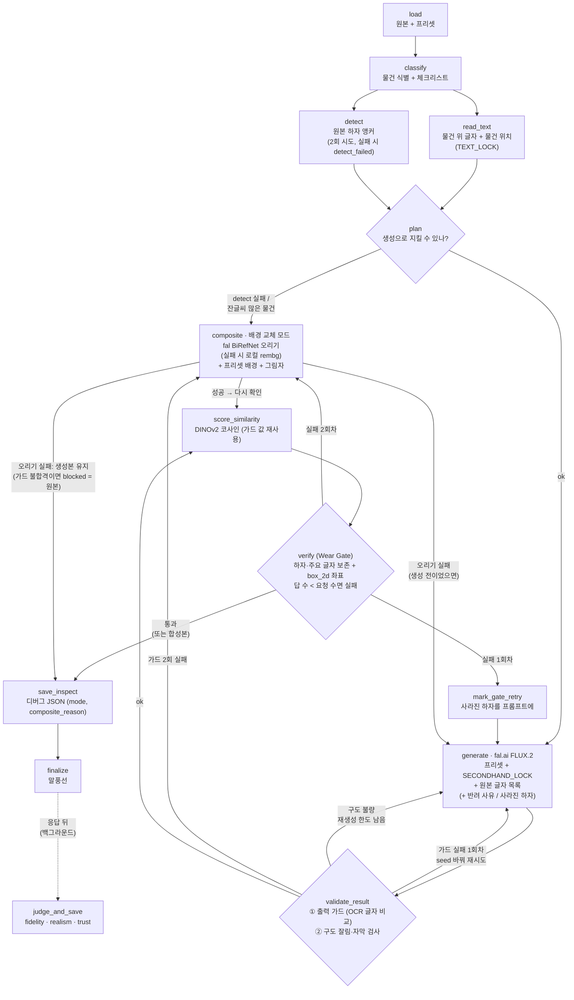

# Carret 🥕

*[English](Readme.md)*

**대충 찍은 중고 사진을 정직한 상품 사진으로.**

Carret은 대충 찍은 중고 물품 사진을 깔끔한 스튜디오 스타일 상품 사진으로
바꿔주는 AI 파이프라인입니다. 단, **얼룩·찢김·색바램·보풀 같은 하자는
전부 그대로 남깁니다.** 중고 거래에서는 예쁜 사진보다 믿을 수 있는 사진이
먼저이기 때문입니다.

> 원칙: **배경은 바꾸고, 물건의 상태는 바꾸지 않는다.**

---

## 📌 한눈에 보기

| | |
|---|---|
| **문제** | 생성형 편집 모델은 배경만 바꿔 달라고 해도 흠집을 "고쳐" 버린다. 중고 거래에서는 이게 곧 허위 매물이다 |
| **해결** | 생성 전에는 프롬프트로 복원을 금지하고, 생성 후에는 VLM 체크리스트 + 로컬 벡터 점수로 하자가 남아 있는지 검증한다 |
| **스택** | FastAPI · LangGraph · fal.ai (FLUX edit) · Gemini (VLM) · DINOv2 · SQLite · S3 · Langfuse · Vanilla JS |
| **품질** | 유닛 테스트 245개 (외부 API 호출 없음, CI에서 PR마다 실행) + 실제 API를 호출하는 평가 스위트 (main 브랜치/라벨로 실행) |

---

## 🏗️ 동작 방식

변환 파이프라인은 [LangGraph](https://github.com/langchain-ai/langgraph)
`StateGraph`로 구성되어 있습니다 (`backend/app/services/pipeline.py`).



1. **classify**: VLM이 물건 종류를 알아내고 "이 물건이면 봐야 할 하자"
   체크리스트를 만든다 (예: 신발이면 밑창 마모, 앞코 주름)
2. **read_text** (`TEXT_LOCK`, 기본 켬): 원본 물건 **위의** 글자를 읽어 generate
   프롬프트에 대략 위치와 함께 넣는다 (생성 모델이 작은 글씨·한글을 뭉개는 것을 줄임).
   물건 위치 박스도 함께 받아 배경 교체 모드에서 쓴다
3. **detect** (read_text 와 병렬): 원본에서 하자를 찾아 *무엇이 / 어디에* 있는지 앵커로
   남긴다. 2회 모두 실패하면 "하자 없음"이 아니라 `detect_failed`로 표시한다
4. **plan**: 생성으로는 정직하게 지킬 수 없는 게 보이면(하자 검출 실패, 잔글씨가 많은
   물건) 생성을 건너뛰고 바로 배경 교체 모드로 간다
5. **generate**: 프리셋(화이트 스튜디오 / 우든 테이블 / 미니멀 그레이)으로
   배경을 교체한다. 모든 프롬프트에 `SECONDHAND_LOCK`(복원·보정 금지)이
   붙는다
6. **validate_result**: 먼저 출력 가드 — 결과 물건 위 글자를 다시 읽어 원본과 줄 단위로
   비교한다. hard 실패는 seed 를 바꿔 1회 재시도, 그래도 실패면 배경 교체 모드로.
   다음으로 결과가 잘리거나 자막이 덮였으면 **반려 사유를 프롬프트에 붙여서** 다시
   생성한다. 같은 프롬프트로 다시 돌리지 않고, 재시도 횟수는 설정으로 상한을 둔다
7. **score_similarity**: VLM과 별개인 DINOv2 임베딩 유사도 (가드가 계산한 값 재사용)
8. **verify (Wear Gate)**: "문제를 찾아라"라고 묻지 않고 "이 하자들이
   아직 보이는지 확인해라"라고 묻는 체크리스트 방식으로 (물건 위 주요 글자 —
   큰 줄 최대 8개 — 도 체크리스트에 들어간다), 하자 보존 여부와
   결과 이미지 속 좌표를 받아 온다. 좌표는 Gemini가 학습된 형식인
   `box_2d [ymin, xmin, ymax, xmax]`로 받고, VLM이 확인을 요청한 하자보다
   적게 답하면(빈 응답 포함) 게이트를 실패로 본다
9. **게이트 실패 폴백**: verify 게이트가 실패하면 사라진 하자 목록을 프롬프트에 붙여
   1회 재생성하고, 그래도 실패하면 **배경 교체 모드**로 넘어간다. 원본 물건을 오려
   (fal BiRefNet, 실패하면 로컬 rembg) 프리셋 배경 위에 합성하므로 물건 픽셀은 원본
   그대로다. 결과에는 `mode: composite`와 `composite_reason`이 기록된다
10. **judge** (그래프 밖): fidelity / realism / trust 성적표를 만들어 같은 트레이스에
   Langfuse Score로 붙인다. API 는 응답을 보낸 뒤 채점하고, UI 는
   `GET /api/quality/{file_id}/{preset}`을 폴링해 받아온다
11. UI는 결과 위에 하자 말풍선을 띄우고 판매자에게 별점과 코멘트를 받는다

---

## 🧭 코드 읽는 법

```
backend/
├── main.py                     # 앱 조립: 라우터, /storage 서빙, 프론트 마운트
└── app/
    ├── api/routes/             # HTTP 경계 (얇게 유지, 계산은 services로)
    │   ├── images.py           #   업로드 (파일 / URL)
    │   ├── transform.py        #   POST /api/transform → pipeline
    │   ├── feedback.py         #   별점·코멘트 upsert / 조회
    │   └── dev.py              #   개발용 도구 (DEV_TOOLS=true일 때만 등록)
    ├── services/
    │   ├── pipeline.py         # ⭐ LangGraph 파이프라인 (가장 먼저 읽을 파일)
    │   ├── ingest.py           #   원본 1장 → 파이프라인 → 자동 피드백 (진입점 하나)
    │   ├── ai/                 # 외부/모델 호출만 모아 둔 곳
    │   │   ├── generator.py    #   fal.ai 배경 교체
    │   │   ├── detector.py     #   Gemini: classify / detect / verify / check_photo
    │   │   ├── judge.py        #   품질 성적표 (fidelity·realism·trust)
    │   │   ├── embedder.py     #   DINOv2 임베딩 (로컬, lazy 싱글톤)
    │   │   └── auto_feedback.py#   "판매자라면 몇 점?" VLM 에이전트
    │   ├── quality/            # 결정론적 지표 (API 호출 없음)
    │   │   ├── metric.py       #   wear_ratio, text_recall, product_sim …
    │   │   └── guards.py       #   hard/soft 출력 가드 + block/pass 판정
    │   └── persistence/        # 저장
    │       ├── storage.py      #   바이트: local FS ↔ S3 (설정 하나로 전환)
    │       └── store.py        #   메타데이터: SQLite (originals/results/feedbacks)
    ├── prompts/
    │   ├── presets.py          # 배경 프리셋 + SECONDHAND_LOCK
    │   ├── rubric.py           # judge 채점 축
    │   └── fragments/*.md      # 조립해서 쓰는 프롬프트 조각 (role / rules / schema)
    ├── core/
    │   ├── config.py           # pydantic Settings (.env)
    │   ├── db.py               # SQLite 스키마 + 마이그레이션
    │   ├── tracing.py          # Langfuse v4 OTEL (키가 없으면 noop)
    │   ├── vlm.py              # VLM 호출별 생각(thinking) 수준 (비용 제어)
    │   └── prompt_registry.py  # Langfuse 프롬프트, 실패하면 로컬 fragment로 fallback
    └── schemas/                # pydantic 요청/응답 (file_id 정규식 = 경로 순회 방어)

scripts/    run_text_check.py (글자·로고 깨짐 확인), seed_langfuse_prompts.py …
frontend/   index.html (메인 앱) · test.html (dev 랩) · js/{api,render,main,dev}.js
study/      날짜별 개발 로그: 버그 원인, 설계 판단, 뒤집은 결정
```

**추천 읽기 순서**

1. `services/pipeline.py`: 전체 흐름. 노드 하나가 함수 하나라 위에서부터
   읽으면 된다
2. `prompts/presets.py` → `prompts/__init__.py` → `fragments/`: 정직성
   원칙이 프롬프트에 어떻게 들어가 있는지
3. `services/ai/detector.py`: VLM 호출과 출력 검증 (`_valid_anchor`, `_as_bool`)
4. `services/quality/guards.py`: VLM의 "판단"과 결정론적인 "가드"를 나눈 이유
5. `services/persistence/`: 바이트와 메타데이터를 나눈 구조, S3 추상화
6. `test/software/unit/`: 각 모듈이 어떤 계약을 지키는지

**레이어 규칙.** `routes`는 입력을 검증해서 `services`에 넘기기만 합니다.
`services/ai`는 외부 모델 호출만 하고, `services/quality`는 순수 계산만,
`services/persistence`는 저장만 합니다. 디스크 경로를 아는 곳은
`storage.BASE` 한 군데뿐입니다.

---

## ✨ 주요 기능

- 🔒 **정직성 우선 프롬프트**: 모든 프리셋에 `SECONDHAND_LOCK`이 붙어서
  복원·보정을 막는다
- 🛡️ **Wear Gate**: 원본에서 찾은 하자 앵커를 결과에서 체크리스트로 다시 검증한다
- 🔁 **이유를 넘기는 재생성**: 구도 잘림이나 자막 때문에 반려되면 그 사유를
  다음 프롬프트에 넣고, 재시도 횟수에 상한을 둔다
- 📐 **VLM + 벡터 이중 신호**: 판단은 Gemini judge가, 고정된 기준의 점수는
  DINOv2 코사인 유사도가 맡는다
- 💬 **하자 말풍선 + 줌**: `object-fit: contain`의 레터박스를 계산에 넣은
  좌표로 결과 이미지 위에 하자를 표시한다
- ⭐ **피드백 루프**: 사람 피드백(`source=user`)과 에이전트 피드백
  (`source=agent`)을 구분해서 저장하고, 사람 피드백을 에이전트가 덮어쓰지 않는다
- 🤖 **자동 피드백 에이전트 + 인박스**: `storage/inbox/`에 원본을 넣거나
  URL을 주면 실제 파이프라인을 돌리고 자동 피드백까지 한 번에 쌓는다
- 📊 **Langfuse 관측성**: 노드별 트레이스, judge 축별 Score, 콘솔에서 고치는
  프롬프트. 키가 없으면 완전히 noop이라 CI와 테스트가 안전하다
- 🗂️ **스토리지 전환**: `STORAGE_BACKEND=local|s3` 하나로 바꾸며 서빙 URL은
  같다
- 🧪 **테스트 랩 결과 한눈에 보기**: `test.html`에서 지금까지 돌린 결과 전부를
  원본과 나란히 보고, 게이트·가드·judge 점수·DINO·별점·하자 체크리스트를
  한 화면에서 비교한다 (필터·정렬·요약 포함)
- 🔤 **글자·로고 깨짐 확인 (text_check)**: 물건 **위의** 글자만 읽고(배경·소매·소품
  글자 제외, 철자 자동 교정 금지) 원본과 결과를 줄 단위로 비교한다
- 💸 **VLM 비용 제어**: 호출마다 생각(thinking) 수준을 따로 정한다. verify는 생각
  토큰 상한 2048로 폭주를 막고, 단순 판단(classify, auto_feedback)은 생각을 끈다

---

## 💼 포트폴리오 관점의 강점

**1. 생성 AI의 실패를 제품 요구사항에서부터 다룬다**
"더 예쁘게"가 아니라 "고치면 안 된다"를 목표로 잡았습니다. 이 제약을 생성
전(프롬프트 잠금), 생성 중(반려 사유를 넣은 재생성), 생성 후(Wear Gate와
가드) 세 단계에 모두 걸었습니다. 모델을 믿지 않고 검증하는 구조입니다.

**2. LLM의 판단과 결정론적 지표를 나눴다**
VLM judge는 프롬프트나 모델 버전에 따라 흔들립니다. 그래서 DINOv2 유사도,
OCR 매칭, 크롭 단위 하자 가시성 같은 결정론적 신호를 따로 두었습니다
(`quality/guards.py`). 가드는 계산이 실패했을 때 자동으로 통과시키지 않고
(fail-open 금지) 예외를 그대로 올립니다. 반대로 관측용 단계(detect, judge)는
실패해도 이미 비용을 쓴 생성 결과를 버리지 않습니다. 실패 정책을 단계마다
의도적으로 다르게 가져갔습니다.

**3. 평가를 먼저 설계했다**
하이브리드 데이터셋(실사진 + AI로 주입한 하자)을 쓰고, 정답(GT)은 모델을
돌리기 **전에** 고정합니다. `wear_ratio`, `text_recall`, `product_sim`,
`bg_whiteness` 같은 지표로 재고, CI는 무료 유닛 테스트와 비용이 드는
평가를 분리해서 돌립니다.

**4. 운영을 전제로 만들었다**
Langfuse로 트레이싱과 프롬프트 버전을 관리하고, 외부 의존성이 없어도 앱이
돌아가도록 모든 외부 연동에 fallback을 두었습니다. 비용 상한
(`max_generate_attempts`, 1~5로 검증), 경로 순회 방어(스키마 정규식과
`_safe_path` 두 겹), `.env`에 모르는 키가 있어도 뜨는 설정 등을 갖췄습니다.

**5. 테스트 가능한 구조**
외부 호출은 `services/ai/`에만 모여 있어서 목(mock)으로 갈아 끼우기 쉽습니다.
그래서 유닛 테스트 193개가 네트워크 없이 약 6초 안에 끝납니다. dev 리플레이
(`run_transform_with_result`)는 생성 단계만 건너뛰고 **프로덕션 노드 함수를
그대로 호출**합니다. 로직을 복사해 두지 않았기 때문에 테스트와 실제 동작이
어긋나지 않습니다.

**6. 판단 과정을 기록했다**
`study/`에는 무엇을 만들었는지뿐 아니라 왜 두 번 갈아엎었는지, 어떤 버그를
어떻게 잡았는지가 날짜별로 남아 있습니다. 아래 "실패와 교훈" 표가 그 요약입니다.

---

## 🚀 시작하기

```bash
python -m venv venv1 && source venv1/bin/activate
pip install -r requirements.txt
cd backend
touch .env                  # FAL_KEY, VLM_KEY (Gemini) 필수 / LANGFUSE_* 선택
uvicorn main:app --reload   # http://localhost:8000 (프론트 포함)
```

| 환경변수 | 설명 |
|---|---|
| `PIPELINE_MODE=mock` | 외부 호출 없이 원본을 그대로 돌려준다 (UI 개발용) |
| `STORAGE_BACKEND=s3` | `S3_BUCKET`, `S3_PREFIX`, `AWS_REGION` 필요 |
| `MAX_GENERATE_ATTEMPTS` | 재생성 상한 (기본 2, 1~5) |
| `DEV_TOOLS=false` | `/dev/*` 라우트 비활성화 (배포 시) |
| `LANGFUSE_PUBLIC_KEY` / `SECRET_KEY` | 없으면 트레이싱과 프롬프트 관리가 noop |
| `VLM_THINKING` | 호출별 생각 수준 덮어쓰기, 예: `{"verify": "default", "judge": "low"}` (정수 = 생각 토큰 상한) |

### 테스트

```bash
cd backend && pytest test/software/unit -q   # 무료 유닛 테스트 (CI와 동일)
make test    # eval / e2e 제외 전체
make eval    # 실제 VLM·fal.ai 호출 (비용 발생)
make e2e     # 브라우저 테스트
```

| 폴더 | 범위 |
|---|---|
| `test/software/unit/` | 서비스·웹·데이터 계층 (외부 호출은 mock) |
| `test/software/integration/` | 업로드 흐름, dev 리플레이 |
| `test/software/full/` | 사용자 여정 (mock / real), 브라우저 |
| `test/eval/` | 평가 스위트 (GT 대비 지표) |

---

## 🧪 평가 지표

| 지표 | 측정 내용 | 범위 |
|---|---|---|
| `wear_ratio` | 보존된 하자 비율 | 0–1 |
| `text_recall` | 인쇄된 텍스트가 살아남은 비율 (VLM OCR) | 0–1 |
| `product_sim` | 물건 마스크 안쪽 픽셀 보존도 | 0–1 |
| `bg_whiteness` | 배경이 프리셋 의도와 맞는 정도 | 0–1 |
| `visual_similarity` | 원본과 결과의 DINOv2 코사인 유사도 | ~0–1 |
| `latency` | 이미지 한 장 처리 시간 | s |

---

## 🧠 설계 결정

- **열린 질문보다 체크리스트**: VLM에게 "문제를 찾아라"라고 묻는 것보다
  알려진 하자 목록을 확인시키는 편이 훨씬 일관된다
- **진실과 미학을 분리**: 반드시 지켜야 하는 최소선은 결정론적 가드가
  (hard/soft), 미적 판단은 judge가 맡는다
- **단계마다 다른 실패 정책**: 관측 단계는 실패해도 넘어가고, 가드는
  실패하면 막는다
- **로직을 복사하지 않는다**: dev 도구와 테스트도 프로덕션 노드 함수를 그대로
  호출한다
- **경로의 기준은 하나**: 디스크 구조는 `storage.BASE`만 안다
- **바이트와 메타데이터 분리**: 이미지는 storage(local/S3)에, 메타데이터는
  SQLite에 둔다
- **외부 연동은 전부 선택 사항**: Langfuse, S3가 없어도 앱은 똑같이 동작한다

---

## 🩸 실패와 교훈

| 버그 | 교훈 |
|---|---|
| dict에 `await` → TypeError | 동기인지 비동기인지는 호출하는 쪽과 불리는 쪽이 함께 지켜야 하는 계약이다 |
| 503 UNAVAILABLE | 일시적인 오류에는 지수 백오프 재시도가 필요하다 |
| `file_id` 패턴 불일치 | 데이터를 만드는 쪽이 스키마를 따라야 한다. 스키마를 거기에 맞추면 안 된다 |
| `db.init_db()`를 아무 데서도 호출하지 않아 테이블이 한 번도 만들어지지 않음 | 새로 만든 계층은 실제로 연결됐는지 끝까지 확인해야 한다 |
| S3 마이그레이션 중 `storage.py`에 구현 두 개가 이어 붙어 있었음 | 새 구현을 넣기 전에 옛 구현부터 지운다. "혹시 몰라서" 둘 다 남기지 않는다 |
| `.env`에 `Settings`가 모르는 키가 있어 부팅 실패 | 외부 입력은 너그럽게 받는다 (`extra="ignore"`) |
| CI의 pip 목록이 `requirements.txt`와 어긋남 | CI 의존성은 수동으로 맞춰야 하는 두 번째 소스다. 깨끗한 venv에서 재현해서 확인한다 |
| 재생성할 때 같은 프롬프트를 다시 던져서 같은 결함이 반복됨 | 재시도에는 직전에 반려된 이유를 같이 넘겨야 한다 |
| 말풍선 좌표가 레터박스 때문에 어긋남 | 오버레이 좌표는 컨테이너가 아니라 실제로 렌더링된 이미지 박스를 기준으로 잡는다 |
| 말풍선 좌표가 가로세로 뒤바뀌어 나옴 (11개 중 4개만 정위치) | 좌표 형식은 모델이 학습된 형식(`box_2d [ymin, xmin, ymax, xmax]`)으로 받고 변환은 코드가 한다. 박스는 이미지에 직접 그려서 확인한다 |
| VLM이 깨진 글자를 원래 철자로 "고쳐서" 읽음 ("시한부일꽈" → "시한부일까") | 글자 보존 검사는 읽어서 비교하기보다 원본·결과를 나란히 보여주고 달라진 곳을 묻는 편이 낫다 |
| verify가 가끔 생각 토큰을 ~63,000개 써서 호출 1번에 ~$0.57 | 생각 토큰은 응답에 안 보이지만 출력 단가로 청구된다. 호출별로 상한을 두고, Langfuse 비용에도 합산한다 |
| verify가 빈 응답을 주면 게이트가 통과였음 | 게이트는 "확인 못 함"을 통과로 치면 안 된다 (fail-closed) |
| main CI가 `langfuse` 미설치로 09-15부터 실패 중이었음 | CI 의존성 목록은 새 import가 생길 때마다 같이 챙겨야 한다 |

---

## 📝 최근 변경

**2026-09-24**
- 테스트 랩에 **결과 한눈에 보기** (`GET /dev/results`) 추가, inbox 원본 10장 추가 실행
- **말풍선 좌표 버그 수정**: `x1,y1,x2,y2`로 요청하면 Gemini가 가로세로를 뒤바꿔 줌 →
  `box_2d`로 받도록 바꿔 리플레이에서 16/16 정위치 (Langfuse `verify` v2 반영)
- **text_check 개선**: 물건 위 글자만 읽기, 줄 단위·순서 무관 비교(`metric.text_match`),
  `scripts/run_text_check.py`. graphic 사진 실패 원인은 생성 모델이 작은 영어 문단을 다시
  그리며 뭉갠 것 (진짜 실패)
- **한글 OCR 실험**: EasyOCR은 원본부터 오독, PaddleOCR은 CPU 환경에서 불안정 → 채택 안 함
- **글자 프롬프트 주입 실험**: 원본 글자를 생성 프롬프트에 넣었더니 book(한글)·rolex·graphic의
  글자가 거의 그대로 보존됨. 부작용으로 상장에 "賞"이 하나 더 생김 → 반복 검증 예정
- **VLM 비용**: 생각 토큰이 비용의 약 65%였고 verify는 가끔 폭주 → 호출별 thinking 설정,
  Langfuse 사용량에 생각 토큰 합산
- **verify 게이트 강화**: 하자보다 답이 적으면 실패, `preserved` 값 정규화
- CI: pytest 잡에 `langfuse` 설치 (main CI 복구)

---

## 🗺️ 로드맵

- [x] MVP 파이프라인 + 성적표 UI
- [x] 평가 데이터셋 v1 + GT
- [x] 피드백 수집 (사람 / 에이전트 구분)
- [x] pytest + CI (유닛 테스트가 모든 PR을 막는 게이트)
- [x] Langfuse 트레이싱 · 프롬프트 관리 · Score
- [x] 결과 검증 기반 재생성 (`validate_result`)
- [x] 서비스 레이어 재구성 (`ai/` · `quality/` · `persistence/`)
- [x] 출력 가드(`guards.py`)를 `validate_result`에 연결 (현재는 DINO 대역 가드만 실제로 동작, OCR 입력과 앵커 크롭 가드는 미연결)
- [x] 말풍선 좌표 전치 수정 (`box_2d`) + verify 게이트 강화
- [x] VLM 생각 토큰 제어 (호출별 thinking 설정)
- [ ] OCR 가드 입력 연결 + 앵커 크롭 가드(`embedder.crop_sim`)
- [ ] 원본 글자를 생성 프롬프트에 넣기 — 첫 실험(각 1회)에서 한글·작은 글씨 보존이 크게 개선, 반복 검증 필요
- [ ] 한글 글자 깨짐 판정: 줄 단위 크롭 비교 또는 한글 특화 OCR (로컬 EasyOCR/PaddleOCR은 부정확·불안정)
- [ ] verify 게이트를 하자별 id로 매칭 (지금은 개수만 확인)
- [ ] 정량 스코어카드 (CSV) + 모델 A/B
- [ ] S3 완전 지원 (dev 도구 일부가 아직 로컬 경로를 전제함)
- [ ] 공개 데모 배포

> 투명성 라벨: 모든 결과에 *"배경은 AI로 생성됨. 물건 상태는 원본 사진
> 그대로."*라는 안내가 붙습니다.
