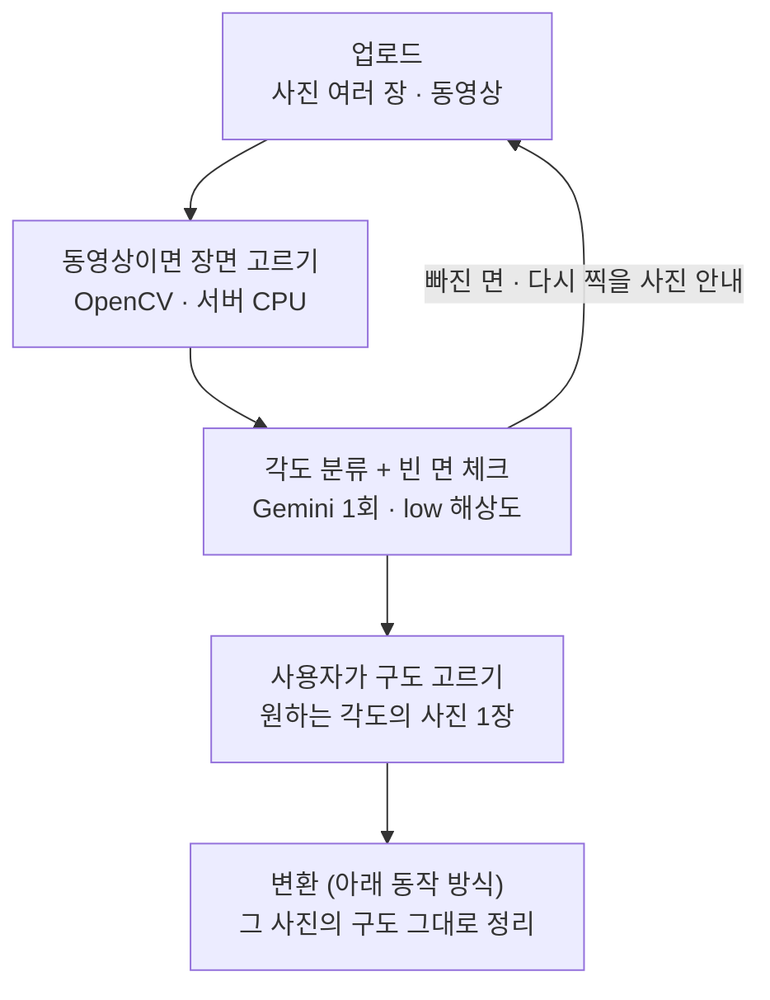
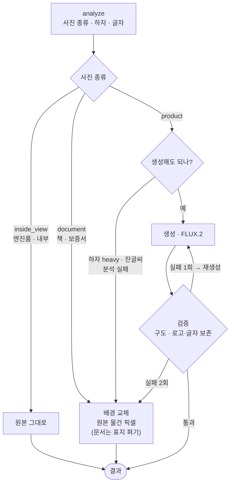

# Carret 🥕

*[English](Readme.md)*

**대충 찍은 중고 사진을 정직한 상품 사진으로.**

Carret은 대충 찍은 중고 물품 사진을 깔끔한 스튜디오 스타일 상품 사진으로
바꿔주는 AI 파이프라인입니다. 판매자가 **여러 각도의 사진이나 동영상**을 올리면 빠진 면을 알려 주고,
원하는 구도의 사진을 고르면 **그 구도 그대로** 정리합니다. **로고·글자 같은 물건의 정체는 원본 그대로 지키고,
하자가 많은 물건은 생성하지 않고 원본 물건 사진에 배경만 바꿉니다.** 중고 거래에서는
예쁜 사진보다 믿을 수 있는 사진이 먼저이기 때문입니다.

> 원칙: **배경은 바꾸고, 물건의 정체는 지키고, 상태는 원본으로 보여준다.**

---

## 📌 한눈에 보기

| | |
|---|---|
| **문제** | 생성형 편집 모델은 배경만 바꿔 달라고 해도 흠집을 "고쳐" 버린다. 중고 거래에서는 이게 곧 허위 매물이다 |
| **해결** | 구도는 모델이 다시 그리지 않고 판매자가 찍은 사진에서 고른다 (빠진 면은 업로드 단계에서 알려 준다). 생성 전에 사진을 분석해 하자가 많거나 글자를 못 지킬 물건은 원본 물건 픽셀에 배경만 바꾸고, 생성한 결과는 VLM 체크리스트로 로고·글자가 그대로인지 검증한다 |
| **스택** | FastAPI · LangGraph · fal.ai (FLUX edit) · Gemini (VLM) · DINOv2 · OpenCV · SQLite · S3 · Langfuse · Vanilla JS |
| **품질** | 유닛 테스트 1644개 (외부 API 호출 없음, CI에서 PR마다 실행) + 실제 API를 호출하는 평가 스위트 (main 브랜치/라벨로 실행) |

---

## 🧭 사용 흐름


```mermaid
flowchart TD
  U["업로드<br/>사진 여러 장 · 동영상"] --> F["동영상이면 장면 고르기<br/>OpenCV · 서버 CPU"]
  F --> W["각도 분류 + 빈 면 체크<br/>Gemini 1회 · low 해상도"]
  W -->|"빠진 면 · 다시 찍을 사진 안내"| U
  W --> S["사용자가 구도 고르기<br/>원하는 각도의 사진 1장"]
  S --> T["변환 (아래 동작 방식)<br/>그 사진의 구도 그대로 정리"]
```

1. **업로드** (`POST /api/items`, 더 올리기 `/api/items/{id}/files`): 사진(jpg·png·webp)과 동영상(mp4·mov·webm,
   90초·100MB 이내)을 물건 하나에 최대 12장까지. 휴대폰 사진의 EXIF 회전은 저장할 때 바로 세운다
2. **동영상 장면 고르기** (`services/video.py`, 모델 없음): 고른 간격의 후보 40장 → 흐린 것 빼기 →
   마지막으로 고른 장면과 거의 같은 것 빼기 → 최대 8장
3. **각도 분류 + 빈 면 체크** (`detector.classify_views` + `services/coverage.py`): 사진 전부를 VLM 1회로 보고
   종류(신발·옷·가방·전자기기·차·기타)와 사진별 각도·가림·흐림을 받는다. **필요한 면은 코드가 종류별로 정한다**
   (같은 물건에 매번 같은 안내). 가려졌거나 흐린 사진은 면을 채운 것으로 치지 않고 다시 찍기로 안내한다
4. **구도 고르기**: 사용자가 원하는 각도의 사진을 누르면 그 사진이 변환된다
5. **변환** (`POST /api/transform`): 아래 파이프라인. 생성 모델에게 **구도를 바꾸게 하지 않는다** —
   한 장으로 각도를 바꾸게 하면 원본에 없던 면을 지어냈다 (2026-10-01, 아래 "실패와 교훈")

**단계별 모델 · 비용 · 시간** (물건 1개, 대표 사진 1장 생성 기준)

| 단계 | 모델 | 비용 | 시간 |
|---|---|---|---|
| 동영상 장면 고르기 | OpenCV (로컬) | 0 | 1080p 10초 영상 약 2.5초 |
| 각도 분류 | Gemini 3.8-flash, low (장당 268 토큰) | 약 $0.001 (추정) | 수 초 (추정) |
| analyze(글자 포함) · 보존 검사 | Gemini 3.8-flash, high | 생성 경로 VLM 합계 약 $0.012 | |
| 구도·자막 확인 | Gemini 3.5-flash-lite, low | (위에 포함) | 2~3초 |
| 생성 | fal `flux-2/flash/edit`, 8스텝 | 약 $0.010 × 평균 1.38회 | 대기열 포함 6~50초 |
| 배경 교체 (물러날 때) | rembg / fal BiRefNet + 단색 | 경로 전체 약 $0.007 | 약 22초 |
| 누끼 비교 (응답 뒤) | rembg + DINOv2 (로컬) | 0 | 사용자 대기 없음 |
| **합계 (생성 경로)** | | **약 $0.03** | **변환 35~60초** |

비용·시간은 2026-09-29 Langfuse 중앙값(변환 33건)과 2026-10-01 eval 실행 기준. 각도 분류는 토큰 수만 실측했다.

---

## 🏗️ 동작 방식

고른 사진 한 장의 변환 파이프라인은 [LangGraph](https://github.com/langchain-ai/langgraph)
`StateGraph`로 구성되어 있습니다 (`backend/app/services/pipeline.py`).


```mermaid
flowchart TD
  A["analyze<br/>사진 종류 · 하자 · 글자"] --> P{"사진 종류"}
  P -->|"inside_view<br/>엔진룸 · 내부"| O["원본 그대로"]
  P -->|"document<br/>책 · 보증서"| X["배경 교체<br/>원본 물건 픽셀<br/>(문서는 표지 펴기)"]
  P -->|product| C{"생성해도 되나?"}
  C -->|"하자 heavy · 잔글씨<br/>분석 실패"| X
  C -->|예| G["생성 · FLUX.2"]
  G --> V{"검증<br/>구도 · 로고·글자 보존"}
  V -->|"실패 1회 → 재생성"| G
  V -->|"실패 2회"| X
  V -->|통과| R(["결과"])
  X --> R
  O --> R
```

세부 분기(글자 읽기, 오리기 실패 처리, 재생성 한도)는 아래 단계 설명에 있다.

1. **analyze** (VLM 1회, 2026-09-27 에 classify + detect 를 합침): 원본에서 물건 종류,
   **물건의 정체를 이루는 마크**(로고·인쇄 글자·그래픽 — 하자는 목록으로 뽑지 않는다), 물건 위치,
   사진 종류(`photo_type`: document 책·음반·보증서 / inside_view 물건 일부·내부 / product 상품), 하자 수준(`wear_level`: none / light / heavy),
   워터마크(`watermark`: 없음 / 배경만 / 물건 위), 글자 수준(`text_level`: none / simple / dense)을 받는다.
   `dense`는 잔글씨가 많거나 **물건의 주요 글자를 원본에서도 그대로 옮겨 적을 수 없는** 경우다
   (목 라벨·번호판 같은 작은 글자는 세지 않는다). 2회 모두 실패하면 `detect_failed`
2. **plan**: 사진 종류로 먼저 나눈다. 물건 일부·내부(엔진룸·케이스를 뜯은 노트북 회로)면 생성도 오리기도 하지 않고
   **원본 그대로** 둔다 (`mode: original`). 책·음반·보증서처럼 글자가 곧 물건이면 생성하지 않고
   **표지 네 모서리를 찾아 정면으로 편 뒤** 배경 위에 놓는다 (`compose_flat`, 못 펴면 일반 배경 교체).
   분석이 실패했거나, 상품 사진인데 글자 `dense`·하자 `heavy`면 생성을 건너뛰고 바로 배경 교체 모드로 —
   하자를 목록으로 뽑아 "지켜라"고 하면 생성 모델이 하자를 지우거나 **지어냈다**(09-27 실험).
   하자가 넓은 물건은 원본 픽셀을 쓰는 배경 교체만 상태를 그대로 보여준다.
   하자가 없거나 적으면(none / light) 생성한다. 글자가 없으면(`none`) 글자 읽기 없이 바로 생성
3. (예전 classify / detect 단계는 analyze 로 합쳐졌다 — eval 용 함수는 `detector.py` 에 남아 있다)
4. **read_text** (`TEXT_LOCK`, 기본 켬, `simple`일 때만): 원본 물건 **위의** 글자를
   generate 프롬프트에 대략 위치와 함께 넣는다 (생성 모델이 작은 글씨·한글을 뭉개는 것을 줄임).
   글자는 **analyze 가 함께 읽는다** (2026-10-01, Langfuse `analyze_v2`) — 따로 부르던 글자 읽기 호출(VLM 비용의 21%)을
   없앴고, 응답이 깨지면 analyze 재시도·`detect_failed` 로 드러난다 (예전엔 조용히 "글자 없음"이 됐다).
   글자가 없는 옛 analyze 결과일 때만 따로 읽는다. 12줄 이상이면 배경 교체 모드로 간다 (안전망)
5. **generate**: 프리셋(화이트 스튜디오 / 우든 테이블 / 미니멀 그레이)으로
   배경을 교체한다. 모든 프롬프트에 `SECONDHAND_LOCK`이 붙는다 — **카메라 각도는 그대로** 두고
   가운데 놓기·화면 채우기·구김·옷걸이 정리만 허용하며, 다른 물건·자막 추가와 복원·보정을 막는다.
   손은 가린 부분이 없을 때만 지운다
6. **validate_result**: 구도 검사(check_photo)와 관측용 신호. 결과를 막는(hard) 가드는 없다 —
   결과 글자를 VLM 으로 다시 읽어 원본과 비교하던 OCR 글자 가드는 폰 사진 6장에서 반려의 대부분이
   읽기 흔들림("H.M"/"H-M", "00 3060"을 두 줄로 읽기)이라 멀쩡한 생성본을 버려서 **없앴다** (09-27).
   글자는 생성 전 `TEXT_LOCK` 과 verify 의 주요 글자 확인이 맡는다. check_photo를 기다리는 동안 원본·결과에서 **물건만 누끼를 따서** 같은 회색 배경에 놓고 DINOv2로 비교한다
   (`item_dino`, soft — 물건이 통째로 바뀌거나 형태·색·무늬가 달라진 것을 잡는다).
   같은 누끼 쌍을 ECC 로 정렬한 뒤 DINO **패치** 단위로도 비교한다 (`item_patch`, soft —
   물건 안쪽 패치의 하위 1%, 흠집 한 줄처럼 한 군데만 바뀐 것을 보려는 값).
   `LOCAL_OCR_GUARD=true`면 EasyOCR 로 글자를 한 번 더 읽는다 (`ocr_local`, soft, eval 용).
   결과가 잘리거나 자막이 덮였으면 **반려 사유를 프롬프트에 붙여서** 다시
   생성한다. 같은 프롬프트로 다시 돌리지 않고, 재시도 횟수는 설정으로 상한을 둔다
7. **score_similarity**: VLM과 별개인 DINOv2 임베딩 유사도 (가드가 계산한 값 재사용)
8. **verify**: "문제를 찾아라"라고 묻지 않고 "이 마크들이 아직 그대로인지 확인해라"라고 묻는
   체크리스트 방식으로 (analyze 가 준 로고·마크 + 물건 위 주요 글자 — 큰 줄 최대 8개, 원본에서도
   못 읽은 "?" 글자는 제외), 보존 여부와 결과 이미지 속 좌표를 받아 온다. **하자는 여기서 확인하지 않는다**
   (하자 수준은 analyze → plan 에서만 본다). 좌표는 Gemini가 학습된 형식인
   `box_2d [ymin, xmin, ymax, xmax]`로 받고, VLM이 확인을 요청한 항목보다
   적게 답하면(빈 응답 포함) 게이트를 실패로 본다. verify **호출 자체**가 2회 모두
   실패하면 "통과"가 아니라 `verify_failed`로 표시하고 바로 배경 교체 모드로 간다.
   **생성본에만** 부른다 — 배경 교체본은 물건 픽셀이 원본이라 확인할 게 없다
9. **게이트 실패 폴백**: verify 게이트가 실패하면 바뀐 마크 목록을 프롬프트에 붙여
   1회 재생성하고, 그래도 실패하면 **배경 교체 모드**로 넘어간다. 원본 물건을 오려
   (fal BiRefNet, 실패하면 로컬 rembg) 프리셋 배경 위에 합성하므로 물건 픽셀은 원본
   그대로다. 결과에는 `mode: composite`와 `composite_reason`이 기록된다
10. **judge** (그래프 밖, `judge_and_save` 한 곳, **eval·dev 만**): fidelity / realism / trust 성적표를
   만들어 같은 트레이스에 Langfuse Score로 붙인다. 2026-10-05 에 운영 경로와 화면에서 뺐다 —
   결정에 쓰지 않고, 사람 판정과 17쌍 중 11쌍만 맞아 화면 점수가 오히려 헷갈렸다
11. UI는 결과 위에 마크 말풍선을 띄우고, 결과가 생성본인지 / 원본 물건 + 배경 교체인지 / 원본 그대로인지
   알려 준다. 생성본에는 "하자는 자동으로 검사하지 않으니 원본 사진으로 확인"을 함께 적는다.
   판매자에게 별점과 코멘트를 받는다

---

## 🧭 코드 읽는 법

```
backend/
├── main.py                     # 앱 조립: 라우터, /storage 서빙, 프론트 마운트
└── app/
    ├── api/routes/             # HTTP 경계 (얇게 유지, 계산은 services로)
    │   ├── images.py           #   업로드 (파일 / URL)
    │   ├── items.py            #   여러 각도 업로드 (사진·동영상 → 각도 · 빠진 면)
    │   ├── transform.py        #   POST /api/transform → pipeline
    │   ├── feedback.py         #   별점·코멘트 upsert / 조회
    │   └── dev.py              #   개발용 도구 (DEV_TOOLS=true일 때만 등록)
    ├── services/
    │   ├── pipeline.py         # ⭐ LangGraph 파이프라인 (가장 먼저 읽을 파일)
    │   ├── ingest.py           #   원본 1장 → 파이프라인 → 자동 피드백 (진입점 하나)
    │   ├── video.py            #   동영상 → 선명하고 서로 다른 장면 (OpenCV)
    │   ├── coverage.py         #   종류별 필요한 면 · 빠진 면 · 다시 찍을 사진
    │   ├── ai/                 # 외부/모델 호출만 모아 둔 곳
    │   │   ├── generator.py    #   fal.ai 배경 교체
    │   │   ├── detector.py     #   Gemini: analyze / verify / check_photo / classify_views (+ eval 용 classify·detect)
    │   │   ├── judge.py        #   품질 성적표 (fidelity·realism·trust)
    │   │   ├── embedder.py     #   DINOv2 임베딩 (로컬, lazy 싱글톤)
    │   │   └── auto_feedback.py#   "판매자라면 몇 점?" VLM 에이전트
    │   ├── quality/            # 결정론적 지표 (API 호출 없음)
    │   │   ├── metric.py       #   wear_ratio, text_recall, product_sim …
    │   │   └── guards.py       #   hard/soft 출력 가드 + block/pass 판정
    │   └── persistence/        # 저장
    │       ├── storage.py      #   바이트: local FS ↔ S3 (설정 하나로 전환)
    │       └── store.py        #   메타데이터: SQLite (originals/results/feedbacks)
    ├── prompts/
    │   ├── presets.py          # 배경 프리셋 + SECONDHAND_LOCK
    │   ├── rubric.py           # judge 채점 축
    │   └── fragments/*.md      # 조립해서 쓰는 프롬프트 조각 (role / rules / schema)
    ├── core/
    │   ├── config.py           # pydantic Settings (.env)
    │   ├── db.py               # SQLite 스키마 + 마이그레이션
    │   ├── tracing.py          # Langfuse v4 OTEL (키가 없으면 noop)
    │   ├── vlm.py              # Gemini 공용 클라이언트(타임아웃) · 재시도 판정 · 호출별 thinking
    │   └── prompt_registry.py  # Langfuse 프롬프트, 실패하면 로컬 fragment로 fallback
    └── schemas/                # pydantic 요청/응답 (file_id 정규식 = 경로 순회 방어)

scripts/    seed_langfuse_prompts.py (로컬 프롬프트를 Langfuse 에 등록)
frontend/   index.html (메인 앱) · test.html (dev 랩) · js/{api,render,main,dev}.js
study/      날짜별 개발 로그: 버그 원인, 설계 판단, 뒤집은 결정
```

**추천 읽기 순서**

1. `services/pipeline.py`: 전체 흐름. 노드 하나가 함수 하나라 위에서부터
   읽으면 된다
2. `prompts/presets.py` → `prompts/__init__.py` → `fragments/`: 정직성
   원칙이 프롬프트에 어떻게 들어가 있는지
3. `services/ai/detector.py`: VLM 호출과 출력 검증 (`_valid_anchor`, `_as_bool`)
4. `services/quality/guards.py`: VLM의 "판단"과 결정론적인 "가드"를 나눈 이유
5. `services/persistence/`: 바이트와 메타데이터를 나눈 구조, S3 추상화
6. `test/software/unit/`: 각 모듈이 어떤 계약을 지키는지

**레이어 규칙.** `routes`는 입력을 검증해서 `services`에 넘기기만 합니다.
`services/ai`는 외부 모델 호출만 하고, `services/quality`는 순수 계산만,
`services/persistence`는 저장만 합니다. 디스크 경로를 아는 곳은
`storage.BASE` 한 군데뿐입니다.

---

## ✨ 주요 기능

- 📸 **여러 각도 업로드**: 사진 여러 장·동영상을 받아 각도를 분류하고, 종류별로 빠진 면과
  다시 찍을 사진(가림·흐림)을 알려 준다. 구도는 판매자가 찍은 사진 중에서 고른다
- 🔒 **정직성 우선 프롬프트**: 모든 프리셋에 `SECONDHAND_LOCK`이 붙어서
  구도 변경·복원·보정을 막는다
- 🔎 **생성 전 분석**: 사진 종류·하자 수준·글자 수준·워터마크를 먼저 보고, 생성해도 되는 사진만 생성한다
- 🛡️ **마크 게이트 (verify)**: 원본의 로고·글자를 결과에서 체크리스트로 다시 검증한다
- 🔁 **이유를 넘기는 재생성**: 구도 잘림이나 자막 때문에 반려되면 그 사유를
  다음 프롬프트에 넣고, 재시도 횟수에 상한을 둔다
- 📐 **VLM + 벡터 이중 신호**: 판단은 Gemini judge가(eval·dev 실행 때만), 고정된 기준의 점수는
  DINOv2 코사인 유사도가 맡는다
- 💬 **마크 말풍선 + 줌**: `object-fit: contain`의 레터박스를 계산에 넣은
  좌표로 결과 이미지 위에 보존된 로고·글자 위치를 표시한다
- ⭐ **피드백 루프**: 사람 피드백(`source=user`)과 에이전트 피드백
  (`source=agent`)을 구분해서 저장하고, 사람 피드백을 에이전트가 덮어쓰지 않는다
- 🤖 **자동 피드백 에이전트 + 인박스**: `storage/inbox/`에 원본을 넣거나
  URL을 주면 실제 파이프라인을 돌리고 자동 피드백까지 한 번에 쌓는다
- 📊 **Langfuse 관측성**: 노드별 트레이스, judge 축별 Score(eval·dev 실행 때), 콘솔에서 고치는
  프롬프트. 키가 없으면 완전히 noop이라 CI와 테스트가 안전하다
- 🗂️ **스토리지 전환**: `STORAGE_BACKEND=local|s3` 하나로 바꾸며 서빙 URL은
  같다
- 🧪 **테스트 랩 결과 한눈에 보기**: `test.html`에서 지금까지 돌린 결과 전부를
  원본과 나란히 보고, 게이트·가드·judge 점수·DINO·별점·하자 체크리스트를
  한 화면에서 비교한다 (필터·정렬·요약 포함)
- 🔤 **글자·로고 깨짐 확인**: analyze 가 물건 **위의** 글자만 읽고(배경·소매·소품 글자 제외,
  철자 자동 교정 금지) 생성 프롬프트에 잠근 뒤, verify 가 생성본에서 지켜졌는지 게이트로 건다
- 💸 **VLM 비용 제어**: 호출마다 생각(thinking) 수준을 따로 정한다. verify는 생각
  토큰 상한 2048로 폭주를 막고, 단순 판단(auto_feedback)은 생각을 낮춘다

---

## 💼 포트폴리오 관점의 강점

**1. 생성 AI의 실패를 제품 요구사항에서부터 다룬다**
"더 예쁘게"가 아니라 "고치면 안 된다"를 목표로 잡았습니다. 이 제약을 생성
전(사진 분석으로 생성 여부 결정 + 프롬프트 잠금), 생성 중(반려 사유를 넣은 재생성), 생성 후(마크 게이트와
가드) 세 단계에 모두 걸었습니다. 모델을 믿지 않고 검증하고, 못 지킬 것 같으면 생성하지 않습니다.

**2. LLM의 판단과 결정론적 지표를 나눴다**
VLM judge는 프롬프트나 모델 버전에 따라 흔들립니다. 그래서 DINOv2 유사도(전체·누끼 딴 물건),
OCR 글자 매칭 같은 결정론적 신호를 따로 두었습니다
(`quality/guards.py`). 가드는 계산이 실패했을 때 자동으로 통과시키지 않고
(fail-open 금지) 예외를 그대로 올립니다. 검사 단계(analyze, verify) 호출이 실패하면
"통과"가 아니라 `detect_failed` / `verify_failed`로 드러내고 배경 교체 모드로 갑니다.
반대로 관측용 단계(judge)는 실패해도 이미 비용을 쓴 생성 결과를 버리지 않습니다. 실패 정책을 단계마다
의도적으로 다르게 가져갔습니다.

**3. 평가를 먼저 설계했다**
하이브리드 데이터셋(실사진 + AI로 주입한 하자)을 쓰고, 정답(GT)은 모델을
돌리기 **전에** 고정합니다. `wear_ratio`, `text_recall`, `product_sim`,
`bg_whiteness` 같은 지표로 재고, CI는 무료 유닛 테스트와 비용이 드는
평가를 분리해서 돌립니다.

**4. 운영을 전제로 만들었다**
Langfuse로 트레이싱과 프롬프트 버전을 관리하고, 외부 의존성이 없어도 앱이
돌아가도록 모든 외부 연동에 fallback을 두었습니다. 비용 상한
(`max_generate_attempts`, 1~5로 검증), 경로 순회 방어(스키마 정규식과
`_safe_path` 두 겹), `.env`에 모르는 키가 있어도 뜨는 설정 등을 갖췄습니다.

**5. 테스트 가능한 구조**
외부 호출은 `services/ai/`에만 모여 있어서 목(mock)으로 갈아 끼우기 쉽습니다.
그래서 유닛 테스트 1644개가 네트워크 없이 약 25초 안에 끝납니다
(`unit/conftest.py`가 실수로 실제 VLM을 부르는 것도 막습니다). dev 리플레이
(`run_transform_with_result`)는 생성 단계만 건너뛰고 **프로덕션 노드 함수를
그대로 호출**합니다. 로직을 복사해 두지 않았기 때문에 테스트와 실제 동작이
어긋나지 않습니다.

**6. 판단 과정을 기록했다**
`study/`에는 무엇을 만들었는지뿐 아니라 왜 두 번 갈아엎었는지, 어떤 버그를
어떻게 잡았는지가 날짜별로 남아 있습니다. 아래 "실패와 교훈" 표가 그 요약입니다.

---

## 🚀 시작하기

```bash
python -m venv venv1 && source venv1/bin/activate
pip install -r requirements.txt
cd backend
touch .env                  # FAL_KEY, VLM_KEY (Gemini) 필수 / LANGFUSE_* 선택
uvicorn main:app --reload   # http://localhost:8000 (프론트 포함)
```

| 환경변수 | 설명 |
|---|---|
| `PIPELINE_MODE=mock` | 외부 호출 없이 원본을 그대로 돌려준다 (UI 개발용) |
| `STORAGE_BACKEND=s3` | `S3_BUCKET`, `S3_PREFIX`, `AWS_REGION` 필요 |
| `MAX_GENERATE_ATTEMPTS` | 재생성 상한 (기본 2, 1~5) |
| `DEV_TOOLS=false` | `/dev/*` 라우트 비활성화 (배포 시) |
| `LANGFUSE_PUBLIC_KEY` / `SECRET_KEY` | 없으면 트레이싱과 프롬프트 관리가 noop |
| `VLM_TIMEOUT_S` | VLM 호출 1회 타임아웃 (기본 60초) |
| `VLM_THINKING` | 호출별 생각 수준 덮어쓰기, 예: `{"verify": "default", "judge": "low"}` (정수 = 생각 토큰 상한) |
| `VLM_MEDIA_RESOLUTION` | 호출별 이미지 해상도 덮어쓰기 (`low`/`medium`/`high`/`default`), 예: `{"check_photo": "high"}`. 이미지 토큰은 픽셀 크기가 아니라 이 등급으로 정해진다 |
| `VLM_MODELS` | 호출별 모델 덮어쓰기 (없으면 `VLM_MODEL`), 예: `{"classify": "gemini-3.5-flash-lite"}` |
| `LOCAL_OCR_GUARD=true` | EasyOCR 로 글자 보존을 한 번 더 재는 soft 가드 (eval 용, easyocr 별도 설치) |
| `MAX_VIDEO_SIZE_MB` | 여러 각도 업로드의 동영상 한 개 크기 상한 (기본 100) |
| `MAX_ITEM_PHOTOS` | 물건 하나에 모을 사진 상한, 동영상에서 뽑은 장면 포함 (기본 12) |

### 테스트

```bash
cd backend && pytest test/software/unit -q   # 무료 유닛 테스트 (CI와 동일)
make test    # eval / e2e 제외 전체
make eval    # backend/eval 사진으로 분류 정확도 (실제 VLM 호출, 비용 발생)
make e2e     # 브라우저 테스트
make docs    # 레포의 .md 를 브라우저로 보기 (http://localhost:8090, mermaid 렌더링)
```

| 폴더 | 범위 |
|---|---|
| `test/software/unit/` | 서비스·웹·데이터 계층 (외부 호출은 mock) |
| `test/software/integration/` | 업로드 흐름, dev 리플레이 |
| `test/software/full/` | 사용자 여정 (mock / real), 브라우저 |

---

## 🧪 평가 지표

| 지표 | 측정 내용 | 범위 |
|---|---|---|
| `wear_ratio` | 보존된 하자 비율 | 0–1 |
| `text_recall` | 인쇄된 텍스트가 살아남은 비율 (VLM OCR) | 0–1 |
| `product_sim` | 물건 마스크 안쪽 픽셀 보존도 | 0–1 |
| `bg_whiteness` | 배경이 프리셋 의도와 맞는 정도 | 0–1 |
| `visual_similarity` | 원본과 결과의 DINOv2 코사인 유사도 | ~0–1 |
| `latency` | 이미지 한 장 처리 시간 | s |

---

## 🧠 설계 결정

- **열린 질문보다 체크리스트**: VLM에게 "문제를 찾아라"라고 묻는 것보다
  알려진 마크 목록을 확인시키는 편이 훨씬 일관된다
- **하자는 목록이 아니라 수준으로**: 하자를 하나하나 뽑아 "지켜라"고 하면 생성 모델이 지우거나
  과장해서 지어낸다. 목록에 없는 전반적 사용감은 어차피 못 지킨다. 그래서 하자는 수준만 보고,
  많으면 생성하지 않는다. 대신 하자가 적은 물건의 생성본은 하자가 정돈돼도 자동으로 잡지 못한다 (알려진 한계)
- **진실과 미학을 분리**: 반드시 지켜야 하는 최소선은 결정론적 가드가
  (hard/soft), 미적 판단은 judge가 맡는다
- **단계마다 다른 실패 정책**: 관측 단계는 실패해도 넘어가고, 가드는
  실패하면 막는다
- **"확인 못 함"은 통과가 아니다**: analyze·verify 호출이 실패하면 `detect_failed` /
  `verify_failed`로 드러내고 배경 교체 모드로 간다. 재시도는 다시 해서 나아질
  오류(타임아웃·429·5xx·깨진 응답)에만 한다
- **같은 일은 한 곳에서**: 채점은 `judge_and_save` 하나, "언제"만 호출부가 정한다
- **로직을 복사하지 않는다**: dev 도구와 테스트도 프로덕션 노드 함수를 그대로
  호출한다
- **경로의 기준은 하나**: 디스크 구조는 `storage.BASE`만 안다
- **바이트와 메타데이터 분리**: 이미지는 storage(local/S3)에, 메타데이터는
  SQLite에 둔다
- **외부 연동은 전부 선택 사항**: Langfuse, S3가 없어도 앱은 똑같이 동작한다
- **VLM 비용은 호출마다 다르게**: 이미지 토큰은 픽셀 크기가 아니라 해상도 등급으로 정해진다
  (gemini-3.x: low 268 / high 1,066). 큰 그림만 보는 호출(품목 분류·구도 확인)은 low + lite 모델,
  작은 흠집·글씨를 보는 호출(analyze·verify·글자 읽기)은 high. 모든 호출에 생각 토큰 상한
  (`vlm.py` 의 `DEFAULT_THINKING` / `DEFAULT_MEDIA_RESOLUTION` / `DEFAULT_MODELS`)

---

## 🩸 실패와 교훈

| 버그 | 교훈 |
|---|---|
| dict에 `await` → TypeError | 동기인지 비동기인지는 호출하는 쪽과 불리는 쪽이 함께 지켜야 하는 계약이다 |
| 503 UNAVAILABLE | 일시적인 오류에는 지수 백오프 재시도가 필요하다 |
| `file_id` 패턴 불일치 | 데이터를 만드는 쪽이 스키마를 따라야 한다. 스키마를 거기에 맞추면 안 된다 |
| `db.init_db()`를 아무 데서도 호출하지 않아 테이블이 한 번도 만들어지지 않음 | 새로 만든 계층은 실제로 연결됐는지 끝까지 확인해야 한다 |
| S3 마이그레이션 중 `storage.py`에 구현 두 개가 이어 붙어 있었음 | 새 구현을 넣기 전에 옛 구현부터 지운다. "혹시 몰라서" 둘 다 남기지 않는다 |
| `.env`에 `Settings`가 모르는 키가 있어 부팅 실패 | 외부 입력은 너그럽게 받는다 (`extra="ignore"`) |
| CI의 pip 목록이 `requirements.txt`와 어긋남 | CI 의존성은 수동으로 맞춰야 하는 두 번째 소스다. 깨끗한 venv에서 재현해서 확인한다 |
| 재생성할 때 같은 프롬프트를 다시 던져서 같은 결함이 반복됨 | 재시도에는 직전에 반려된 이유를 같이 넘겨야 한다 |
| 말풍선 좌표가 레터박스 때문에 어긋남 | 오버레이 좌표는 컨테이너가 아니라 실제로 렌더링된 이미지 박스를 기준으로 잡는다 |
| 말풍선 좌표가 가로세로 뒤바뀌어 나옴 (11개 중 4개만 정위치) | 좌표 형식은 모델이 학습된 형식(`box_2d [ymin, xmin, ymax, xmax]`)으로 받고 변환은 코드가 한다. 박스는 이미지에 직접 그려서 확인한다 |
| VLM이 깨진 글자를 원래 철자로 "고쳐서" 읽음 ("시한부일꽈" → "시한부일까") | 글자 보존 검사는 읽어서 비교하기보다 원본·결과를 나란히 보여주고 달라진 곳을 묻는 편이 낫다 |
| verify가 가끔 생각 토큰을 ~63,000개 써서 호출 1번에 ~$0.57 | 생각 토큰은 응답에 안 보이지만 출력 단가로 청구된다. 호출별로 상한을 두고, Langfuse 비용에도 합산한다 |
| verify가 빈 응답을 주면 게이트가 통과였음 | 게이트는 "확인 못 함"을 통과로 치면 안 된다 (fail-closed) |
| main CI가 `langfuse` 미설치로 09-15부터 실패 중이었음 | CI 의존성 목록은 새 import가 생길 때마다 같이 챙겨야 한다 |
| detect 호출이 실패해도 "하자 없음"(`[]`)으로 읽혀 게이트를 건너뜀. verify 호출 예외도 `gate_passed=None` → 통과 | "진짜 없음"과 "못 물어봄"은 다른 값이어야 한다. 한 곳에서 찾으면 같은 종류의 구멍을 다른 곳에서도 찾는다 |
| 가장 보수적인 경로(blocked = 원본 반환)가 KeyError로 500 | 분기가 늘면 "이 노드까지 오는 모든 길에서 이 키가 채워지나"를 따진다. `TypedDict(total=False)`는 못 잡는다 |
| judge가 그래프 노드와 `judge_later` 두 벌 | "왜 이렇게 돼 있지?"는 호출부를 grep 해서 실제로 읽는 곳을 보고 답한다. 당시엔 동기 채점이 필요한 곳이 없었다 (10-05 부터는 eval·dev 만 동기로 채점) |
| 병렬화 뒤 테스트가 `.env` 키로 실제 Gemini를 부름. 가짜가 새 인자를 못 받아 엉뚱한 경로로 통과 | 가짜(fake)는 실제 시그니처를 따라가야 한다. 안 그러면 "통과하지만 엉뚱한 걸 검사하는" 테스트가 된다 |
| 판매처 워터마크를 "보존할 하자"로 잡아 멀쩡한 생성본이 게이트에서 떨어짐 | 모델 탓이 아니었다 — 프롬프트의 카테고리 예시에 "watermark"가 있었다. 오탐은 프롬프트부터 읽는다 |
| 글자 읽기 호출 1번이 생각 토큰 62,912개($0.57) — 최근 500건 비용의 25% | 상한을 건 호출만 안전하다. 새 VLM 호출을 만들면 생각 설정도 같이 정한다 |
| VLM 비용을 줄이려고 이미지를 줄여 보내려 함 | `count_tokens`(무료)로 먼저 쟀더니 384px 여도 토큰이 그대로 — 비용은 해상도 등급·생각 토큰이 정한다 |
| fal CDN 이 500 에러 페이지(HTML)를 돌려줬는데 그걸 이미지로 넘겨 PIL 이 터짐 | 외부 다운로드는 상태 코드부터 확인한다. 5xx 는 1회 재시도, 리다이렉트는 따라간다 |
| 하자를 "반드시 남겨라"며 재생성하자 원본보다 큰 녹을 그려 넣음 (승용차), 없던 긁힘 (Braun) | 지켜야 할 것을 목록으로 강조하면 모델은 그것을 **그린다**. 하자는 수준으로만 보고 많으면 생성하지 않는다 |
| 글자 가드 반려의 대부분이 "H.M"/"H-M", "00 3060"을 두 줄로 읽기 같은 **읽기 흔들림** — 멀쩡한 생성본을 버림 | 검사기의 오차가 생성 모델의 오차보다 클 수 있다. 떨어진 결과도 저장해서 눈으로 봐야 안다 |
| 400px 데이터셋으로 "생성이 물건을 바꾼다"고 판단 | 입력이 작으면 모델이 디테일을 지어낸다. 실제 입력(폰 사진) 화질로 다시 쟀더니 대부분 괜찮았다 |
| 모델 비교에서 3.8-flash 의 품목 분류가 17/17 실패 | 모델 탓이 아니라 우리 설정(`thinking_level="minimal"`)을 그 모델이 거부. 모델을 바꿀 땐 호출 설정도 같이 바꾼다 |
| 사진 한 장으로 "판매 사진처럼 다시 연출"을 시키자 가려졌던 깔창 로고·시계 다이얼 글자·소매 로고를 지어냄 | 보이지 않는 면은 프롬프트로 지킬 수 없다. 원하는 각도는 직접 찍게 하고, 생성은 구도를 유지한 정리만 |
| 잠금 문구에 종류별 예시(옷은 펼치고·신발은 나란히)를 넣자 신발 사진에 재킷·셔츠를 그려 넣음 | 예시는 지시로 읽힌다. 종류별 문장이 필요하면 그 종류일 때만 붙인다 |
| 게이트가 재킷·자막처럼 **새로 생긴 것**을 통과시킴 | 체크리스트 게이트는 "남아 있나"만 본다. 추가된 것은 따로 재야 한다 (채점표에 `added_content`) |

---

## 📝 최근 변경

**2026-10-01**
- **여러 각도 업로드로 워크플로우 재설계**: 사진 여러 장·동영상 → 각도 분류(VLM 1회, low) → 빠진 면·다시 찍을 사진
  안내 → 사용자가 구도 고르기 → 그 사진을 구도 그대로 정리. 한 장으로 구도를 바꾸던 실험(catalog · listing)은 실패로 정리
- **동영상 → 사진**: OpenCV 로 선명하고 서로 다른 장면 최대 8장 (매직 바이트 확인, FFmpeg 은 로컬 파일만,
  해상도·길이·시간 상한)
- **EXIF 회전**: 저장할 때 휴대폰 사진을 바로 세운다 (`img_util.normalize`), 압축 폭탄 픽셀 상한
- **평가 도구**: 채점표에 `added_content`(없던 것 생김)·`photo_quality`(1~5), 보고서에 "바로 쓸 수 있음"
  (보존 통과 + 품질 4 이상), `meta.json` 에 모델·스텝·잠금 해시·커밋. 채점 페이지는 사진당 카드 1장

**2026-09-27**
- **첫 단계를 analyze 로**: classify + detect(VLM 2회) → analyze(1회). 사진 유형·하자 수준·워터마크·글자
  수준을 먼저 보고, 물건 일부·내부 사진은 원본 그대로, 하자가 많거나 주요 글자를 못 읽는 물건은 배경 교체
- **하자 앵커 제거**: 하자를 목록으로 뽑아 지키게 하면 생성 모델이 녹·긁힘을 **지어냈다**(승용차·Braun).
  verify 는 로고·글자만 확인
- **OCR 글자 가드 제거**: 반려의 대부분이 읽기 흔들림. 그것 때문에 있던 seed 재시도·blocked 경로도 없앴다
- 폰 사진 6장: 5장 첫 시도에 생성 통과, 엔진룸은 원본 그대로 (예전: 4장이 글자 가드에 걸려 배경 교체)
- **사진 종류 셋으로 시작** (`photo_type`): document(책·음반·보증서 — 글자가 곧 물건) / inside_view(엔진룸·
  뜯은 노트북 — 원본 그대로) / product(생성 경로). 스펙·상태 글자(용량·주행거리)는 판매 정보로 따로 받는다
- **책 표지 펴기** (`compose_flat`): document 는 생성하지 않고 표지 네 모서리를 찾아 정면으로 편 뒤 배경에 놓는다
  (원본 픽셀 — 제목이 바뀌지 않는다). 하자 heavy 문서는 펴지 않는다
- **배경 교체본은 verify 생략** (물건 픽셀이 원본 — VLM 1회 절약), DB `results` 에 경로(mode·이유·사진 종류·하자) 기록
- **평가 도구** (`backend/eval/`): 정답 라벨 → 실행 → 원본·결과 나란히 사람 채점 → 분류 정확도·보존 통과율·
  평가자 일치도·자동 지표 AUC 집계

**2026-09-26 (밤)**
- **기본 VLM 모델 3.5-flash → 3.8-flash**: 진짜 하자 사진 19장에서 진짜 하자는 3.5 만큼 찾고,
  3.5 가 잡던 헛하자(물결 테두리·빈티지 마감)는 안 잡음. 단가 절반. 품목 분류·구도 확인은 3.5-flash-lite
- **VLM 비용**: 호출별 해상도(low/high)·모델·생각 상한. 한 장 약 $0.035~0.045 (실측, FLUX 포함)
- **`text_level` 분기**: detect 가 글자 수준을 함께 판단 → 글자 없으면 글자 읽기 생략,
  잔글씨 많으면 바로 배경 교체. 새 응답 형식은 Langfuse `detect_v2` (배포된 옛 서버는 `detect` 그대로)
- **워터마크 오탐 수정**, 새 soft 가드 `item_patch`(누끼 패치 비교)·`ocr_local`(EasyOCR)
- **fal 다운로드 버그**: 에러 페이지를 이미지로 넘기던 것 → 상태 확인 + 5xx 재시도

**2026-09-26**
- **상품 DINO 가드**: 한 번도 안 돌던 좌표 크롭 가드를 지우고, 누끼 딴 물건끼리 비교하는 `item_dino`(soft)
- **파이프라인 게이트 구멍 해소** (PR #19): detect 실패를 `detect_failed`로, judge 캐시 제거,
  OCR 출력 가드 연결, 생성 전 `plan` 라우팅, 글자 사후검증, dev 경로 = 운영 그래프,
  UI에 blocked·composite 상태 표시, `considered` XSS 수정
- **judge 한 벌로** (`judge_and_save`): 그래프 노드와 백그라운드 경로의 중복 제거
- **대기 시간**: OCR 읽기 ∥ check_photo (생성 1회당 VLM 직렬 1회 ↓), Gemini 클라이언트 공용,
  타임아웃 60초, 원본 DINO 임베딩 캐시
- **verify 호출 실패 구멍**: 예외가 통과로 라우팅되던 것 → `verify_failed` → 배경 교체,
  UI 배지 "검사하지 못했습니다"
- **md 도구**: `make docs` 뷰어, `.markdownlint.json` (프롬프트 fragment 는 린트 제외)

**2026-09-24**
- 테스트 랩에 **결과 한눈에 보기** (`GET /dev/results`) 추가, inbox 원본 10장 추가 실행
- **말풍선 좌표 버그 수정**: `x1,y1,x2,y2`로 요청하면 Gemini가 가로세로를 뒤바꿔 줌 →
  `box_2d`로 받도록 바꿔 리플레이에서 16/16 정위치 (Langfuse `verify` v2 반영)
- **text_check 개선**: 물건 위 글자만 읽기, 줄 단위·순서 무관 비교(`metric.text_match`),
  `scripts/run_text_check.py`. graphic 사진 실패 원인은 생성 모델이 작은 영어 문단을 다시
  그리며 뭉갠 것 (진짜 실패)
- **한글 OCR 실험**: EasyOCR은 원본부터 오독, PaddleOCR은 CPU 환경에서 불안정 → 채택 안 함
- **글자 프롬프트 주입 실험**: 원본 글자를 생성 프롬프트에 넣었더니 book(한글)·rolex·graphic의
  글자가 거의 그대로 보존됨. 부작용으로 상장에 "賞"이 하나 더 생김 → 반복 검증 예정
- **VLM 비용**: 생각 토큰이 비용의 약 65%였고 verify는 가끔 폭주 → 호출별 thinking 설정,
  Langfuse 사용량에 생각 토큰 합산
- **verify 게이트 강화**: 하자보다 답이 적으면 실패, `preserved` 값 정규화
- CI: pytest 잡에 `langfuse` 설치 (main CI 복구)

---

## 🗺️ 로드맵

- [x] MVP 파이프라인 + 성적표 UI
- [x] 평가 데이터셋 v1 + GT
- [x] 피드백 수집 (사람 / 에이전트 구분)
- [x] pytest + CI (유닛 테스트가 모든 PR을 막는 게이트)
- [x] Langfuse 트레이싱 · 프롬프트 관리 · Score
- [x] 결과 검증 기반 재생성 (`validate_result`)
- [x] 서비스 레이어 재구성 (`ai/` · `quality/` · `persistence/`)
- [x] 출력 가드(`guards.py`)를 `validate_result`에 연결
- [x] 말풍선 좌표 전치 수정 (`box_2d`) + verify 게이트 강화
- [x] VLM 생각 토큰 제어 (호출별 thinking 설정)
- [x] ~~OCR 가드 입력 연결 (`ocr_match` recall ≥ 0.95 = hard)~~ 09-27 에 제거 (읽기 흔들림)
- [x] 원본 글자를 생성 프롬프트에 넣기 (`TEXT_LOCK`, 기본 켬)
- [x] detect / verify 호출 실패를 통과로 치지 않기 (`detect_failed`, `verify_failed`)
- [x] 생성 전 분석(analyze): 사진 종류·하자 수준·워터마크·글자 수준으로 생성 여부 결정
- [ ] 하자가 적은 물건의 생성본에서 하자가 정돈되는 것을 잡을 방법 (지금은 judge 점수로만 관측)
- [ ] 워터마크가 물건 위에 있는데 배경 교체로 가는 경우 처리 (지금은 기록만)
- [ ] eval 로 임계값 검증: `text_heavy` 기준(12줄), composite 비율, analyze 분류 정확도
- [x] 좌표 크롭 가드 제거 → 누끼 딴 물건끼리 비교하는 `item_dino` (soft)
- [ ] `item_dino` 기준값(지금 0.80, 경험값 없음)을 eval 분포로 정하고 hard 로 올릴지 결정
- [ ] 생성 모델이 지키지 못하는 작은 하자(흠집 등)를 어떻게 다룰지 — 원본 픽셀 되붙이기 등 검토
  (패치 단위 비교는 `item_patch` soft 로 넣음, 기준값은 eval 로)
- [x] VLM 비용 제어: 호출별 해상도·모델·생각 상한, 기본 모델 3.8-flash
- [x] 글자 수준(`text_level`)으로 글자 읽기 생략 / 바로 배경 교체
- [x] 여러 각도 업로드 · 동영상 · 빠진 면 안내 · 구도 고르기 (구도는 모델이 아니라 판매자 사진에서)
- [ ] 여러 각도 데이터셋으로 "한 장 + 구도 변경" vs "고른 각도 + 정리만" 짝 비교, 각도 분류 정확도
- [ ] 고른 사진 말고 나머지 사진도 배경 교체로 한꺼번에 정리
- [ ] 게이트에 "새로 생긴 것" 검사 (결과 글자 − 원본 글자, 없던 물건)
- [ ] 배경 교체 결과 품질: 비생성형 업스케일
- [x] 채점(judge)을 운영에서 빼기 — eval·dev 만 (10-05)
- [ ] 한글 글자 깨짐 판정: 줄 단위 크롭 비교 또는 한글 특화 OCR (로컬 EasyOCR/PaddleOCR은 부정확·불안정)
- [ ] verify 게이트를 마크별 id로 매칭 (지금은 개수만 확인)
- [ ] 정량 스코어카드 (CSV) + 모델 A/B
- [ ] S3 완전 지원 (dev 도구 일부가 아직 로컬 경로를 전제함)
- [ ] 공개 데모 배포

> 투명성 라벨: 모든 결과에 *"배경은 AI로 생성됨. 물건 상태는 원본 사진
> 그대로."*라는 안내가 붙습니다.
