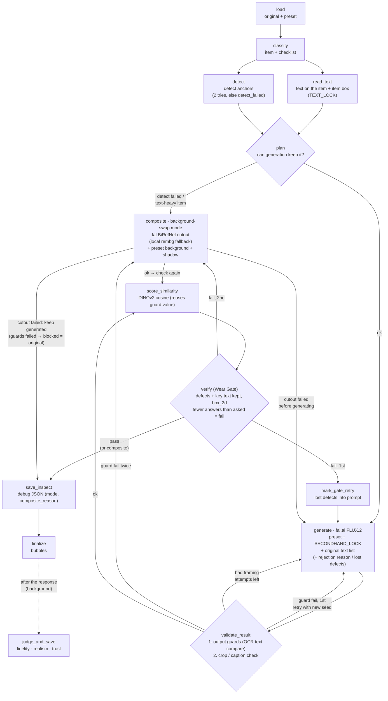

# Carret 🥕

*[한국어](Readme.ko.md)*

**Turn casual secondhand photos into honest product photos.**

Carret is an AI pipeline that turns roughly shot photos of used items into
clean, studio-style product photos. It **keeps every defect**: stains,
tears, fading and pilling all stay in the picture. In secondhand commerce,
a photo buyers can trust matters more than a pretty one.

> Principle: **change the background, never the item's condition.**

---

## 📌 At a Glance

| | |
|---|---|
| **Problem** | Generative edit models "fix" scratches even when you only ask them to swap the background. In secondhand listings, that turns the photo into a misleading one |
| **Solution** | Before generation, a prompt lock forbids restoration. After generation, a VLM checklist and local vector scores check that the defects are still there |
| **Stack** | FastAPI · LangGraph · fal.ai (FLUX edit) · Gemini (VLM) · DINOv2 · SQLite · S3 · Langfuse · Vanilla JS |
| **Quality** | 245 unit tests that make no external API calls and run on every PR, plus an eval suite that calls the real APIs (runs on main or a PR label) |

---

## 🏗️ How It Works

The transform pipeline is a [LangGraph](https://github.com/langchain-ai/langgraph)
`StateGraph` (`backend/app/services/pipeline.py`).



1. **classify**: the VLM identifies the item and builds a checklist of
   defects worth checking for that kind of item (for shoes: sole wear, toe creases)
2. **read_text** (`TEXT_LOCK`, on by default): reads the text **on the item** in the
   original and adds it, with rough positions, to the generate prompt (so the generator
   garbles small text and Korean less). It also returns the item box used by
   background-swap mode
3. **detect** (runs in parallel with read_text): finds defects in the original and
   records each one as a *what / where* anchor. If it fails twice, the run is marked
   `detect_failed` instead of being treated as "no defects"
4. **plan**: when generation clearly can't keep the item honest (defects couldn't be
   detected, or the item carries lots of small text), it skips generation and goes
   straight to background-swap mode
5. **generate**: replaces the background with a preset (studio white, warm
   wood or minimal gray). Every prompt carries `SECONDHAND_LOCK`, which
   forbids restoration
6. **validate_result**: output guards first. The text on the item is read again from the
   result and compared line by line with the original; a hard failure is retried once
   with a new seed, then sent to background-swap mode. After that, if the result is
   cropped or covered by a caption, it is regenerated **with the rejection reason added
   to the prompt** rather than retried blindly. The number of attempts is capped by config
7. **score_similarity**: a local DINOv2 embedding similarity, separate from the VLM
   (reuses the value the guard already computed)
8. **verify (Wear Gate)**: the VLM gets a checklist ("confirm these defects
   are still visible") instead of an open question ("find problems"). The key text on
   the item (largest lines, up to 8) is on the checklist too.
   It returns whether each defect survived and where it is in the result.
   Coordinates are requested in Gemini's native `box_2d [ymin, xmin, ymax, xmax]`
   format, and if the VLM answers for fewer defects than it was asked about
   (including an empty answer), the gate fails
9. **Gate-failure fallback**: if the verify gate fails, the pipeline regenerates once
   with the lost defects added to the prompt. If it still fails, it switches to
   **background-swap mode**: the original item is cut out (fal BiRefNet, local rembg as a
   fallback) and placed on the preset background, so the item's pixels are the
   original's. The result is recorded with `mode: composite` and a `composite_reason`
10. **judge** (outside the graph): produces a fidelity / realism / trust report card and
   attaches it to the same trace as Langfuse Scores. The API runs it after the response
   is sent, and the UI polls `GET /api/quality/{file_id}/{preset}` for it
11. The UI overlays defect bubbles on the result and collects a star rating
   and comment from the seller

---

## 🧭 Reading the Code

```
backend/
├── main.py                     # app assembly: routers, /storage serving, frontend mount
└── app/
    ├── api/routes/             # HTTP boundary (thin; the work happens in services)
    │   ├── images.py           #   upload (file / URL)
    │   ├── transform.py        #   POST /api/transform → pipeline
    │   ├── feedback.py         #   rating/comment upsert + fetch
    │   └── dev.py              #   dev tooling (registered only when DEV_TOOLS=true)
    ├── services/
    │   ├── pipeline.py         # ⭐ LangGraph pipeline (read this first)
    │   ├── ingest.py           #   one original → pipeline → auto feedback (single entry point)
    │   ├── ai/                 # all external / model calls
    │   │   ├── generator.py    #   fal.ai background swap
    │   │   ├── detector.py     #   Gemini: classify / detect / verify / check_photo
    │   │   ├── judge.py        #   report card (fidelity · realism · trust)
    │   │   ├── embedder.py     #   DINOv2 embeddings (local, lazy singleton)
    │   │   └── auto_feedback.py#   "how would a seller rate this?" VLM agent
    │   ├── quality/            # deterministic metrics (no API calls)
    │   │   ├── metric.py       #   wear_ratio, text_recall, product_sim …
    │   │   └── guards.py       #   hard/soft output guards + block/pass decision
    │   └── persistence/
    │       ├── storage.py      #   bytes: local FS ↔ S3 (switched by one setting)
    │       └── store.py        #   metadata: SQLite (originals/results/feedbacks)
    ├── prompts/
    │   ├── presets.py          # background presets + SECONDHAND_LOCK
    │   ├── rubric.py           # judge scoring axes
    │   └── fragments/*.md      # composable prompt fragments (role / rules / schema)
    ├── core/
    │   ├── config.py           # pydantic Settings (.env)
    │   ├── db.py               # SQLite schema + migrations
    │   ├── tracing.py          # Langfuse v4 OTEL (noop without keys)
    │   ├── vlm.py              # per-call VLM thinking level (cost control)
    │   └── prompt_registry.py  # Langfuse prompts, falls back to local fragments on failure
    └── schemas/                # pydantic request/response (file_id regex = path-traversal guard)

scripts/    run_text_check.py (text/logo damage check), seed_langfuse_prompts.py …
frontend/   index.html (main app) · test.html (dev lab) · js/{api,render,main,dev}.js
study/      dated dev logs: bug root causes, design calls, reversed decisions
```

**Suggested reading order**

1. `services/pipeline.py`: the whole flow. Each node is one function, so it reads top to bottom
2. `prompts/presets.py` → `prompts/__init__.py` → `fragments/`: how the honesty principle is written into the prompts
3. `services/ai/detector.py`: VLM calls and output validation (`_valid_anchor`, `_as_bool`)
4. `services/quality/guards.py`: why the VLM's *judgment* is kept separate from deterministic *guards*
5. `services/persistence/`: the split between bytes and metadata, and the S3 abstraction
6. `test/software/unit/`: the contract each module keeps

**Layer rules.** `routes` validate input and hand off to `services`.
`services/ai` only calls external models, `services/quality` only computes,
and `services/persistence` only stores. `storage.BASE` is the only place
that knows the disk layout.

---

## ✨ Key Features

- 🔒 **Honesty-first prompts**: `SECONDHAND_LOCK` is attached to every
  preset and forbids restoration or retouching
- 🛡️ **Wear Gate**: the defect anchors found in the original are checked
  again in the result, one by one
- 🔁 **Regeneration that carries the reason**: when a result is rejected for
  cropping or a caption, the reason goes into the next prompt, and retries are capped
- 📐 **Two kinds of signal**: the Gemini judge gives a judgment, and DINOv2
  cosine similarity gives a score on a fixed scale
- 💬 **Defect bubbles + zoom**: overlay coordinates account for the
  letterboxing from `object-fit: contain`
- ⭐ **Feedback loop**: human feedback (`source=user`) and agent feedback
  (`source=agent`) are stored separately, and the agent never overwrites
  human feedback
- 🤖 **Auto-feedback agent + inbox**: put originals in `storage/inbox/` (or
  pass URLs), and each one runs through the real pipeline and gets agent feedback
- 📊 **Langfuse observability**: per-node traces, a Score for each judge axis,
  and prompts you can edit from the console. Without keys it is a complete
  noop, so CI and tests stay safe
- 🗂️ **Swappable storage**: `STORAGE_BACKEND=local|s3` switches the backend,
  and the serving URLs stay the same
- 🧪 **All results at a glance**: the dev lab (`test.html`) shows every result
  next to its original, with gate, guards, judge scores, DINO, rating and the
  defect checklist on one screen (with filters, sorting and a summary)
- 🔤 **Text/logo damage check (text_check)**: reads only the text **on the item**
  (ignoring background, sleeves and props, with no spelling correction) and
  compares original and result line by line
- 💸 **VLM cost control**: each call has its own thinking level. verify gets a
  2048-token thinking cap so it can't run away, and simple calls (classify,
  auto_feedback) run without thinking

---

## 💼 Why This Is a Strong Portfolio Project

**1. Generative-AI failure is handled starting from the product requirement.**
The goal is "don't fix it," not "make it prettier." That constraint is
enforced at three points: before generation (prompt lock), during
generation (regeneration with the rejection reason) and after generation
(Wear Gate and guards). The design verifies the model's output instead of
trusting it.

**2. LLM judgment is separated from deterministic metrics.**
A VLM judge's scores shift with prompt and model versions. So the project
adds deterministic signals: DINOv2 similarity, OCR matching and per-crop
defect visibility (`quality/guards.py`). When a guard computation fails,
the exception is raised instead of letting the result pass. The
observational stages (detect, judge) work the other way: their failures
are swallowed, so an already-paid-for generation is never thrown away.
Each stage's failure policy was chosen on purpose.

**3. Evaluation was designed first.**
The dataset is a hybrid of real photos and AI-injected defects, and the
ground truth is fixed **before** the model runs. Results are measured with
`wear_ratio`, `text_recall`, `product_sim` and `bg_whiteness`. CI runs the
free unit tests separately from the paid evals.

**4. Built with production operation in mind.**
Langfuse handles tracing and prompt versions, and every external
integration has a fallback so the app runs without it. Other safeguards:
a cost cap (`max_generate_attempts`, validated to 1–5), two layers of
path-traversal defense (the schema regex and `_safe_path`), and settings
that still boot when `.env` contains unknown keys.

**5. Built to be testable.**
External calls live only in `services/ai/`, which makes them easy to mock.
That's why 193 unit tests finish in about 6 seconds with no network. The
dev replay (`run_transform_with_result`) skips only the generation step and
**calls the production node functions directly**. The logic is never
copied, so tests and production can't drift apart.

**6. The reasoning is written down.**
`study/` records more than what was built: why the approach was thrown out
twice, and how each bug was caught. The "Failures & Lessons" table below
summarizes it.

---

## 🚀 Getting Started

```bash
python -m venv venv1 && source venv1/bin/activate
pip install -r requirements.txt
cd backend
touch .env                  # FAL_KEY, VLM_KEY (Gemini) required / LANGFUSE_* optional
uvicorn main:app --reload   # http://localhost:8000 (frontend included)
```

| Env var | Purpose |
|---|---|
| `PIPELINE_MODE=mock` | Returns the original unchanged, with no external calls (for UI work) |
| `STORAGE_BACKEND=s3` | Needs `S3_BUCKET`, `S3_PREFIX`, `AWS_REGION` |
| `MAX_GENERATE_ATTEMPTS` | Regeneration cap (default 2, range 1–5) |
| `DEV_TOOLS=false` | Disables the `/dev/*` routes (for deployment) |
| `LANGFUSE_PUBLIC_KEY` / `SECRET_KEY` | Without them, tracing and prompt management are a noop |
| `VLM_THINKING` | Per-call thinking override, e.g. `{"verify": "default", "judge": "low"}` (an integer = thinking token cap) |

### Tests

```bash
cd backend && pytest test/software/unit -q   # free unit tests (same as CI)
make test    # everything except eval / e2e
make eval    # real VLM · fal.ai calls (costs money)
make e2e     # browser tests
```

| Folder | Scope |
|---|---|
| `test/software/unit/` | service, web and data layers (external calls mocked) |
| `test/software/integration/` | upload flow, dev replay |
| `test/software/full/` | user journeys (mock / real), browser |
| `test/eval/` | eval suite (metrics against ground truth) |

---

## 🧪 Evaluation Metrics

| Metric | Measures | Range |
|---|---|---|
| `wear_ratio` | share of defects preserved | 0–1 |
| `text_recall` | how much printed text survives (VLM OCR) | 0–1 |
| `product_sim` | pixel fidelity inside the item mask | 0–1 |
| `bg_whiteness` | how well the background matches the preset's intent | 0–1 |
| `visual_similarity` | DINOv2 cosine similarity between original and result | ~0–1 |
| `latency` | processing time per image | s |

---

## 🧠 Design Decisions

- **Checklists over open-ended questions**: asking a VLM to confirm a
  known list of defects is far more consistent than asking it to "find problems"
- **Truth is kept separate from aesthetics**: the non-negotiable minimum is
  enforced by deterministic guards (hard/soft), and aesthetic judgment is
  left to the judge
- **A different failure policy per stage**: observational stages move on
  after a failure, and guards block
- **No copied logic**: dev tools and tests call the production node functions directly
- **One source of truth for paths**: only `storage.BASE` knows the disk layout
- **Bytes and metadata are stored separately**: images go to storage
  (local/S3), and metadata goes to SQLite
- **Every integration is optional**: the app behaves the same without Langfuse or S3

---

## 🩸 Failures & Lessons

| Bug | Lesson |
|---|---|
| `await` on a dict → TypeError | Whether a call is sync or async is a contract that caller and callee both have to keep |
| 503 UNAVAILABLE | Transient errors need retries with exponential backoff |
| `file_id` pattern mismatch | The code that produces data has to follow the schema. Don't bend the schema to fit it |
| `db.init_db()` was never called, so the tables were never created | Check that a new layer is actually wired in, end to end |
| Two implementations ended up concatenated in `storage.py` during the S3 migration | Delete the old implementation before adding the new one. Don't keep both "just in case" |
| An unknown key in `.env` crashed the app on boot | Be lenient with external input (`extra="ignore"`) |
| CI's pip list drifted from `requirements.txt` | CI dependencies are a second source that has to be kept in sync by hand. Verify them in a clean venv |
| Retrying with the same prompt repeated the same flaw | A retry has to carry the reason the previous attempt was rejected |
| Bubble coordinates were off because of letterboxing | Compute overlay coordinates from the rendered image box, not the container |
| Bubble boxes came back with x and y swapped (only 4 of 11 in place) | Ask for coordinates in the format the model was trained on (`box_2d [ymin, xmin, ymax, xmax]`) and convert in code. Check boxes by drawing them on the image |
| The VLM "corrected" garbled text while reading it ("시한부일꽈" read as "시한부일까") | To check text preservation, show original and result side by side and ask what changed, instead of transcribing and diffing |
| verify sometimes spent ~63,000 thinking tokens, ~$0.57 per call | Thinking tokens are invisible but billed at the output rate. Cap them per call and include them in Langfuse cost |
| An empty verify answer passed the gate | A gate must not count "couldn't check" as a pass (fail-closed) |
| main CI had been failing since 09-15 because `langfuse` wasn't installed | Update CI's dependency list whenever a new import appears |

---

## 📝 Recent Changes

**2026-09-24**
- Dev lab: **all results at a glance** (`GET /dev/results`); ran 10 more inbox originals
- **Bubble coordinate fix**: asking for `x1,y1,x2,y2` made Gemini swap x and y →
  switched to `box_2d`, 16/16 boxes in place on replay (Langfuse `verify` v2 published)
- **text_check**: reads only text on the item, line-level order-independent comparison
  (`metric.text_match`), `scripts/run_text_check.py`. The graphic tee failed for a real
  reason: the generator redrew the small English paragraphs as gibberish
- **Korean OCR trial**: EasyOCR misread even the originals and PaddleOCR was unstable on
  CPU → not adopted
- **Text-in-prompt trial**: adding the original's text to the generation prompt kept the
  text on book (Korean), rolex and graphic almost intact. Side effect: an extra "賞" on the
  certificate → needs repeated runs
- **VLM cost**: thinking tokens were ~65% of the cost and verify occasionally ran away →
  per-call thinking settings, thinking tokens now counted in Langfuse usage
- **Stricter verify gate**: fails when there are fewer answers than defects; `preserved` normalized
- CI: install `langfuse` in pytest jobs (main CI green again)

---

## 🗺️ Roadmap

- [x] MVP pipeline + report card UI
- [x] Eval dataset v1 + ground truth
- [x] Feedback collection (human / agent kept separate)
- [x] pytest + CI (unit tests gate every PR)
- [x] Langfuse tracing · prompt management · Scores
- [x] Validation-driven regeneration (`validate_result`)
- [x] Service layer restructure (`ai/` · `quality/` · `persistence/`)
- [x] Output guards (`guards.py`) wired into `validate_result` (only the DINO band guard is effective today; OCR input and anchor crop guards are not wired yet)
- [x] Fix transposed bubble coordinates (`box_2d`) + stricter verify gate
- [x] VLM thinking-token control (per-call thinking settings)
- [ ] Feed OCR into the guards + anchor crop guard (`embedder.crop_sim`)
- [ ] Put the original's text into the generation prompt — a first run (one sample each) kept Korean and small text far better; needs repeated runs
- [ ] Korean text damage check: line-crop comparison or a Korean-specialized OCR (local EasyOCR/PaddleOCR were inaccurate or unstable)
- [ ] Match verify answers to defects by id (today the gate only checks the count)
- [ ] Quantitative scorecard (CSV) + model A/B
- [ ] Full S3 support (some dev tools still assume local paths)
- [ ] Public demo deployment

> Transparency label: every result is shown with *"Background generated by
> AI; item condition is exactly as in the original photo."*
