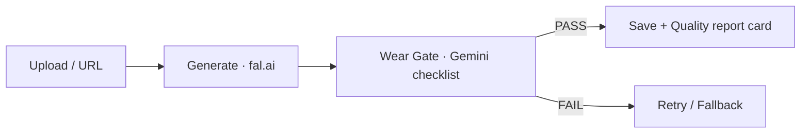

# Carret 🥕

**Turn casual secondhand photos into honest product photos.**

Carret is an AI pipeline that transforms roughly-shot used-item photos
into clean studio-style product photos — while *preserving every defect*
(stains, tears, fading, pilling). In secondhand commerce,
**trust beats beauty**.

## 🎯 Why

- Poor photos sell poorly. But "AI-restored to look new" photos are lies
  → returns, disputes, broken trust.
- Principle: **change the background, never the truth.**

## 🏗️ How It Works



1. Seller uploads a casual photo (drag-drop or URL)
2. A generative edit model replaces the background (presets: studio white,
   warm wood, minimal gray)
3. `SECONDHAND_LOCK` prompt forbids any restoration of the item
4. A VLM **Wear Gate** checks that every known defect still survives
5. The UI shows the result with a quality report card
   (fidelity / realism / trust) and defect bubbles overlaid on the photo
6. The seller can rate the result (1–5★) + leave a comment; feedback is
   stored per `file_id` + preset and reused if they revisit the same result

## ✨ Key Features

- 🔒 **Honesty-first prompts** — explicit "do NOT clean/repair" locking
- 🛡️ **Wear Gate** — checklist-based defect preservation verification
  ("verify these defects", not "find defects")
- 🧾 **Quality report card** in the UI, written by a VLM judge
- 💬 **Defect bubbles + zoom** — detected defects are shown as bubbles
  positioned on the actual (letterboxed, zoomable) result image
- ⭐ **Feedback loop** — rating + comment per result, `POST/GET /api/feedback`,
  SQLite-backed, upsert on `file_id` + preset
- 🗂️ **Pluggable storage** — local disk or S3, switched with one env var
- 🧪 **Eval suite** — hybrid dataset (real photos + AI-injected defects)
  with frozen ground truth and quantitative metrics

## 🧪 Evaluation

| Metric | What it measures | Range |
|---|---|---|
| `wear_ratio` | fraction of known defects preserved | 0–1 |
| `text_recall` | printed-text survival (OCR via VLM) | 0–1 |
| `product_sim` | pixel preservation inside the item mask | 0–1 |
| `bg_whiteness` | background matches preset intent | 0–1 |
| `latency` | seconds per image | s |

Dataset philosophy: **hybrid** — real photos for distribution truth,
synthetic defect injection for perfect ground truth.
Ground truth is frozen *before* any model run.

```bash
python test.py     # runs dataset → saves results to storage/dataset/after/
```

## 🚀 Getting Started

```bash
cd backend
python -m venv venv && source venv1/bin/activate
pip install -r requirements.txt
cp .env.example .env        # FAL_KEY, VLM_KEY (Gemini)
uvicorn main:app --reload
```

Storage backend defaults to local disk (`STORAGE_DIR=./storage`). To use S3
instead, set `STORAGE_BACKEND=s3`, `S3_BUCKET`, `S3_PREFIX`, `AWS_REGION` in
`.env` (AWS credentials via the usual boto3 chain) — note dev tools and the
transform pipeline currently still read/write via local paths, so full S3
support is a work in progress (see `study/` below).

```bash
cd backend && pytest test/software/unit -q   # free unit tests (same as CI)
```

### Dev workflow: sub-agents + study log
- `.claude/agents/tester.md` / `reviewer.md` — Claude Code sub-agents; run
  after a code change to get pytest coverage for it (`tester`) and a
  read-only security/perf/readability pass on the diff (`reviewer`)
- `study/` — dated dev-log notes on non-obvious bugs found and the reasoning
  behind bigger cleanups, written as they happen

## 🧠 Design Decisions

- **Checklist over open-ended judging** — verification with a known defect
  list is far more consistent than asking a VLM to "find problems"
- **Hybrid eval dataset** — synthetic gives perfect GT; real anchors realism
- **pydantic Settings** — secrets never touch code or git
- **Schema as security** — `file_id` regex prevents path traversal
- **One path source of truth** — the storage layer's `BASE` is the only
  place that knows the on-disk layout; routes/pipeline/dev-tools all go
  through it instead of building paths themselves
- **Overlay math must know about letterboxing** — any UI that draws
  coordinates on top of an `object-fit: contain` image has to compute the
  actual displayed image box, not assume the image fills its container

## 🩸 Failures & Lessons

| Bug | Lesson |
|---|---|
| `await` on a dict → TypeError | sync/async is a contract between caller and callee |
| 503 UNAVAILABLE | transient errors need exponential-backoff retry |
| `file_id` pattern mismatch | the producer must obey the schema, not the reverse |
| missing `max_bytes` | new code ships with new config — together |
| S3 migration left two `storage.py` implementations pasted together (duplicate `BASE`, dropped image normalization) | mid-migration, delete the old implementation before adding the new one — don't let both live in the same file "just in case" |
| `.env` key unknown to `Settings` crashed the app at boot | external input (env vars) should degrade gracefully by default (`extra="ignore"`), not hard-fail on anything new |
| CI's pip install list quietly drifted from `requirements.txt`; `storage.py` importing `boto3` unconditionally broke CI silently until checked | CI's dependency list is a second source of truth that has to be kept in sync manually — verify by replicating CI's exact install in a clean venv, don't assume |
| defect bubbles positioned as % of the whole canvas, but `object-fit: contain` letterboxes non-square images | overlay coordinate math must be computed against the actual rendered image box, not its container |

## 🗺️ Roadmap

- [x] MVP pipeline + report-card UI
- [x] Eval dataset v1 (5 images) + ground truth
- [x] Feedback collection (1–5★ + comment, per result)
- [x] pytest + CI (free unit tests gate every PR)
- [ ] Quantitative scorecard (CSV) + model A/B
- [ ] Wear Gate inside production pipeline (retry/fallback)
- [ ] Full S3 support (pipeline/dev-tools still assume local disk)
- [ ] Fix "paid eval" CI job (needs `VLM_KEY`/`FAL_KEY` repo secrets)
- [ ] Public demo deployment

> Transparency label policy: every result is presented as
> *"Background AI-generated; item condition per original photo."*