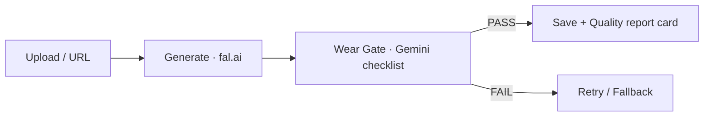

# Carret 🥕

**Turn casual secondhand photos into honest product photos.**

Carret is an AI pipeline that transforms roughly-shot used-item photos
into clean studio-style product photos — while *preserving every defect*
(stains, tears, fading, pilling). In secondhand commerce,
**trust beats beauty**.

## 🎯 Why

- Poor photos sell poorly. But "AI-restored to look new" photos are lies
  → returns, disputes, broken trust.
- Principle: **change the background, never the truth.**

## 🏗️ How It Works



1. Seller uploads a casual photo (drag-drop or URL)
2. A generative edit model replaces the background (presets: studio white,
   warm wood, minimal gray)
3. `SECONDHAND_LOCK` prompt forbids any restoration of the item
4. A VLM **Wear Gate** checks that every known defect still survives
5. The UI shows the result with a quality report card
   (fidelity / realism / trust)

## ✨ Key Features

- 🔒 **Honesty-first prompts** — explicit "do NOT clean/repair" locking
- 🛡️ **Wear Gate** — checklist-based defect preservation verification
  ("verify these defects", not "find defects")
- 🧾 **Quality report card** in the UI, written by a VLM judge
- 🧪 **Eval suite** — hybrid dataset (real photos + AI-injected defects)
  with frozen ground truth and quantitative metrics

## 🧪 Evaluation

| Metric | What it measures | Range |
|---|---|---|
| `wear_ratio` | fraction of known defects preserved | 0–1 |
| `text_recall` | printed-text survival (OCR via VLM) | 0–1 |
| `product_sim` | pixel preservation inside the item mask | 0–1 |
| `bg_whiteness` | background matches preset intent | 0–1 |
| `latency` | seconds per image | s |

Dataset philosophy: **hybrid** — real photos for distribution truth,
synthetic defect injection for perfect ground truth.
Ground truth is frozen *before* any model run.

```bash
python test.py     # runs dataset → saves results to storage/dataset/after/
```

## 🚀 Getting Started

```bash
cd backend
python -m venv venv && source venv1/bin/activate
pip install -r requirements.txt
cp .env.example .env        # FAL_KEY, VLM_KEY (Gemini)
uvicorn main:app --reload
```

## 🧠 Design Decisions

- **Checklist over open-ended judging** — verification with a known defect
  list is far more consistent than asking a VLM to "find problems"
- **Hybrid eval dataset** — synthetic gives perfect GT; real anchors realism
- **pydantic Settings** — secrets never touch code or git
- **Schema as security** — `file_id` regex prevents path traversal

## 🩸 Failures & Lessons

| Bug | Lesson |
|---|---|
| `await` on a dict → TypeError | sync/async is a contract between caller and callee |
| 503 UNAVAILABLE | transient errors need exponential-backoff retry |
| `file_id` pattern mismatch | the producer must obey the schema, not the reverse |
| missing `max_bytes` | new code ships with new config — together |

## 🗺️ Roadmap

- [x] MVP pipeline + report-card UI
- [x] Eval dataset v1 (5 images) + ground truth
- [ ] Quantitative scorecard (CSV) + model A/B
- [ ] Wear Gate inside production pipeline (retry/fallback)
- [ ] pytest + CI
- [ ] Public demo deployment

> Transparency label policy: every result is presented as
> *"Background AI-generated; item condition per original photo."*