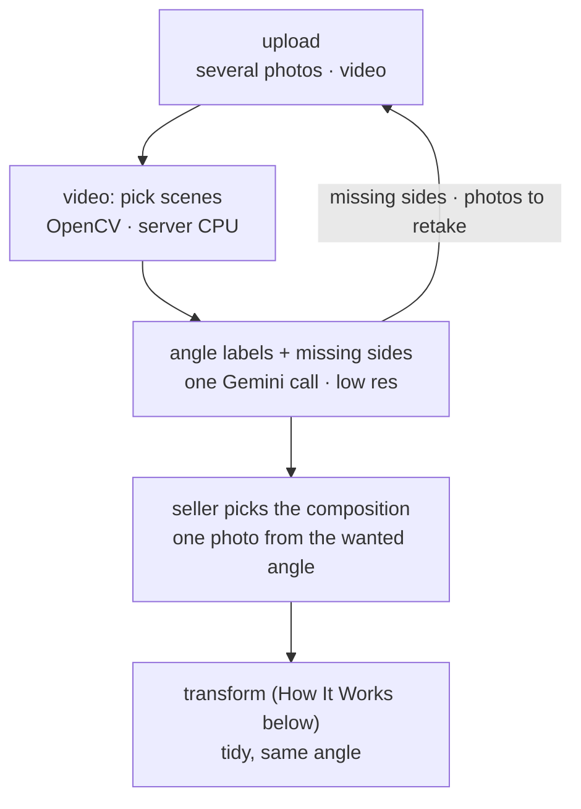
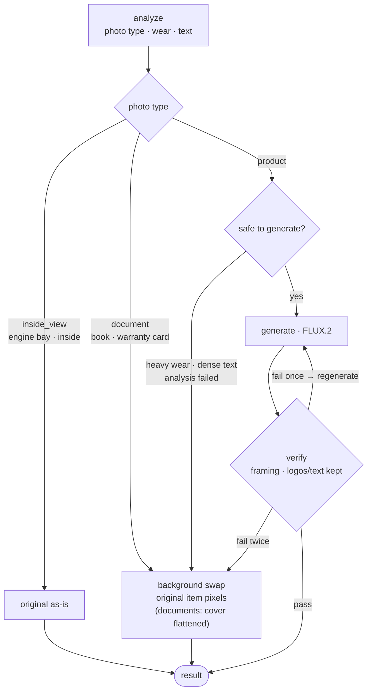

# Carret 🥕

*[한국어](Readme.ko.md)*

**Turn casual secondhand photos into honest product photos.**

Carret is an AI pipeline that turns roughly shot photos of used items into
clean, studio-style product photos. Sellers upload **photos from several angles or a video**;
Carret points out the sides that are missing, and the seller picks the shot whose composition they want,
which is then tidied **without changing its angle**. It **keeps the item's identity** (logos, printed
text) exactly as in the original, and for **heavily worn items it doesn't generate at all**:
it cuts out the original item and only swaps the background. In secondhand commerce,
a photo buyers can trust matters more than a pretty one.

> Principle: **change the background, keep the item's identity, show its condition as photographed.**

---

## 📌 At a Glance

| | |
|---|---|
| **Problem** | Generative edit models "fix" scratches even when you only ask them to swap the background. In secondhand listings, that turns the photo into a misleading one |
| **Solution** | The model never redraws the composition: the seller picks it from their own shots, and missing sides are flagged at upload. Before generation, the photo is analyzed: heavily worn items, or items whose main text can't be kept, get only a background swap on the original pixels. Generated results are checked with a VLM checklist that logos and text are unchanged |
| **Stack** | FastAPI · LangGraph · fal.ai (FLUX edit) · Gemini (VLM) · DINOv2 · OpenCV · SQLite · S3 · Langfuse · Vanilla JS |
| **Quality** | 1644 unit tests that make no external API calls and run on every PR, plus an eval suite that calls the real APIs (runs on main or a PR label) |

---

## 🧭 User Flow


```mermaid
flowchart TD
  U["upload<br/>several photos · video"] --> F["video: pick scenes<br/>OpenCV · server CPU"]
  F --> W["angle labels + missing sides<br/>one Gemini call · low res"]
  W -->|"missing sides · photos to retake"| U
  W --> S["seller picks the composition<br/>one photo from the wanted angle"]
  S --> T["transform (How It Works below)<br/>tidy, same angle"]
```

1. **Upload** (`POST /api/items`, add more with `/api/items/{id}/files`): photos (jpg · png · webp) and videos
   (mp4 · mov · webm, up to 90 s / 100 MB), up to 12 per item. Phone photos are rotated upright from EXIF on save
2. **Pick scenes from a video** (`services/video.py`, no model): 40 evenly spaced candidates → drop blurry ones →
   drop near-duplicates of the last kept scene → up to 8
3. **Angle labels + missing sides** (`detector.classify_views` + `services/coverage.py`): one VLM call over all photos
   returns the kind (shoes · clothing · bag · electronics · vehicle · other) and, per photo, the angle, occlusion and blur.
   **Which sides are required is decided in code** per kind, so the same item always gets the same advice.
   Occluded or blurry photos don't count and are flagged for a retake
4. **Pick the composition**: the seller taps the photo with the angle they want
5. **Transform** (`POST /api/transform`): the pipeline below. The generator is **never asked to change the angle**:
   asking it to re-pose a single photo made it invent sides it had never seen (2026-10-01, see Failures & Lessons)

**Models · cost · time per step** (one item, one cover photo generated)

| Step | Model | Cost | Time |
|---|---|---|---|
| Video scene picking | OpenCV (local) | 0 | ~2.5 s for a 10 s 1080p clip |
| Angle labels | Gemini 3.8-flash, low (268 tokens per photo) | ~$0.001 (estimate) | a few seconds (estimate) |
| analyze (incl. text) · mark gate | Gemini 3.8-flash, high | ~$0.012 VLM total on the generate path | |
| Framing/caption check | Gemini 3.5-flash-lite, low | (included above) | 2–3 s |
| Generation | fal `flux-2/flash/edit`, 8 steps | ~$0.010 × 1.38 attempts on average | 6–50 s incl. queue |
| Background swap (fallback) | rembg / fal BiRefNet + solid color | ~$0.007 for the whole path | ~22 s |
| Cutout comparison (after the response) | rembg + DINOv2 (local) | 0 | user doesn't wait |
| **Total (generate path)** | | **~$0.03** | **transform 35–60 s** |

Costs and times are Langfuse medians from 2026-09-29 (33 transforms) and the 2026-10-01 eval runs. For angle labels only the token count was measured.

---

## 🏗️ How It Works

The transform pipeline for the chosen photo is a [LangGraph](https://github.com/langchain-ai/langgraph)
`StateGraph` (`backend/app/services/pipeline.py`).


```mermaid
flowchart TD
  A["analyze<br/>photo type · wear · text"] --> P{"photo type"}
  P -->|"inside_view<br/>engine bay · inside"| O["original as-is"]
  P -->|"document<br/>book · warranty card"| X["background swap<br/>original item pixels<br/>(documents: cover flattened)"]
  P -->|product| C{"safe to generate?"}
  C -->|"heavy wear · dense text<br/>analysis failed"| X
  C -->|yes| G["generate · FLUX.2"]
  G --> V{"verify<br/>framing · logos/text kept"}
  V -->|"fail once → regenerate"| G
  V -->|"fail twice"| X
  V -->|pass| R(["result"])
  X --> R
  O --> R
```

Finer branches (reading text, cutout failures, retry limits) are in the step list below.

1. **analyze** (one VLM call; classify + detect were merged on 2026-09-27): from the original it
   returns the item, the **marks that make up the item's identity** (logos, printed text, graphics;
   defects are no longer listed), the item box, the photo type (`photo_type`: document — books, albums, warranty
   cards / inside_view — part or inside of an object / product), the wear level (`wear_level`: none / light / heavy), watermarks
   (`watermark`: none / background / on the item) and the text level (`text_level`: none / simple /
   dense). `dense` means lots of small text, or **the item's main text can't be copied letter for
   letter even from the original** (tiny neck labels or license plates don't count). Two failures →
   `detect_failed`
2. **plan**: the photo type decides first. A photo of part or the inside of an object (an engine
   bay, a laptop with its case removed) is left **as-is** (`mode: original`). A document (book, album, warranty
   card) is not generated: its **cover is found and flattened** onto the background (`compose_flat`,
   plain background swap if no cover is found). Analysis failure, or a product photo with `dense` text or `heavy` wear, skip generation and go straight
   to background-swap mode: when defects were listed and the generator was told to keep them, it
   erased them or **drew new ones** (09-27 experiments). For widely worn items only the background
   swap, which uses the original pixels, shows the real condition. Items with no or light wear are
   generated; with no text (`none`) it generates without reading text
3. (the old classify / detect stages are merged into analyze; the eval-only functions remain in `detector.py`)
4. **read_text** (`TEXT_LOCK`, on by default, only for `simple`): adds the text **on the
   item** in the original, with rough positions, to the generate prompt (so the
   generator garbles small text and Korean less). The text is **read by analyze** (2026-10-01, Langfuse
   `analyze_v2`): the separate text-reading call (21% of VLM cost) is gone, and a broken response now goes
   through analyze's retry and `detect_failed` instead of silently becoming "no text". Only an older saved
   analysis without text is read separately. With 12+ lines it goes to background-swap mode (safety net)
5. **generate**: replaces the background with a preset (studio white, warm
   wood or minimal gray). Every prompt carries `SECONDHAND_LOCK`: it **keeps the camera angle**, allows only
   centering, filling the frame and tidying wrinkles or hangers, and forbids adding other items or captions as
   well as restoration. A hand is removed only when nothing of the item is hidden behind it
6. **validate_result**: the framing check (check_photo) plus observe-only signals. No guard blocks
   the result: the OCR text guard (re-read the result's text with the VLM and compare with the
   original) was **removed** on 09-27, because on 6 phone photos most of its rejections were reading
   noise ("H.M"/"H-M", "00 3060" read as two lines) and it threw away good results. Text is covered
   by `TEXT_LOCK` before generation and by verify's key-text check. While waiting for check_photo, the item is **cut out** of both original and result, placed on the same gray background
   and compared with DINOv2 (`item_dino`, soft: catches a swapped item or a changed
   shape, color or pattern). The same cutout pair is aligned with ECC and compared per DINO
   **patch** too (`item_patch`, soft: the lowest 1% of inner patches, aimed at a change in one
   spot such as a single scratch). With `LOCAL_OCR_GUARD=true`, EasyOCR reads the text once more
   (`ocr_local`, soft, for eval). If the result is
   cropped or covered by a caption, it is regenerated **with the rejection reason added
   to the prompt** rather than retried blindly. The number of attempts is capped by config
7. **score_similarity**: a local DINOv2 embedding similarity, separate from the VLM
   (reuses the value the guard already computed)
8. **verify**: the VLM gets a checklist ("confirm these marks are unchanged") instead of an
   open question ("find problems"): the logos and marks from analyze plus the key text on the
   item (largest lines, up to 8; text the original itself couldn't read, with "?", is skipped).
   It returns whether each one survived and where it is in the result. **Defects are not checked
   here**; wear is only judged by analyze → plan.
   Coordinates are requested in Gemini's native `box_2d [ymin, xmin, ymax, xmax]`
   format, and if the VLM answers for fewer items than it was asked about
   (including an empty answer), the gate fails. If the verify **call itself** fails twice,
   the run is marked `verify_failed` (not passed) and goes straight to background-swap mode
9. **Gate-failure fallback**: if the verify gate fails, the pipeline regenerates once
   with the changed marks added to the prompt. If it still fails, it switches to
   **background-swap mode**: the original item is cut out (fal BiRefNet, local rembg as a
   fallback) and placed on the preset background, so the item's pixels are the
   original's. The result is recorded with `mode: composite` and a `composite_reason`
10. **judge** (outside the graph, one function: `judge_and_save`, **eval and dev only**): produces a
   fidelity / realism / trust report card and attaches it to the same trace as Langfuse Scores.
   Removed from the live path and the UI on 2026-10-05 — no decision uses it, and it agreed with
   human verdicts on only 11 of 17 pairs, so showing the score confused more than it helped
11. The UI overlays mark bubbles on the result and says whether it is generated / the original item
   on a new background / the original as-is. Generated results also say that defects aren't checked
   automatically and should be confirmed on the original. It collects a star rating and comment

---

## 🧭 Reading the Code

```
backend/
├── main.py                     # app assembly: routers, /storage serving, frontend mount
└── app/
    ├── api/routes/             # HTTP boundary (thin; the work happens in services)
    │   ├── images.py           #   upload (file / URL)
    │   ├── items.py            #   multi-angle upload (photos · video → angles · missing sides)
    │   ├── transform.py        #   POST /api/transform → pipeline
    │   ├── feedback.py         #   rating/comment upsert + fetch
    │   └── dev.py              #   dev tooling (registered only when DEV_TOOLS=true)
    ├── services/
    │   ├── pipeline.py         # ⭐ LangGraph pipeline (read this first)
    │   ├── ingest.py           #   one original → pipeline → auto feedback (single entry point)
    │   ├── video.py            #   video → sharp, distinct scenes (OpenCV)
    │   ├── coverage.py         #   required sides per kind · missing sides · retakes
    │   ├── ai/                 # all external / model calls
    │   │   ├── generator.py    #   fal.ai background swap
    │   │   ├── detector.py     #   Gemini: analyze / verify / check_photo / classify_views (+ eval-only classify·detect)
    │   │   ├── judge.py        #   report card (fidelity · realism · trust)
    │   │   ├── embedder.py     #   DINOv2 embeddings (local, lazy singleton)
    │   │   └── auto_feedback.py#   "how would a seller rate this?" VLM agent
    │   ├── quality/            # deterministic metrics (no API calls)
    │   │   ├── metric.py       #   wear_ratio, text_recall, product_sim …
    │   │   └── guards.py       #   hard/soft output guards + block/pass decision
    │   └── persistence/
    │       ├── storage.py      #   bytes: local FS ↔ S3 (switched by one setting)
    │       └── store.py        #   metadata: SQLite (originals/results/feedbacks)
    ├── prompts/
    │   ├── presets.py          # background presets + SECONDHAND_LOCK
    │   ├── rubric.py           # judge scoring axes
    │   └── fragments/*.md      # composable prompt fragments (role / rules / schema)
    ├── core/
    │   ├── config.py           # pydantic Settings (.env)
    │   ├── db.py               # SQLite schema + migrations
    │   ├── tracing.py          # Langfuse v4 OTEL (noop without keys)
    │   ├── vlm.py              # shared Gemini client (timeout) · retryable errors · per-call thinking
    │   └── prompt_registry.py  # Langfuse prompts, falls back to local fragments on failure
    └── schemas/                # pydantic request/response (file_id regex = path-traversal guard)

scripts/    seed_langfuse_prompts.py (seeds local prompts into Langfuse)
frontend/   index.html (main app) · test.html (dev lab) · js/{api,render,main,dev}.js
study/      dated dev logs: bug root causes, design calls, reversed decisions
```

**Suggested reading order**

1. `services/pipeline.py`: the whole flow. Each node is one function, so it reads top to bottom
2. `prompts/presets.py` → `prompts/__init__.py` → `fragments/`: how the honesty principle is written into the prompts
3. `services/ai/detector.py`: VLM calls and output validation (`_valid_anchor`, `_as_bool`)
4. `services/quality/guards.py`: why the VLM's *judgment* is kept separate from deterministic *guards*
5. `services/persistence/`: the split between bytes and metadata, and the S3 abstraction
6. `test/software/unit/`: the contract each module keeps

**Layer rules.** `routes` validate input and hand off to `services`.
`services/ai` only calls external models, `services/quality` only computes,
and `services/persistence` only stores. `storage.BASE` is the only place
that knows the disk layout.

---

## ✨ Key Features

- 📸 **Multi-angle upload**: takes several photos or a video, labels each angle, and points out missing sides
  and photos to retake (occluded, blurry). The composition is picked from the seller's own shots
- 🔒 **Honesty-first prompts**: `SECONDHAND_LOCK` is attached to every
  preset and forbids changing the angle, restoration or retouching
- 🔎 **Analysis before generation**: photo type, wear level, text level and watermarks decide whether a
  photo is generated at all
- 🛡️ **Mark gate (verify)**: the original's logos and text are checked again in the result, one by one
- 🔁 **Regeneration that carries the reason**: when a result is rejected for
  cropping or a caption, the reason goes into the next prompt, and retries are capped
- 📐 **Two kinds of signal**: the Gemini judge gives a judgment (eval and dev runs only), and DINOv2
  cosine similarity gives a score on a fixed scale
- 💬 **Mark bubbles + zoom**: overlay coordinates account for the
  letterboxing from `object-fit: contain`
- ⭐ **Feedback loop**: human feedback (`source=user`) and agent feedback
  (`source=agent`) are stored separately, and the agent never overwrites
  human feedback
- 🤖 **Auto-feedback agent + inbox**: put originals in `storage/inbox/` (or
  pass URLs), and each one runs through the real pipeline and gets agent feedback
- 📊 **Langfuse observability**: per-node traces, a Score for each judge axis (eval and dev runs),
  and prompts you can edit from the console. Without keys it is a complete
  noop, so CI and tests stay safe
- 🗂️ **Swappable storage**: `STORAGE_BACKEND=local|s3` switches the backend,
  and the serving URLs stay the same
- 🧪 **All results at a glance**: the dev lab (`test.html`) shows every result
  next to its original, with gate, guards, judge scores, DINO, rating and the
  defect checklist on one screen (with filters, sorting and a summary)
- 🔤 **Text/logo damage check**: analyze reads only the text **on the item**
  (ignoring background, sleeves and props, with no spelling correction), locks it
  into the generation prompt, and verify gates on whether it survived
- 💸 **VLM cost control**: each call has its own thinking level. verify gets a
  2048-token thinking cap so it can't run away, and simple calls
  (auto_feedback) use low thinking

---

## 💼 Why This Is a Strong Portfolio Project

**1. Generative-AI failure is handled starting from the product requirement.**
The goal is "don't fix it," not "make it prettier." That constraint is
enforced at three points: before generation (photo analysis decides whether to generate, plus a
prompt lock), during generation (regeneration with the rejection reason) and after generation
(mark gate and guards). The design verifies the model's output instead of trusting it, and
doesn't generate when it can't keep the item honest.

**2. LLM judgment is separated from deterministic metrics.**
A VLM judge's scores shift with prompt and model versions. So the project
adds deterministic signals: DINOv2 similarity (whole image and cut-out item) and OCR text matching
(`quality/guards.py`). When a guard computation fails,
the exception is raised instead of letting the result pass. When a check stage
(analyze, verify) call fails, the run is marked `detect_failed` / `verify_failed`
instead of passing, and goes to background-swap mode. The observational stage
(judge) works the other way: its failures are swallowed, so an already-paid-for generation is never thrown away.
Each stage's failure policy was chosen on purpose.

**3. Evaluation was designed first.**
The dataset is a hybrid of real photos and AI-injected defects, and the
ground truth is fixed **before** the model runs. Results are measured with
`wear_ratio`, `text_recall`, `product_sim` and `bg_whiteness`. CI runs the
free unit tests separately from the paid evals.

**4. Built with production operation in mind.**
Langfuse handles tracing and prompt versions, and every external
integration has a fallback so the app runs without it. Other safeguards:
a cost cap (`max_generate_attempts`, validated to 1–5), two layers of
path-traversal defense (the schema regex and `_safe_path`), and settings
that still boot when `.env` contains unknown keys.

**5. Built to be testable.**
External calls live only in `services/ai/`, which makes them easy to mock.
That's why 1644 unit tests finish in about 25 seconds with no network
(and `unit/conftest.py` blocks any accidental real VLM call). The
dev replay (`run_transform_with_result`) skips only the generation step and
**calls the production node functions directly**. The logic is never
copied, so tests and production can't drift apart.

**6. The reasoning is written down.**
`study/` records more than what was built: why the approach was thrown out
twice, and how each bug was caught. The "Failures & Lessons" table below
summarizes it.

---

## 🚀 Getting Started

```bash
python -m venv venv1 && source venv1/bin/activate
pip install -r requirements.txt
cd backend
touch .env                  # FAL_KEY, VLM_KEY (Gemini) required / LANGFUSE_* optional
uvicorn main:app --reload   # http://localhost:8000 (frontend included)
```

| Env var | Purpose |
|---|---|
| `PIPELINE_MODE=mock` | Returns the original unchanged, with no external calls (for UI work) |
| `STORAGE_BACKEND=s3` | Needs `S3_BUCKET`, `S3_PREFIX`, `AWS_REGION` |
| `MAX_GENERATE_ATTEMPTS` | Regeneration cap (default 2, range 1–5) |
| `DEV_TOOLS=false` | Disables the `/dev/*` routes (for deployment) |
| `LANGFUSE_PUBLIC_KEY` / `SECRET_KEY` | Without them, tracing and prompt management are a noop |
| `VLM_TIMEOUT_S` | Timeout for a single VLM call (default 60 s) |
| `VLM_THINKING` | Per-call thinking override, e.g. `{"verify": "default", "judge": "low"}` (an integer = thinking token cap) |
| `VLM_MEDIA_RESOLUTION` | Per-call image resolution override (`low`/`medium`/`high`/`default`), e.g. `{"check_photo": "high"}`. Image tokens depend on this level, not on pixel size |
| `VLM_MODELS` | Per-call model override (falls back to `VLM_MODEL`), e.g. `{"classify": "gemini-3.5-flash-lite"}` |
| `LOCAL_OCR_GUARD=true` | Soft guard that re-checks text with EasyOCR (for eval; install easyocr separately) |
| `MAX_VIDEO_SIZE_MB` | Size cap for one video in a multi-angle upload (default 100) |
| `MAX_ITEM_PHOTOS` | Photos per item, including scenes taken from videos (default 12) |

### Tests

```bash
cd backend && pytest test/software/unit -q   # free unit tests (same as CI)
make test    # everything except eval / e2e
make eval    # analyze accuracy on backend/eval photos (real VLM calls, costs money)
make e2e     # browser tests
make docs    # browse the repo's .md files (http://localhost:8090, renders mermaid)
```

| Folder | Scope |
|---|---|
| `test/software/unit/` | service, web and data layers (external calls mocked) |
| `test/software/integration/` | upload flow, dev replay |
| `test/software/full/` | user journeys (mock / real), browser |

---

## 🧪 Evaluation Metrics

| Metric | Measures | Range |
|---|---|---|
| `wear_ratio` | share of defects preserved | 0–1 |
| `text_recall` | how much printed text survives (VLM OCR) | 0–1 |
| `product_sim` | pixel fidelity inside the item mask | 0–1 |
| `bg_whiteness` | how well the background matches the preset's intent | 0–1 |
| `visual_similarity` | DINOv2 cosine similarity between original and result | ~0–1 |
| `latency` | processing time per image | s |

---

## 🧠 Design Decisions

- **Checklists over open-ended questions**: asking a VLM to confirm a
  known list of marks is far more consistent than asking it to "find problems"
- **Wear as a level, not a list**: listing defects and telling the generator to keep them made it
  erase them or exaggerate them into new ones, and general wear that isn't on any list can't be kept
  anyway. So wear is only judged as a level, and heavy wear isn't generated. Known limit: on lightly
  worn items, a generated result that tidies a defect isn't caught automatically
- **Truth is kept separate from aesthetics**: the non-negotiable minimum is
  enforced by deterministic guards (hard/soft), and aesthetic judgment is
  left to the judge
- **A different failure policy per stage**: observational stages move on
  after a failure, and guards block
- **"Couldn't check" is not a pass**: when an analyze or verify call fails, the run is
  marked `detect_failed` / `verify_failed` and goes to background-swap mode. Retries
  happen only for errors that can improve (timeouts, 429, 5xx, broken responses)
- **One place for one job**: judging lives in `judge_and_save`; callers only decide *when*
- **No copied logic**: dev tools and tests call the production node functions directly
- **One source of truth for paths**: only `storage.BASE` knows the disk layout
- **Bytes and metadata are stored separately**: images go to storage
  (local/S3), and metadata goes to SQLite
- **Every integration is optional**: the app behaves the same without Langfuse or S3
- **VLM cost is set per call**: image tokens depend on the resolution level, not pixel size
  (gemini-3.x: low 268 / high 1,066). Calls that only need the big picture (item class, framing)
  use low + a lite model; calls that look for small scratches and text (analyze, verify, text
  reading) use high. Every call has a thinking-token cap (`DEFAULT_THINKING` /
  `DEFAULT_MEDIA_RESOLUTION` / `DEFAULT_MODELS` in `vlm.py`)

---

## 🩸 Failures & Lessons

| Bug | Lesson |
|---|---|
| `await` on a dict → TypeError | Whether a call is sync or async is a contract that caller and callee both have to keep |
| 503 UNAVAILABLE | Transient errors need retries with exponential backoff |
| `file_id` pattern mismatch | The code that produces data has to follow the schema. Don't bend the schema to fit it |
| `db.init_db()` was never called, so the tables were never created | Check that a new layer is actually wired in, end to end |
| Two implementations ended up concatenated in `storage.py` during the S3 migration | Delete the old implementation before adding the new one. Don't keep both "just in case" |
| An unknown key in `.env` crashed the app on boot | Be lenient with external input (`extra="ignore"`) |
| CI's pip list drifted from `requirements.txt` | CI dependencies are a second source that has to be kept in sync by hand. Verify them in a clean venv |
| Retrying with the same prompt repeated the same flaw | A retry has to carry the reason the previous attempt was rejected |
| Bubble coordinates were off because of letterboxing | Compute overlay coordinates from the rendered image box, not the container |
| Bubble boxes came back with x and y swapped (only 4 of 11 in place) | Ask for coordinates in the format the model was trained on (`box_2d [ymin, xmin, ymax, xmax]`) and convert in code. Check boxes by drawing them on the image |
| The VLM "corrected" garbled text while reading it ("시한부일꽈" read as "시한부일까") | To check text preservation, show original and result side by side and ask what changed, instead of transcribing and diffing |
| verify sometimes spent ~63,000 thinking tokens, ~$0.57 per call | Thinking tokens are invisible but billed at the output rate. Cap them per call and include them in Langfuse cost |
| An empty verify answer passed the gate | A gate must not count "couldn't check" as a pass (fail-closed) |
| main CI had been failing since 09-15 because `langfuse` wasn't installed | Update CI's dependency list whenever a new import appears |
| A failed detect call read as "no defects" (`[]`) and skipped the gate; a verify exception left `gate_passed=None`, which routed as a pass | "Really none" and "couldn't ask" must be different values. Once you find a hole, look for the same kind elsewhere |
| The most conservative path (blocked = return the original) crashed with a KeyError → 500 | As branches grow, check that every path into a node fills the keys it reads. `TypedDict(total=False)` won't catch it |
| judge existed twice: a graph node and `judge_later` | Answer "why is it like this?" by grepping the callers. At the time nothing needed synchronous judging (since 10-05 only eval and dev judge, synchronously) |
| After parallelizing, tests called real Gemini with the `.env` key; a fake that didn't accept a new argument passed through the wrong path | Fakes must follow the real signature, or tests pass while checking the wrong thing |
| A seller's watermark became a "defect to keep", so good results failed the gate | Not the model: the category examples in our prompt listed "watermark". Read the prompt first when chasing false positives |
| One text-reading call used 62,912 thinking tokens ($0.57), 25% of the last 500 calls' cost | Only capped calls are safe. When adding a VLM call, set its thinking config too |
| Tried to cut VLM cost by sending smaller images | `count_tokens` (free) showed 384px costs the same tokens. Cost comes from the resolution level and thinking tokens |
| fal's CDN returned a 500 HTML page that was passed on as image bytes, and PIL crashed | Check the status code on every external download; retry 5xx once, follow redirects |
| Regenerating with "these defects MUST remain" drew rust far larger than the original (car) and scratches that weren't there (Braun) | If you emphasize a list of things to keep, the model **draws** them. Judge wear as a level and don't generate heavy wear |
| Most text-guard rejections were **reading noise** ("H.M"/"H-M", "00 3060" read as two lines) that threw away good results | The checker's error can be larger than the generator's. Save rejected results and look at them |
| Concluded "generation changes the item" from a 400px dataset | Small inputs make the model invent detail. Re-measured at real input quality (phone photos), most results were fine |
| In the model comparison, 3.8-flash failed item classification 17/17 | Not the model: it rejects our `thinking_level="minimal"`. Changing models means changing per-call settings too |
| Asked to "restage as a listing photo" from one shot, the model invented a hidden insole logo, watch-dial text and a sleeve logo | A side the camera never saw can't be protected by a prompt. Have the seller shoot the angle; generation only tidies the same angle |
| Per-kind examples in the lock (lay clothes flat, shoes side by side) made it draw a jacket and a shirt into shoe photos | Examples read as instructions. Attach a per-kind sentence only for that kind |
| The gate passed **added** things like that jacket or a caption | A checklist gate only asks "is it still there". Additions need their own measure (`added_content` in the rating sheet) |

---

## 📝 Recent Changes

**2026-10-01**
- **Workflow redesigned around multi-angle upload**: photos or a video → angle labels (one low-res VLM call) → missing
  sides and retakes → the seller picks the composition → that photo is tidied at the same angle. The single-photo
  re-posing experiments (catalog · listing) are recorded as failures
- **Video → photos**: OpenCV picks up to 8 sharp, distinct scenes (magic-byte check, FFmpeg limited to local files,
  resolution / duration / time caps)
- **EXIF rotation**: phone photos are rotated upright on save (`img_util.normalize`), with a pixel cap against decompression bombs
- **Eval tools**: `added_content` (something new appeared) and `photo_quality` (1–5) in the rating sheet, "usable as is"
  (preserved + quality ≥ 4) in the report, model · steps · lock hash · commit in `meta.json`. One card per photo in the grading page

**2026-09-27**
- **analyze as the first stage**: classify + detect (2 VLM calls) → analyze (1). Photo type, wear level,
  watermark and text level come first; a part/inside photo stays as-is, and heavily worn items or
  items whose main text can't be read go to background swap
- **Defect anchors removed**: when defects were listed to keep, the generator **drew** rust and
  scratches (car, Braun). verify now checks logos and text only
- **OCR text guard removed**: most rejections were reading noise. The seed retry and "blocked" path
  that existed only for it are gone too
- 6 phone photos: 5 generated on the first try, the engine bay kept as-is (before: 4 blocked by the text guard)
- **Three photo types first** (`photo_type`): document (books, albums, warranty cards — the text is
  the item) / inside_view (engine bay, opened-up laptop — kept as-is) / product (generation path).
  Spec and condition text (capacity, mileage) belongs in the listing fields, not the photo
- **Cover flattening** (`compose_flat`): documents are not generated; the cover's four corners are
  found and it is flattened onto the background (original pixels, so the title can't change).
  Heavily worn documents are not flattened
- **No verify on background swaps** (the item pixels are the original's; one VLM call saved), and
  the DB `results` table now records the route (mode, reason, photo type, wear)
- **Eval tooling** (`backend/eval/`): ground-truth labels → run → side-by-side human review →
  classification accuracy, preservation pass rate, rater agreement and AUC of the automatic scores

**2026-09-26 (night)**
- **Default VLM 3.5-flash → 3.8-flash**: on 19 photos with real defects it found the real defects as
  well as 3.5 and skipped 3.5's false ones (scalloped rim, distressed finish), at half the price.
  Item classification and framing check use 3.5-flash-lite
- **VLM cost**: per-call resolution (low/high), model and thinking caps. About $0.035–0.045 per photo
  (measured, FLUX included)
- **`text_level` routing**: detect also judges how much text is on the item → no text skips text
  reading, dense small text goes straight to background swap. The new response format lives in
  Langfuse `detect_v2` (the deployed old server keeps `detect`)
- **Watermark false positive fixed**; new soft guards `item_patch` (cutout patch compare) and
  `ocr_local` (EasyOCR)
- **fal download bug**: an error page was passed on as an image → status check + 5xx retry

**2026-09-26**
- **Product DINO guard**: removed the coordinate crop guard that never ran; added `item_dino` (soft),
  which compares the cut-out items
- **Pipeline gate holes closed** (PR #19): failed detect → `detect_failed`, judge cache removed,
  OCR output guard wired in, pre-generation `plan` routing, post-check of key text, dev path =
  production graph, blocked / composite shown in the UI, `considered` XSS fixed
- **One judge path** (`judge_and_save`): removed the duplicate graph node / background path
- **Latency**: OCR read ∥ check_photo (one fewer serial VLM round-trip per generation), shared
  Gemini client, 60 s timeout, cached DINO embedding of the original
- **verify call-failure hole**: an exception used to route as a pass → `verify_failed` →
  background swap, UI badge "couldn't check"
- **Markdown tooling**: `make docs` viewer, `.markdownlint.json` (prompt fragments excluded)

**2026-09-24**
- Dev lab: **all results at a glance** (`GET /dev/results`); ran 10 more inbox originals
- **Bubble coordinate fix**: asking for `x1,y1,x2,y2` made Gemini swap x and y →
  switched to `box_2d`, 16/16 boxes in place on replay (Langfuse `verify` v2 published)
- **text_check**: reads only text on the item, line-level order-independent comparison
  (`metric.text_match`), `scripts/run_text_check.py`. The graphic tee failed for a real
  reason: the generator redrew the small English paragraphs as gibberish
- **Korean OCR trial**: EasyOCR misread even the originals and PaddleOCR was unstable on
  CPU → not adopted
- **Text-in-prompt trial**: adding the original's text to the generation prompt kept the
  text on book (Korean), rolex and graphic almost intact. Side effect: an extra "賞" on the
  certificate → needs repeated runs
- **VLM cost**: thinking tokens were ~65% of the cost and verify occasionally ran away →
  per-call thinking settings, thinking tokens now counted in Langfuse usage
- **Stricter verify gate**: fails when there are fewer answers than defects; `preserved` normalized
- CI: install `langfuse` in pytest jobs (main CI green again)

---

## 🗺️ Roadmap

- [x] MVP pipeline + report card UI
- [x] Eval dataset v1 + ground truth
- [x] Feedback collection (human / agent kept separate)
- [x] pytest + CI (unit tests gate every PR)
- [x] Langfuse tracing · prompt management · Scores
- [x] Validation-driven regeneration (`validate_result`)
- [x] Service layer restructure (`ai/` · `quality/` · `persistence/`)
- [x] Output guards (`guards.py`) wired into `validate_result`
- [x] Fix transposed bubble coordinates (`box_2d`) + stricter verify gate
- [x] VLM thinking-token control (per-call thinking settings)
- [x] ~~Feed OCR into the guards (`ocr_match` recall ≥ 0.95 = hard)~~ removed on 09-27 (reading noise)
- [x] Put the original's text into the generation prompt (`TEXT_LOCK`, on by default)
- [x] Don't count failed detect / verify calls as a pass (`detect_failed`, `verify_failed`)
- [x] Analysis before generation (analyze): photo type, wear level, watermark and text level decide whether to generate
- [ ] Catch tidied defects in generated results of lightly worn items (today only the judge score shows it)
- [ ] Handle watermarks on the item when the result is a background swap (recorded only today)
- [ ] Validate thresholds with eval: `text_heavy` cutoff (12 lines), composite rate, analyze accuracy
- [x] Removed the coordinate crop guards → `item_dino` compares the cut-out items (soft)
- [ ] Set the `item_dino` threshold (0.80 today, a placeholder) from eval and decide whether it becomes hard
- [ ] Decide how to handle small defects (scratches) the generator can't keep — pasting original pixels back, etc.
  (patch-level comparison is in as the soft `item_patch`; threshold from eval)
- [x] VLM cost control: per-call resolution, model and thinking caps; default model 3.8-flash
- [x] Skip text reading / go straight to background swap by `text_level`
- [x] Multi-angle upload · video · missing-side advice · composition picking (composition comes from the seller's shots, not the model)
- [ ] Paired comparison on a multi-angle dataset: "one photo + re-posing" vs "picked angle + tidy only", plus angle-label accuracy
- [ ] Tidy the other photos too with a background swap, in one go
- [ ] A gate check for **added** things (result text minus original text, items that weren't there)
- [ ] Background-swap quality: non-generative upscaling
- [x] Take the judge off the live path — eval and dev only (10-05)
- [ ] Korean text damage check: line-crop comparison or a Korean-specialized OCR (local EasyOCR/PaddleOCR were inaccurate or unstable)
- [ ] Match verify answers to marks by id (today the gate only checks the count)
- [ ] Quantitative scorecard (CSV) + model A/B
- [ ] Full S3 support (some dev tools still assume local paths)
- [ ] Public demo deployment

> Transparency label: every result is shown with *"Background generated by
> AI; item condition is exactly as in the original photo."*
