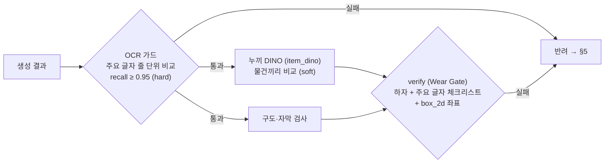
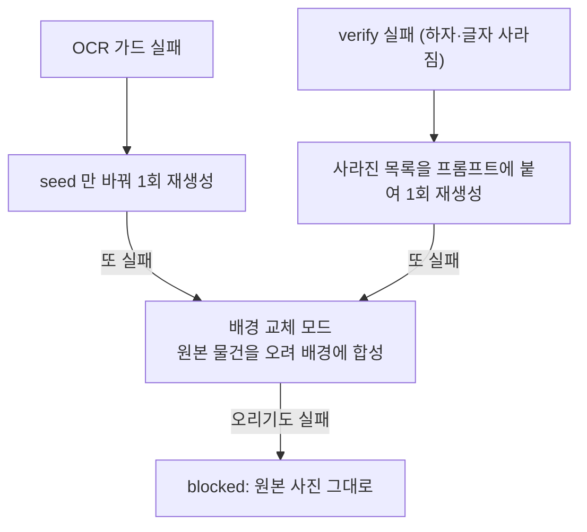

# 고치면 안 되는 흠집, 망가뜨리면 안 되는 글자

*중고 사진 AI 가 글자·로고·하자를 다루는 법 — Carret 개발기*

> 초안 (2026-09-27). `[TODO]` 는 스크린샷·수치를 채울 자리.

---

## 들어가며: 같은 모델이 반대 방향으로 틀린다

[Carret](../../Readme.ko.md) 은 대충 찍은 중고 물품 사진을 스튜디오 사진처럼 바꿔 주는 파이프라인이다.
원칙은 하나다. **배경은 바꾸고, 물건의 상태는 바꾸지 않는다.**

생성형 편집 모델(FLUX)에게 "배경만 바꿔 줘"라고 하면 두 가지 일이 동시에 일어난다.

| 대상 | 모델이 하는 일 | 중고 거래에서의 의미 |
|---|---|---|
| 얼룩·흠집·보풀 | **지운다** (새것처럼 "복원") | 허위 매물 |
| 로고·인쇄 글자 | **뭉갠다** (다시 그리다 틀림) | 가품처럼 보임, 신뢰 하락 |

하자는 *너무 잘 고쳐서* 문제고, 글자는 *너무 못 그려서* 문제다.
그래서 이 글의 주제는 결국 하나다. **무엇은 그대로 두고, 무엇은 원본대로 되돌리고, 언제 포기하는가.**

`[TODO: 흠집이 지워진 결과 / 로고가 뭉개진 결과 before-after 2장]`

---

## 1. 먼저 구분한다: 하자인가, 인쇄인가

detect 단계에서 VLM(Gemini)은 원본에서 찾은 것마다 카테고리를 하나 고른다.

| 카테고리 | 예 | 결과에서 기대하는 것 |
|---|---|---|
| `surface_damage` | 얼룩, 긁힘, 찢김, 보풀, 변색 | **그대로 보여야** 함 |
| `print` | 로고, 인쇄 글자, 자수, 라벨 | **모양·철자까지 똑같아야** 함 |
| `functional_fault` | 액정 줄, 부러진 버튼 | 그대로 보여야 함 |
| `other` | 워터마크, 배경 소품 | 상관없음 |

생각보다 이 구분이 어렵다. 커피 얼룩이 글자처럼 보이고, 빈티지 프린트는 일부러 낡게 만든 디자인이다.
지금 GT 5장 기준 detect 의 recall·precision 은 **0.67 / 0.67** 이고, 틀린 것 대부분이 printed ↔ surface_damage 혼동이다.
(다음 작업: GT 부터 다시 감사한다 — 정답이 틀렸을 수도 있으니까.)

---

## 2. 생성 전: 부탁한다 (프롬프트 잠금 두 개)

### SECONDHAND_LOCK — 하자를 고치지 마라

모든 프리셋 프롬프트 끝에 코드가 **항상** 붙이는 문장이다. Langfuse 에서 프롬프트를 고쳐도 빠지지 않는다.

```text
Do not repair, clean, restore, retouch, or smooth the product itself.
Keep every stain, scratch, tear, dent, fading, pilling, crack, and
printed logo/text exactly as in the original photo, pixel-identical.
Only the background and lighting may change.
```

### TEXT_LOCK — 이 글자를 이 자리에 그대로 그려라

생성 모델이 작은 글씨·한글을 뭉개는 건 "정답"을 모르고 다시 그리기 때문이다. 그래서 원본에서 글자를 먼저 읽어(read_text) 프롬프트에 넣어 준다.

```text
Text printed on the product — keep each one exactly as in the input image,
letter for letter, same font, size and position. Do not retype, restyle,
translate, fix, move, duplicate, or add any text: "OYSTER PERPETUAL DATEJUST" (middle-center); ...
```

09-24 실험 (각 1회 생성):

| 사진 | 글자 안 넣음 | 글자 넣음 |
|---|---|---|
| 책 (한글) | "시한부일꽈", "베스트셀지" | "시한부일까?", "베스트셀러" |
| 롤렉스 | 모델명 뭉개짐 | 선명 |
| 그래픽 티 (작은 영어 문단) | 문장 뭉개짐 | 대부분 정확 |
| 상장 | 정확 | 정확, 단 **"賞"이 하나 더 생김** |

마지막 줄이 중요하다. 메달 안의 賞 을 별도 줄로 읽었더니 모델이 **한 번 더** 그렸다.
그래서 글자마다 대략 위치(`top-left` 같은)를 같이 넣고, 같은 글자·같은 위치는 한 번만 넣는다.

읽기 프롬프트에도 규칙을 걸었다.

- **물건 위 글자만** — 배경, 벽, 셔츠 소매, 가격표는 무시 (롤렉스 사진에서 소매의 "Seoul Watch" 를 읽던 문제)
- **보이는 대로** — 철자 교정 금지, 브랜드 지식으로 채우지 말 것, 못 읽는 글자는 `?`

그리고 사진 속 글자는 곧 **외부 입력**이다. 프롬프트에 넣기 전에 개행·제어문자를 지우고 따옴표를 무력화하고 80자로 자른다 (`prompt_safe`).
사진에 "ignore previous instructions" 가 적혀 있을 수도 있으니까.

---

## 3. 함정: VLM 은 글자를 "고쳐서" 읽는다

생성 결과의 글자가 망가졌는지 보려고 결과를 다시 읽혔더니 이상한 일이 생겼다.

| 결과에 실제로 그려진 것 | VLM 이 읽은 것 |
|---|---|
| "시한부일꽈" | "시한부일까" |
| 뭉개진 "OYSTER PERPETUAL DATEJUST" | 정확한 철자 |
| "Whow te place your" (완전히 뭉개짐) | 그대로 |

**살짝 틀린 글자일수록** 언어 모델이 사전 지식으로 고쳐 읽는다. "고치지 말라"고 적어도 완전히 막히지 않는다.
검사기가 오류를 덮어 주는 셈이라 거짓 통과가 난다.

로컬 OCR 로 바꿔 봤다.

- EasyOCR: **원본부터** 오독 (백은별 → 맥은별), 작은 글씨 신뢰도 0.1 이하
- PaddleOCR: CPU 환경에서 의존성·런타임 오류로 운용 불가

전용 OCR 은 교정은 덜 하지만 인식 오류 자체가 많아서 "달라졌나" 판정에 못 쓴다.

여기서 얻은 원칙: **열린 질문(다 읽어 봐)보다 좁은 판정(이 글자가 그대로 있나?)**.
하자 검사도 "문제를 찾아라" 대신 "이 목록이 아직 보이나"로 묻는 체크리스트 방식이라 같은 원리다.

---

## 4. 생성 후: 확인한다 (세 겹)



### ① OCR 가드 — 결정론적 비교

원본 글자와 결과 글자를 **줄 단위, 순서 무관**으로 비교한다 (`metric.text_match`).
처음엔 전부 이어붙인 문자열로 비교했더니 읽는 순서만 달라도 점수가 깎였다.

모든 글자를 걸지는 않는다. 글자 하나하나가 통과 조건이라, 많이 걸수록 **VLM 읽기 오차만으로** 떨어진다.

- 박스가 큰 글자부터 **최대 8개** (성분표 같은 잔글씨 제외)
- 1글자, 80자 넘게 잘린 문장 제외
- "새로 생긴 글자" 검사는 **soft** — 두 번의 읽기가 "NIKE AIR" 를 "NIKE" + "AIR" 로 쪼개기만 해도 "새 글자"가 된다

결과 읽기 자체가 실패하면? "글자가 전부 사라졌다"가 아니라 `ocr_read_failed` 로 따로 기록한다. 못 읽은 것과 없어진 것은 다르다.

### ② item_dino — 물건이 통째로 바뀌지 않았나 (새로 넣는 중)

원본과 결과에서 **물건만 누끼를 따서** 같은 회색 배경·같은 크기에 놓고 DINOv2 로 비교한다.
배경은 일부러 바꾼 거라 이미지 전체를 비교하면 신호가 흐려지기 때문이다.

- 잡는다: 다른 물건으로 바뀜, 형태·색·무늬 변화, 로고를 새로 그림
- **못 잡는다: 작은 흠집 하나** — 물건 면적의 몇 % 라 임베딩이 거의 안 움직인다

그래서 soft 로 두고 값부터 모은다. 흠집은 여전히 ③의 몫이다.

(원래 있던 "좌표 크롭 가드"는 원본·결과를 **같은 좌표**로 잘라 비교했는데, 생성 모델이 물건을 조금만 옮겨도 어긋나서 한 번도 제대로 못 썼다. 지우고 이걸로 바꿨다.)

### ③ verify (Wear Gate) — 체크리스트

detect 가 찾은 하자 + ①에서 고른 주요 글자를 목록으로 주고, 결과에서 **각각 아직 보이는지 + 어디 있는지**를 받는다.

- 규칙: 로고·인쇄 글자는 모양·철자까지 같아야 `preserved: true`. 뭉개졌으면 false
- 좌표는 Gemini 가 학습된 형식 `box_2d [ymin, xmin, ymax, xmax]` 로 받는다
  (`x1,y1,x2,y2` 로 달라고 했더니 11개 중 4개만 제자리였다 — 가로세로가 뒤바뀜)
- 요청한 항목보다 **답이 적으면 실패** (빈 응답 포함)
- 이 좌표로 결과 이미지 위에 하자 말풍선을 띄운다 — 구매자에게 "여기 흠집 있어요"

`[TODO: 말풍선 스크린샷]`

---

## 5. 실패하면: 반려 → 재시도 → 포기



- **반려 사유를 넘긴다**: 같은 프롬프트로 다시 돌리면 같은 실수를 한다. "이전 시도에서 이 하자가 사라졌다: '왼쪽 소매 커피 얼룩'" 을 붙인다
- **배경 교체 모드**가 최후의 보루다. 물건 픽셀을 다시 그리지 않으니 하자·글자 보존이 **구조적으로** 보장된다 (대신 조명·화질은 원본 그대로)
- 아예 **생성 전에** 포기하기도 한다 (`plan`): 글자가 12줄 넘게 있는 물건(책 표지, 성분표)이나 하자 검출이 실패한 경우. 지킬 수 없는 걸 알면서 비용을 쓰지 않는다
- UI 는 **무엇을 보여주는지** 정직하게 표시한다: 생성 / 합성(원본 물건) / 원본 / "검사하지 못했습니다"

### "확인 못 함"은 통과가 아니다

이번 주에 같은 종류의 구멍을 두 번 찾았다.

1. detect 호출이 실패하면 빈 목록 `[]` → "하자 없음" → 게이트를 건너뜀
2. verify 호출이 예외로 끝나면 `gate_passed=None` → 라우팅이 None 을 통과로 취급

둘 다 "진짜 없음"과 "못 물어봄"이 같은 값이었다. 지금은 `detect_failed` / `verify_failed` 로 구분하고 배경 교체 모드로 보낸다.

---

## 6. "복원"의 경계

글자는 되살리고 흠집은 되살리지(=지우지) 않는다. 그런데 글자 복원도 어디까지가 허용일까?

| 경우 | 판단 |
|---|---|
| 생성이 뭉갠 "BLACK&DECKEN" 을 원본대로 "BLACK&DECKER" 로 | ✅ 원본으로 **되돌리는** 것 |
| 원본 자체의 오타·빛바랜 글자를 브랜드 지식으로 "바로잡기" | ❌ 물건을 바꾸는 것 |
| 원본에서도 못 읽는 작은 버튼 라벨 | ⚠️ 정답이 없어 모델이 지어냄 → 잔글씨가 많으면 배경 교체 |
| 롤렉스 다이얼이 글자와 함께 새것처럼 깨끗해짐 | ❌ TEXT_LOCK 의 부작용 — 글자에 집중하다 표면까지 "복원" |

기준은 **"원본 사진에 있던 그대로"** 하나다. 더 좋아 보이는 쪽이 아니라.

---

## 7. 아직 못 푼 것

- **작은 흠집**: 생성 모델은 계속 지우려 하고, 전역 임베딩으로는 안 보인다. 후보: 패치 단위 DINO 비교, verify 좌표에 원본 패치 되붙이기, 하자가 많으면 처음부터 배경 교체
- **임계값**: OCR 가드 0.95, `text_heavy` 12줄, item_dino 0.80 — 전부 경험값. eval 로 오차단률을 봐야 한다
- **한글**: 클라우드 OCR(CLOVA, Vision) 은 아직 실험 전
- **verify 매칭**: 지금은 답의 개수만 맞춰 본다. 하자 id 로 1:1 매칭해야 한다

---

## 정리

1. 생성 모델은 하자는 **과하게 고치고** 글자는 **못 그린다** — 방향이 반대인 두 실패를 따로 다뤄야 한다
2. **부탁(프롬프트) → 확인(가드·체크리스트) → 포기(배경 교체)** 세 단계. 부탁만으로는 안 된다
3. VLM 에게 글자를 "읽히면" 고쳐 읽는다. **좁게 묻고, 비교시켜라**
4. **확인 못 한 것을 통과시키지 마라**

`[TODO: 마무리 한 문단 — 왜 중고 거래에서 "예쁜 사진"보다 "믿을 수 있는 사진"인가]`
