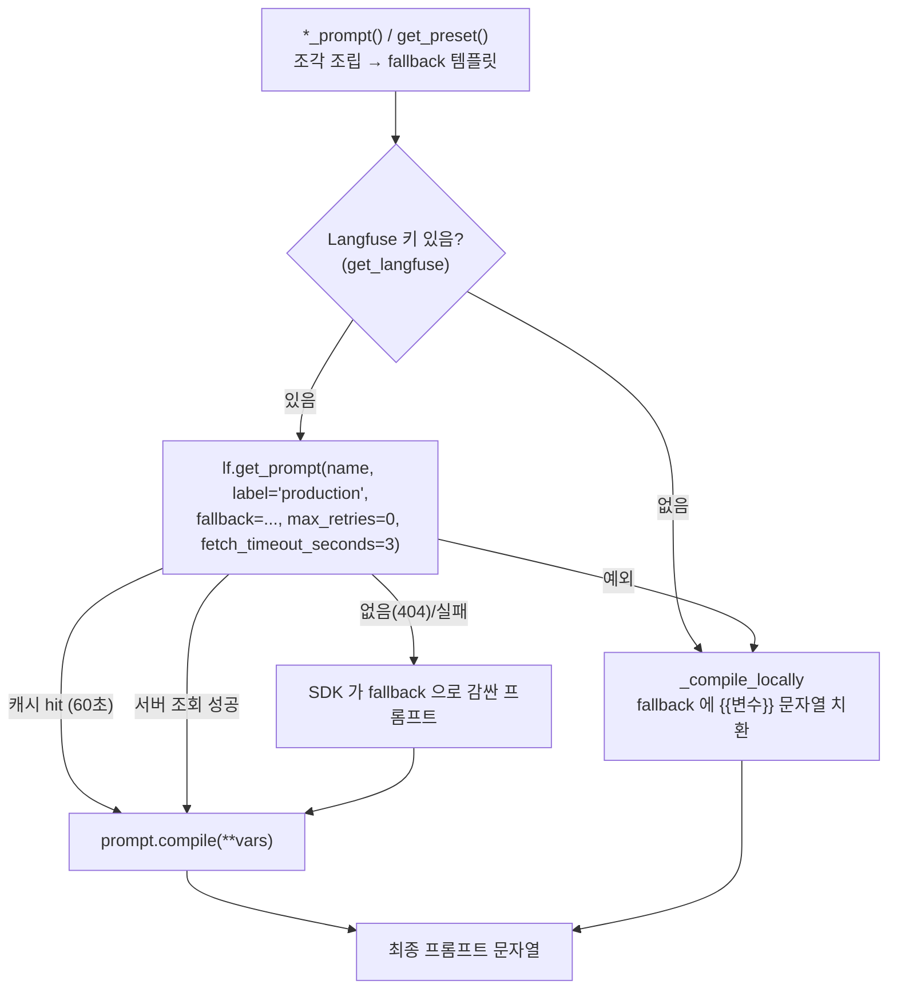

# 2026-09-26

이날 노트 5개를 한 파일로 합친 것. 섹션 참조는 §번호.

1. 오늘 한 것 전체 정리
2. LangGraph / Langfuse 문법 정리 (이 코드베이스에서 쓰는 것만)
3. 프롬프트 관리: 지금 어떻게 유지되고 있나
4. 다음에 볼 것: 점수와 "결정 지점"
5. 파이프라인 점검: 게이트 구멍 · 옛 점수 · 직렬 대기 · 글자 사후검증
6. 오후: judge 한 벌로 · 대기 시간 단축 · verify 구멍
7. 하루 마무리 (저녁 기준 — 최종 목록은 §10)
8. 저녁: 좌표 가드 → 상품 DINO 가드 (누끼 딴 물건끼리 비교)
9. 밤: VLM 비용 · text_level · 모델 비교 → 3.8-flash
10. 하루 마무리 (최종): PR 상태 · 남은 일 한 목록 ← **남은 일은 여기만 보면 된다**

---

## 1. 오늘 한 것 전체 정리

> 한 줄 요약: **md 환경 정리 → "하네스" 개념 정리 → 파이프라인 점검(과한 것/추가할 것 10개)
> → 8개 구현 → 리뷰 2회 + 테스트로 버그 3개 더 잡고 → PR #19.**
> 세부 기술 내용은 §5, 이 노트는 흐름과 판단 기록.

관련 섹션: §5 (수정 상세),
§4 (결정 지점·점수),
§2 (그래프 문법)

---

### 1. md 환경 정리 (브랜치 `chore/md-tooling`, 커밋 c044313, PR #20)

- **문제**: VS Code markdownlint 경고 158개. 전부 스타일(표 파이프 간격 MD060, 빈 줄 MD031/022/032 등)이고
  `study/` 두 파일 + `Readme.md` 에 몰려 있었다.
- **판단**: 파일을 고치지 않고 **규칙을 끔**. 특히 `backend/app/prompts/fragments/*.md` 는 LLM 에
  그대로 들어가는 프롬프트라 린트 때문에 포맷이 바뀌면 안 된다.
  - `.markdownlint.json` — 스타일 규칙 off
  - `.markdownlintignore` — `prompts/`, `llm-wiki/raw/`, `venv*/`
- **md 뷰어**: `scripts/md_serve.py` (표준 라이브러리만, 렌더는 브라우저에서 marked + mermaid)
  - `make docs` → <http://localhost:8090> (Codespaces 는 Ports 탭)
  - 폴더 = `.md` 목록, 파일 = 렌더, `?raw=1` = 원문
  - README 의 mermaid 파이프라인 그림도 그려진다

### 2. "하네스"란? — 이 프로젝트에 대입

- 하네스 = **모델 바깥에서 모델을 감싸는 코드** (입력 준비 · 제약 주입 · 출력 검증 · 재시도 · 폴백 · 기록).
- Carret 의 LangGraph 파이프라인이 곧 FLUX 를 감싼 하네스다.

| 하네스 역할 | Carret |
|---|---|
| 입력 준비 | classify / read_text / detect |
| 제약 주입 | `SECONDHAND_LOCK`, `TEXT_LOCK` 을 코드가 항상 부착 |
| 출력 검증 | 가드 · check_photo · DINOv2 · Wear Gate |
| 피드백 루프 | 반려 사유 / 사라진 하자를 프롬프트에 넣어 재생성 |
| 폴백 | composite (원본 픽셀 + 배경만 교체) |
| 관측 | inspect JSON, Langfuse, judge |

- 더 간다면: ① 에이전트형(VLM 이 도구를 골라 씀 — 유연하지만 정직성 보장은 고정 그래프가 안전),
  ② eval 하네스(회귀 측정), ③ 테스트 하네스(mock 으로 분기 검증).

### 3. 파이프라인 점검 → 추천 10개

| # | 분류 | 내용 | 결과 |
|---|---|---|---|
| 1 | 🔴 버그 | detect 실패 = "하자 없음" → 게이트 생략 | ✅ `detect_failed` |
| 2 | 🔴 버그 | judge 캐시 → 새 이미지에 옛 점수 | ✅ 캐시 제거 |
| 3 | 🔴 | 출력 가드 hard 4종이 입력이 비어 항상 통과 | ✅ OCR 가드만 살림 (사용자 선택) |
| 4 | 🟡 과함 | read_text → detect 직렬 | ✅ 병렬 |
| 5 | 🟡 과함 | DINOv2 두 번 계산 | ✅ (3 과 함께) 가드 값 재사용 |
| 6 | 🟡 과함 | composite 까지 너무 비싼 길 | ✅ `plan` 사전 라우팅 |
| 7 | 🟡 과함 | judge 가 요청 경로에서 동기 | ✅ BackgroundTasks |
| 8 | 🟢 추가 | TEXT_LOCK 사후 검증 없음 | ✅ verify 체크리스트에 글자 |
| 9 | 🟢 추가 | dev 경로가 운영과 달라짐 | ✅ `build(dev=True)` |
| 10 | 🟢 | print/logger 혼용 등 | ⏸ 안 함 |

3번은 선택지가 갈려서 물어봄: (a) OCR 가드 살리기 / (b) 가드 단순화 / (c) DINO 중복만.
→ **(a)**. 좌표 가드(feature/defect)는 생성이 물건 위치를 조금만 옮겨도 크롭이 어긋나 오차단이 나기 쉬워 제외.

### 4. 오늘 받은 질문들 (답 요약)

#### `status == "blocked"` 는 언제?
- (수정 전) 출력 가드 hard fail → seed 만 바꿔 1회 재시도 → 또 fail → 생성본 버리고 **원본을 결과로** 내보냄.
- (수정 후) 두 번째 fail 은 먼저 composite 로. **오리기까지 실패해야** blocked.
- blocked 면 score / verify / judge 를 건너뛴다 (내보내는 게 원본이라 의미 없음).

#### detect 가 "실패"한다는 건?
Gemini 호출 한 번이 망가지는 경우:
- **예외**: 네트워크·타임아웃, 429(한도), 500/503(과부하), 키 오류, 안전 필터 차단(`resp.text=None` → `TypeError`)
- **조용한 실패**: JSON 이 잘리거나 설명 문장이 붙음 → `_call` 이 `{}` 반환 → 예외 없이 "하자 0개" ← 제일 위험
- **모양 틀림**: `{"defects": "none"}`

핵심: "진짜 하자 없는 물건"과 "못 물어본 것"이 둘 다 `[]` 였다.

### 5. 작업 방식 — tester / reviewer 서브에이전트

기능 변경 → **tester(테스트 작성·실행) + reviewer(diff 리뷰) 를 병렬** 로 돌리는 게 기본 절차.
오늘 이 절차가 잡아낸 것:

| 누가 | 잡은 것 |
|---|---|
| reviewer 1차 (13건) | 글자 30줄 전부 게이트 → 오판으로 composite 급증 / S3 삭제 권한 없으면 500 / 프론트 404 무한 폴링 / detect 실패여도 생성 돌고 버림 / eval 호출부가 새 예외에 죽음 |
| reviewer 2차 (18건) | **blocked·composite 가 UI 에 안 보임** / OCR 가드가 오판 완화를 우회 / 빈 응답을 "글자 전부 사라짐"으로 읽음 / DINO(soft) 실패가 500 / **XSS** (`considered` innerHTML) / judge 저장 race |
| tester | **blocked 경로 KeyError** (verify 안 거친 경로에 `checks` 없음) / 짧은 글자 dedup 오탐 / `{"texts": null}` |

교훈:
- 리뷰가 "새로 넣은 기능이 기존 안전장치를 우회하는지"를 잘 잡는다 (OCR 가드 vs `_verify_targets` 완화책).
- 가짜(fake)가 실제 계약을 안 지키면 엉뚱한 데서 터진다 — `fake_verify` 가 요청 개수 무시 → `StopIteration`.
- 분기가 늘수록 "이 노드에 오는 모든 길에서 state 키가 채워지나"를 확인해야 한다 (`total=False` TypedDict 는 못 잡음).
- 도중에 스펙이 바뀌면 tester 를 멈추고 최종 스펙으로 다시 돌리는 게 낫다 (옛 스펙 테스트가 쌓임).

### 6. 커밋 / PR

| 브랜치 | 내용 | 상태 |
|---|---|---|
| `fix/prompt-registry-gaps` | (어제~오늘 오전) 프롬프트 시딩 누락 + 잠금 코드 부착 | PR #18 머지 |
| `fix/pipeline-gate-holes` | 오늘 파이프라인 작업 전부 + study | PR #19 머지 |
| `chore/md-tooling` | markdownlint 설정 + md 뷰어 | PR #20 → 저녁에 #21 브랜치로 합침 (§7) |

- 테스트: `pytest backend/test -m "not eval and not e2e"` → **579 passed**
- (오전 기준) 커밋 안 한 것: `ISSUES/Anchor.md` 삭제 → 저녁에 정리 (§7). next-study 노트는 이 파일 §4 로 합침

### 7. 다음에 할 것 (오전 기준 — 최종 목록은 §7)

- [ ] **eval 로 숫자 보기** — OCR 가드 오차단률(`ocr_match` 0.95), 글자 사후검증 false fail, `text_heavy` 기준 12줄, composite 비율 변화
- [ ] `detect_failed` / `composite_reason` 이 실제 트래픽에서 얼마나 나오는지 Langfuse 로 확인
- [x] genai 클라이언트 타임아웃 (실패 대신 매달리는 경우) → §6-3
- [x] OCR 읽기 ∥ check_photo 병렬 (생성 1회당 VLM 2회 직렬) → §6-3
- [ ] 가드 seed 재시도 예산이 photo 재생성과 공유되는 것 — 의도 명시
- [ ] 죽은 좌표 가드(`_guard_anchors`, `crop_sim` 없음) 살릴지 지울지
- [x] `chore/md-tooling` push / PR → #20

---

## 2. LangGraph / Langfuse 문법 정리 (이 코드베이스에서 쓰는 것만)

대상 파일: `backend/app/services/pipeline.py`, `backend/app/core/tracing.py`,
`backend/app/core/prompt_registry.py`, `backend/app/services/ai/*.py`

---

### Part 1. LangGraph

#### 1-1. import
```python
from langgraph.graph import END, START, StateGraph
```
| 이름 | 뜻 |
|---|---|
| `StateGraph` | 그래프 설계도 (노드/엣지를 붙이는 빌더) |
| `START` | 가상 시작 노드 — 첫 노드를 가리킬 때 |
| `END` | 가상 종료 노드 — 여기 도달하면 `invoke` 가 반환 |

#### 1-2. State 정의 — `TypedDict`
```python
class State(TypedDict, total=False):
    file_id: str
    anchors: list
    gen_attempts: int
    ...
```
- 그래프 전체가 들고 다니는 공유 dict 의 **스키마**.
- `total=False` → 모든 키가 선택. 그래서 노드에서 `s.get("키", 기본값)` 으로 읽는다.
- 리듀서(`Annotated[list, add]` 등)를 안 썼으므로 **키마다 "덮어쓰기"** 가 기본 동작.

#### 1-3. 노드 — `(State) -> dict`
```python
def detect(s: State) -> dict:
    ...
    return {"anchors": anchors}        # 바뀐 키만 반환
```
- 반환한 dict 가 State 에 **merge(덮어쓰기)** 된다.
- ⚠️ 반환 안 한 키는 **이전 값이 그대로 남는다** → 루프 재진입 시 오래된 값을
  명시적으로 초기화해야 함 (`mark_gate_retry` 가 `photo_check: None`,
  `guard_seed: None` 을 돌려주는 이유).
- 노드 안에서 예외를 던지면 그래프 전체가 중단되고 `invoke` 밖으로 예외가 나간다
  (`load` 의 `FileNotFoundError` → route 에서 404).

#### 1-4. 그래프 조립
```python
g = StateGraph(State)
g.add_node("detect", detect)                 # 이름, 함수
g.add_edge(START, "load")                    # 무조건 이동
g.add_edge("load", "classify")
g.add_edge("finalize", END)
```

#### 1-5. 조건부 엣지 — `add_conditional_edges`
```python
g.add_conditional_edges(
    "verify",                     # 출발 노드
    _route_after_verify,          # 라우터 함수: (State) -> str
    {"done": "save_inspect",      # 라벨 → 도착 노드 매핑
     "regen": "mark_gate_retry",
     "composite": "composite"},
)
```
- 라우터는 **State 를 읽기만** 하고 라벨 문자열만 반환 (수정 금지).
- 상태를 바꿔야 하면 → 별도 노드로 뺀다 (`mark_gate_retry` 가 그 예).
- 도착 노드를 이전 노드로 지정하면 **루프**가 된다:
  - `validate_result --retry--> generate`
  - `mark_gate_retry --> generate`
  - `composite --ok--> score_similarity`

#### 1-6. 컴파일 & 실행
```python
GRAPH = g.compile()                           # 모듈 로드 시 1회 (재사용)
out = GRAPH.invoke(
    {"file_id": file_id, "preset_key": preset_key},   # 초기 State
    {"recursion_limit": RECURSION_LIMIT},             # config
)
# out = 최종 State (dict)
```
- `recursion_limit`: 노드 실행 1번 = 1 step. 넘으면 `GraphRecursionError`.
  기본 25 → 이 코드는 루프가 많아 80. **안전망일 뿐, 실제 종료는 State 의
  카운터/플래그가 책임** (`guard_seed`, `gen_attempts`, `gate_retried`, `mode`).

#### 1-7. 그래프 없이 노드 직접 호출 (`run_transform_with_result`)
```python
s = {...}
s.update(load(s))
s.update(classify_node(s))
...
```
- 노드가 순수한 `(dict) -> dict` 라서 그래프 없이도 **수동으로 merge** 가능.
- 테스트 랩(dev)에서 "이미 있는 결과 이미지"로 뒷단만 돌릴 때 쓴다.

#### 1-8. 루프 종료 장치 요약
| 루프 | 경로 | 종료 조건 (State) |
|---|---|---|
| 가드 재시도 | validate_result → generate | `guard_seed` 가 None 이 아니면 재시도 끝 |
| 구도 재생성 | validate_result → generate | `gen_attempts >= max_generate_attempts` |
| 게이트 재생성 | verify → mark_gate_retry → generate | `gate_retried == True` |
| composite 복귀 | composite → score_similarity → verify | `mode != "generate"` 면 즉시 done |

---

### Part 2. Langfuse

원칙: **키 없으면 완전 noop, 있는데 실패해도 로컬 fallback 으로 계속 동작.**
Langfuse SDK 를 직접 쓰는 곳은 `tracing.py`, `prompt_registry.py` 두 곳뿐이고,
나머지 코드는 이 래퍼만 쓴다.

#### 2-1. 클라이언트 — `Langfuse(...)` (`tracing.py:get_langfuse`)
```python
from langfuse import Langfuse
_client = Langfuse(public_key=..., secret_key=..., host=...)
```
- 싱글톤 + double-checked locking (스레드풀 동시 첫 호출 대비).
- 키 없으면 `_disabled = True` → 이후 항상 `None` 반환.

#### 2-2. 트레이스 구간 — `observe()` (우리 래퍼)
```python
with observe("transform", as_type="span", input={...}, metadata={...}) as obs:
    ...
    if obs is not None:
        obs.update(output={...})
```
내부 SDK 호출:
```python
with lf.start_as_current_observation(name=..., as_type=..., **kw) as obs:
    yield obs
```
- `start_as_current_observation`: 구간을 열고 **현재 컨텍스트로 push** →
  이 안에서 연 `observe` 는 자동으로 자식이 된다 (트리 구조).
- 예외가 나면 SDK 가 ERROR 로 표시하고 다시 던진다.
- 키 없으면 `obs = None` → 그래서 항상 `if obs is not None` 체크.

##### `as_type` 종류 (이 코드에서 쓰는 것)
| as_type | 용도 | 쓰는 곳 |
|---|---|---|
| `"span"` | 일반 구간 (묶음) | `pipeline.run_transform` (`transform`, `transform_dev`) |
| `"generation"` | LLM/생성 모델 호출 — model, 토큰, 비용 집계 | `detector._call`, `detector.match_anchors`, `judge`, `auto_feedback`, `generator` |
| `"embedding"` | 임베딩 계산 | `embedder` (`dino_similarity`) |

##### generation 패턴 (`detector._call`)
```python
with observe(name, as_type="generation", model=settings.VLM_MODEL,
             input=prompt) as obs:
    resp = client.models.generate_content(...)
    data = json.loads(resp.text)
    if obs is not None:
        obs.update(output=data, usage_details=_usage(resp))
```
- `model=` → Langfuse 가 모델 단가로 비용 계산.
- `usage_details=` → 토큰 수. `gemini_usage(resp)` 가 Gemini 의
  `usage_metadata` 를 `{"input", "output", "thoughts", "total"}` 로 변환.
  thinking 토큰은 출력 단가로 청구되므로 `output` 에 합산.

#### 2-3. 점수 — `score()` (우리 래퍼)
```python
score("visual_similarity", sim, data_type="NUMERIC")
```
내부: `lf.score_current_trace(name=..., value=..., **kw)`
- **현재 활성 트레이스**(= 바깥 `observe("transform")`)에 점수를 붙인다.
  → 반드시 `observe` 컨텍스트 안에서 호출돼야 의미가 있음.
- 쓰는 곳: `score_similarity` (DINOv2), `run_judge` (루브릭 축별), `guards` (가드 값).

#### 2-4. 전송 — `flush()`
```python
try:
    with observe(...):
        ...
finally:
    flush()        # 내부: lf.flush()
```
- SDK 는 배치로 백그라운드 전송 → 요청 끝나면 즉시 밀어내기.
- `finally` 에 둬서 **실패한 요청의 트레이스도 유실 없이** 보낸다.

#### 2-5. 프롬프트 관리 — `get_prompt_text()` (`prompt_registry.py`)
```python
text = get_prompt_text("judge_system", fallback=TEMPLATE, rubric=rubric_text())
```
내부 SDK 호출:
```python
prompt = lf.get_prompt(name, label="production", fallback=fallback,
                       max_retries=0, fetch_timeout_seconds=3)
return prompt.compile(**variables)
```
| 인자 | 뜻 |
|---|---|
| `label="production"` | 콘솔에서 production 라벨 붙은 버전만 가져옴 |
| `fallback=` | 조회 실패 시 SDK 가 이 문자열을 프롬프트로 감싸서 반환 |
| `max_retries=0`, `fetch_timeout_seconds=3` | Langfuse 막혀도 요청이 오래 멈추지 않게 |
| `.compile(**vars)` | `{{var}}` 자리에 값 채우기 |

- 변수 문법은 **이중 중괄호 `{{name}}`** — 프롬프트 안 JSON 예시(`{"k": 1}`)와 충돌 방지.
- 키 없음 → `_compile_locally` 가 `"{{k}}"` 문자열 치환만 (`str.format` 안 씀).

---

### Part 3. 둘이 만나는 지점 (`run_transform`)
```python
try:
    with observe("transform", as_type="span", input=..., metadata=...) as obs:  # Langfuse 루트 span
        out = GRAPH.invoke(initial_state, {"recursion_limit": 80})              # LangGraph 실행
        #   └ 노드들 안의 observe(...generation...) 들이 전부 자식으로 붙음
        #   └ score(...) 들이 이 트레이스에 붙음
        result = {...}
        if obs is not None:
            obs.update(output={...})
finally:
    flush()
```
Langfuse 화면에서 보이는 트리 (예):
```
transform (span)
├─ classify (generation)
├─ item_text (generation)
├─ detect (generation)
├─ generate_image (generation)
├─ check_photo (generation)
├─ dino_similarity (embedding)
├─ verify (generation)
├─ judge (generation)
└─ scores: visual_similarity, fidelity, ...
```
※ 이 코드는 LangGraph 의 LangChain 콜백 연동(`CallbackHandler`)을 **쓰지 않는다** —
노드 단위 span 은 자동으로 안 생기고, 우리가 `observe` 를 건 호출만 보인다.

---

## 3. 프롬프트 관리: 지금 어떻게 유지되고 있나

> 한 줄 요약: **프롬프트 원본은 코드(`fragments/*.md`, 파이썬 상수)에 있고,
> Langfuse 에 같은 이름의 `production` 버전이 있으면 그걸 우선 쓴다.
> 없거나 실패하면 코드 원본(fallback)을 쓴다.**
> 그리고 실행 중에 붙는 문구(글자 고정, 재시도 사유 등)는 Langfuse 밖에서 코드로 덧붙는다.

관련 노트: `2026-09-15-langfuse.md` (도입 당시 설계), §2 (문법)

---

### 1. 3층 구조

| 층 | 위치 | 하는 일 |
|---|---|---|
| ① 원본 (소스) | `backend/app/prompts/fragments/*.md` (13개 조각), `presets.py` 의 `PRESETS`/`SECONDHAND_LOCK`, `judge.py`·`auto_feedback.py` 의 `_SYSTEM_TEMPLATE`, `rubric.py` 의 `RUBRIC` | 프롬프트 문구의 진짜 출처. git 으로 버전 관리 |
| ② 조립 | `backend/app/prompts/__init__.py` (`*_prompt()` 함수들), `presets.get_preset()` | 조각을 이어 붙여 템플릿 하나로 만들고, 변수 값을 준비 |
| ③ 조회 (레지스트리) | `backend/app/core/prompt_registry.py` → `get_prompt_text(name, fallback, **vars)` | Langfuse `production` 버전을 먼저 찾고, 없으면 ② 결과(fallback) 사용. `{{변수}}` 채워서 문자열 반환 |

모든 VLM/생성 프롬프트는 **반드시 `get_prompt_text()` 한 곳을 지난다** — 이게 이 설계의 핵심.

---

### 2. 조회 흐름



#### 캐시 (SDK 기본값)
- `get_prompt` 는 성공한 프롬프트를 **60초** 캐시 (`LANGFUSE_PROMPT_CACHE_DEFAULT_TTL_SECONDS`, 기본 60).
  → 콘솔에서 production 을 바꾸면 **최대 약 1분 뒤** 반영.
- 60초가 지나면 일단 캐시 값을 돌려주고 백그라운드에서 갱신 (요청이 안 기다림).

#### 변수 문법 `{{name}}`
- 이중 중괄호. 프롬프트 안 JSON 예시(`{"rating": 1-5}`)의 단일 중괄호와 안 겹치게.
- 로컬 fallback 은 `str.format()` 이 아니라 `"{{k}}"` **문자열 치환만** 한다 (JSON 깨짐 방지).

---

### 3. 프롬프트 목록 (Langfuse 이름 기준)

Langfuse 상태는 **2026-09-26 에 실제 조회해서 로컬 fallback 과 비교한 결과**.

| Langfuse 이름 | 로컬 원본 (fallback) | 조립 함수 | 변수 | 누가 부르나 | Langfuse |
|---|---|---|---|---|---|
| `classify` | `role_classify.md` | `classify_prompt()` | – | `classify` 노드 | v1 · 로컬과 동일 |
| `item_text` | `item_text.md` | `item_text_prompt()` | `item` | `read_text` 노드 | v1 · 동일 (09-26 등록) |
| `detect` | `role_detect` + hints + `categories` + `rules_detect` + `schema_detect` | `detect_prompt()` | `item`, `hints` | `detect` 노드 | v1 · 동일 |
| `preset_studio_white` 외 2개 | `PRESETS[key]["fallback_prompt"]` (+ `SECONDHAND_LOCK`) | `get_preset()` | – | `load` 노드 → `generate` | v1 · 동일 |
| `check_photo` | `role_check_photo` + `schema_check_photo` | `check_photo_prompt()` | – | `validate_result` 노드 | v1 · 동일 (09-26 등록) |
| `verify` | `role_verify` + `rules_verify` + `schema_verify` | `verify_prompt()` | `item`, `checklist`, `lines` | `verify` 노드 | v2 · 동일 |
| `judge_system` | `judge._SYSTEM_TEMPLATE` | `judge._system_prompt()` | `rubric` (`rubric_text()`) | `run_judge` 노드 | v1 · 동일 |
| `detect_box` | `detect_box.md` | `detect_box_prompt()` | – | `util/evaluator.py` (평가용) | v1 · 동일 |
| `match` | `match.md` | `match_prompt()` | `orig`, `result` | `util/evaluator.py` (평가용) | v1 · 동일 |
| `auto_feedback_system` | `auto_feedback._SYSTEM_TEMPLATE` | `auto_feedback._system_prompt()` | – | `ingest.py` (자동 피드백) | v1 · 동일 (09-26 등록) |

> 조각 파일(`fragments/*.md`)은 `frag()` 가 프로세스당 1번 읽고 `_cache` 에 보관 →
> **md 파일을 고치면 서버 재시작해야** fallback 에 반영된다.

---

### 4. Langfuse 밖에서 덧붙는 문구 (런타임 조립)

Langfuse 에 저장된 건 "기본 템플릿"뿐이다. 실행 중에 코드가 아래를 **뒤에 이어 붙인다**
— 이 부분은 콘솔에서 안 보이고 못 고친다. 실제로 모델에 들어간 최종본은
State 의 `prompt_used` / Langfuse generation 의 `input` 에서 확인.

#### 이미지 생성 (`pipeline.generate`) — 붙는 순서
```
preset_<key>                      ← Langfuse / fallback (SECONDHAND_LOCK 포함)
+ text_lock(item_texts)           ← presets.text_lock: 원본 물건 위 글자 "letter for letter" 고정
+ gate_note                       ← mark_gate_retry: 게이트에서 사라진 하자 목록 (재생성 때만)
+ "IMPORTANT: a previous attempt was rejected ..."  ← photo_check 반려 사유 (재생성 때만)
```
- 사진/VLM 에서 온 글자는 `prompt_safe()` 로 정리 후 삽입:
  개행·제어문자 제거, `"` → `'`, 80자 제한 (사진에 적힌 문장이 지시문처럼 읽히는 것 방지).
- `text_lock` 은 최대 30줄, 같은 (글자, 위치) 중복 제거, 위치는 `top-left` 같은 9분할.

#### VLM 호출의 user 쪽 문구
- `judge()`, `generate_feedback()` 의 `user_prompt` ("Image1: ORIGINAL, Image2: RESULT ...") 는
  **코드 하드코딩** — Langfuse 관리 대상 아님.
- `verify_prompt()` 의 `lines`(앵커 목록), `detect_prompt()` 의 `hints`(classify 의 considered) 는
  변수로 들어가므로 템플릿은 Langfuse, 값은 런타임.

#### 프롬프트 외 설정
- thinking(생각 토큰) 켜기/끄기는 프롬프트가 아니라 `core/vlm.py::thinking(name)` 에서 **호출 이름별**로 결정.
- `temperature=0`, JSON 모드도 `detector._call` 코드에 고정.

---

### 5. 운영 흐름 (어떻게 바꾸나)

#### 최초 등록 — 시딩
```bash
cd backend && python scripts/seed_langfuse_prompts.py
```
- `prompts_to_seed()` 의 모든 항목을 `create_prompt(..., labels=["production"])` 로 등록.
- **다시 돌리면 모든 프롬프트에 새 버전이 하나씩 생기고 production 이 그쪽으로 옮겨감**
  → "코드 fallback 상태로 전부 되돌리기" 용도로만.

#### 문구를 바꾸고 싶을 때 — 두 갈래
| 방법 | 절차 | 반영 |
|---|---|---|
| A. 콘솔에서 | Langfuse → Prompts → 새 버전 작성 → `production` 라벨 이동 | 배포 없이 ~1분 내 |
| B. 코드에서 | `fragments/*.md` 등 수정 → 커밋/배포 → **Langfuse 에도 동기화** (시딩 재실행 또는 콘솔에 붙여넣기) | 동기화해야 반영 |

⚠️ **B 의 함정: 코드만 고치면 반영이 안 된다.** Langfuse 에 production 버전이
있으면 그게 이기고, fallback(코드)은 Langfuse 가 없거나 실패할 때만 쓰이기 때문.
(`verify` 가 v2 인 건 09-24 `rules_verify`/`schema_verify` 수정 뒤 누군가 동기화했다는 뜻 — 현재는 전부 동일.)

⚠️ **A 의 함정: 코드와 어긋난다.** 콘솔에서만 고치면 git 에는 옛 문구가 남아서,
Langfuse 가 꺼진 환경(로컬 테스트·CI)과 운영이 **다른 프롬프트로 돈다.**
콘솔에서 좋은 버전을 찾으면 코드 fallback 에도 옮겨 적기.

---

### 6. 오늘 조회하며 발견한 것 → 수정 완료 (브랜치 `fix/prompt-registry-gaps`)

> **해결 요약**
> - 1·2 → 템플릿 조립을 `detect_template()`/`verify_template()`/`check_photo_template()` 로 공유,
>   시딩 목록에 `item_text`·`check_photo` 추가, 3개 등록 → 조회 170ms → 0ms(캐시).
>   시딩 기본 동작은 "없는 이름만", 덮어쓰기는 이름 지정 또는 `--all`.
>   `test_seed_prompts.py` 가 코드의 `get_prompt_text("이름")` 을 전부 찾아 시딩 목록과 대조 (드리프트 방지).
> - 3 → `SECONDHAND_LOCK` 을 fallback 에서 빼고 `get_preset()` → `with_secondhand_lock()` 이
>   항상 맨 끝에 1번 붙임 (기존 잠금은 떼고 다시 붙임).
>   ⚠️ Langfuse 의 preset v1 은 아직 잠금 포함 — **배포 후에** `seed_langfuse_prompts.py preset_studio_white preset_warm_wood preset_minimal_gray` 로 교체.

(아래는 발견 당시 기록)

1. **미등록 3개: `item_text`, `check_photo`, `auto_feedback_system`**
   - 시딩 스크립트 `prompts_to_seed()` 에 `item_text`, `check_photo` 가 **아예 빠져 있다** (09-24 에 새로 생긴 프롬프트).
     `auto_feedback_system` 은 목록엔 있지만 추가 이후 시딩을 다시 안 돌린 것으로 보임.
   - 동작은 문제없음 — 항상 코드 fallback 사용. 대신 콘솔에서 수정/버전 비교 불가.
2. **미등록 프롬프트는 호출마다 Langfuse 에 404 조회를 한다 (캐시 안 됨)**
   - 실측: 등록된 `classify` 는 첫 호출 이후 0ms (캐시), 미등록 `check_photo` 는 **매번 약 170ms**.
   - `item_text`·`check_photo` 는 변환 1회마다 호출되고 `check_photo` 는 재생성 루프마다 또 불린다
     → 요청당 수백 ms 가 그냥 더해진다.
   - 해결: 시딩 목록에 추가 후 등록하면 캐시로 사라짐.
3. **`SECONDHAND_LOCK`(물건 보정 금지 문구)이 Langfuse 프리셋 텍스트 안에 통째로 들어 있다**
   - 콘솔에서 프리셋 문구를 고치다 이 문장을 지우면 **정직성 잠금이 사라져도 코드로는 못 막는다.**
   - 대안: 잠금 문구는 `text_lock` 처럼 코드에서 항상 뒤에 붙이고, Langfuse 에는 배경 묘사만 두기.

---

### 7. 파일 지도 (빠르게 찾기)

```
backend/app/
├─ core/prompt_registry.py     get_prompt_text(), _compile_locally()   ← 유일한 조회 입구
├─ prompts/
│  ├─ __init__.py              frag(), classify/detect/verify/item_text/check_photo/detect_box/match_prompt()
│  ├─ presets.py               PRESETS, SECONDHAND_LOCK, get_preset(), text_lock(), prompt_safe()
│  ├─ rubric.py                RUBRIC → rubric_text() (judge_system 의 {{rubric}})
│  └─ fragments/*.md           13개 조각 (role_* / rules_* / schema_* / categories ...)
├─ services/ai/judge.py        _SYSTEM_TEMPLATE (judge_system) + user_prompt 하드코딩
├─ services/ai/auto_feedback.py _SYSTEM_TEMPLATE (auto_feedback_system)
└─ services/pipeline.py        generate(): preset + text_lock + gate_note + 반려 사유 조립
backend/scripts/seed_langfuse_prompts.py   코드 fallback → Langfuse production 등록
```

---

## 4. 다음에 볼 것: 점수와 "결정 지점"

> 한 줄 요약: **노드를 하나씩 다 뜯어볼 필요는 없다. "결과를 바꾸는 결정"을 내리는
> 곳 3군데와, 그 결정에 쓰이거나(또는 안 쓰이는) 점수들만 보면 된다.**
> 나머지 노드는 저장·기록용 배관이라 피드백 반영하다 걸릴 때 보면 충분하다.

관련 섹션: §2 (그래프 문법),
§3 (프롬프트 관리)
관련 계획: 피드백 반영 계획 문서 (Phase 0~3) — <https://claude.ai/code/artifact/e4c8e3b3-d69c-4a41-b765-5121a98d1bde>

---

### 1. 노드를 다 봐야 하나? → 아니다

파이프라인 노드는 두 종류로 나뉜다.

| 종류 | 노드 | 볼 필요 |
|---|---|---|
| **결정** (다음 경로·최종 결과를 바꿈) | `validate_result` (가드 + 구도 검사 → 재생성), `verify` (게이트 → 재생성/배경 교체), `composite` (배경 교체) | **꼭 본다** |
| **입력 준비** (결정에 쓸 재료를 만듦) | `classify_node`, `read_text`, `detect`, `generate` | 프롬프트 뜯어볼 때 같이 본다 |
| **관측·기록** (점수만 남기고 결과는 안 바꿈) | `score_similarity`, `run_judge`, `save_inspect`, `finalize` | 대충만 — 무엇을 남기는지만 알면 됨 |
| **배관** | `load`, `_record_result_safe` 등 | 안 봐도 됨 |

그래서 공부 순서는 "노드 순서"가 아니라 **"결정 지점 → 그 결정이 믿는 점수"** 순서가 맞다.

---

### 2. 점수 지도 — 뭐가 있고, 실제로 뭘 결정하나

| 점수 | 계산 방법 | 어디서 | 결정에 쓰이나 | 지금 상태 |
|---|---|---|---|---|
| `gate_passed` | VLM이 결과에서 앵커(하자·글자)를 찾음 → `detector.all_preserved` | `verify` | **예** — 실패 시 재생성 1회 → 그래도 실패면 composite | 유일하게 제대로 동작하는 게이트 |
| `photo_check.valid` | VLM "제대로 된 사진인가" | `validate_result` | **예** — invalid면 재생성 | 동작 |
| 가드 hard 4종 (`feature_preserved`, `defect_visible`, `ocr_match`, `no_added_text`) | 크롭 유사도 / OCR 비교 | `validate_result` → `guards.py` | 예 (실패 시 재시도 → block) | **사실상 항상 통과** (아래 3-1) |
| `dino_band` (soft) | DINOv2 코사인 유사도가 0.75~0.995 안인가 | `guards.py` | 아니오 (soft) | 관측만 |
| `visual_similarity` | DINOv2 코사인 유사도 (원본 vs 결과 전체) | `score_similarity` | 아니오 | 관측만. 가드와 **중복 계산** |
| `fidelity` / `realism` / `trust` | VLM judge, `rubric.py` 기준 1~5 | `run_judge` | 아니오 | 관측만. 자전거 바퀴살은 정확히 잡음 (fidelity 2) |
| 에이전트 `rating` / `tags` | VLM "판매자라면 몇 점?" | `ingest` → `auto_feedback.py` | 아니오 | 너무 후함 (19건 중 17건 5점), tags 항상 비어 있음 |
| `metric.text_match` | 줄 단위 글자 비교 (recall / changed / added) | `scripts/run_text_check.py` 만 | 아니오 | 파이프라인 **미연결** — 계획 2c에서 쓸 후보 |

Langfuse Score로 올라가는 건 `visual_similarity`, 가드 값들, judge 3축이다 (`tracing.score()`).

**핵심 관찰:** 정말 결과를 바꾸는 점수는 `gate_passed`와 `photo_check` 둘뿐이다.
judge는 문제를 잘 잡는데 결정에 안 쓰이고, 가드는 결정에 쓰이는데 값이 비어 있다.
피드백 반영의 큰 방향이 여기서 나온다 → "잘 잡는 점수를 결정에 연결".

---

### 3. 코드 보며 발견한 것 (공부하면서 직접 확인해 볼 것)

#### 3-1. 가드가 사실상 비어 있다
- `pipeline._guard_anchors`는 `box`가 있는 앵커만 넘기는데, `detect` 앵커는 `what/where`뿐이라 **전부 걸러진다** → feature/defect 가드 0개.
- `_run_guards`는 OCR 자리에 `[], []`를 넘긴다 → `text_recall("", "")` = 1.0 → `ocr_match` 통과, `no_added_text`도 통과.
- 남는 건 soft인 `dino_band`뿐 → **hard 가드가 block하는 경우가 없다.**
- `embedder.crop_sim`은 아직 없다 (`guards.py` docstring에 제안만 있음).

#### 3-2. DINOv2를 두 번 돌린다
- `guards.run_output_guards`의 `dino_band`와 `score_similarity`의 `visual_similarity`가 같은 계산.

#### 3-3. judge 결과가 캐시된다
- `run_judge`는 `quality/{file_id}_{preset}.json`이 이미 있으면 다시 안 돌린다.
- 같은 file_id로 재실행하는 평가(계획 Phase 0)에서는 **옛 점수가 그대로 남는다** → 평가 세트는 매번 새 file_id거나 캐시 무시 옵션 필요.

#### 3-4. composite 후 게이트 값이 옛날 것
- `composite` 뒤에 `verify`를 다시 안 돌려서 `results.gate_passed`는 생성본 기준 (bicycle 사례).

#### 3-5. 게이트는 "있다/없다"만 본다
- `all_preserved`는 앵커 개수와 preserved 여부만 본다. 글자가 **다른 글자로 바뀐** 경우(H→M)는 "글자 있음"으로 통과할 수 있다.

---

### 4. 앞으로 볼 것 — 피드백 계획 Phase에 맞춘 순서

각 Phase를 시작할 때 그 줄만 보면 된다. 미리 다 볼 필요 없음.

| 언제 | 볼 것 | 파일 | 왜 |
|---|---|---|---|
| Phase 0 (평가 세트) | 기존 앵커 평가 구조, judge 캐시 | `storage/dataset/GT.json`, `dev.py`의 `/eval-all`·evaluator, `pipeline.run_judge` | 새로 만들지 말고 여기에 붙이기 (3-3) |
| Phase 1 (에이전트 보정) | 에이전트 프롬프트, rubric, 태그 목록 | `auto_feedback.py`, `rubric.py`, `store.FEEDBACK_TAGS` | judge rubric을 에이전트에도 쓸지 판단 |
| Phase 1 (기록 정정) | 결과 기록 흐름 | `pipeline.save_inspect`·`finalize`, `store.record_result` | `mode` 저장 (3-4) |
| Phase 2a (워터마크) | 앵커 뽑는 프롬프트 | `detect` 노드 → `detector.py`, `prompts/fragments/*` | 오버레이 제외 규칙 |
| Phase 2b (composite 품질) | 게이트 라우팅, 오리기 | `_route_after_verify`, `composite`, `compositor.py` | judge를 결정에 연결 |
| Phase 2c (글자 비교) | 글자 읽기 + 비교 함수 + 가드 OCR 자리 | `read_text` 노드, `metric.text_match`, `_run_guards` | 이미 있는 부품 연결만 하면 됨 (3-1, 3-5) |
| 여유 있을 때 | 가드 정리 | `guards.py`, `embedder.py` | 비어 있는 hard 가드를 살릴지 지울지 (3-1, 3-2) |

**점수 "이론"은 따로 공부 안 해도 된다.** 쓰는 건 세 가지뿐이다.
- 코사인 유사도 (DINOv2 임베딩 두 개의 각도, 1에 가까울수록 비슷)
- `difflib.SequenceMatcher.ratio()` (문자열 유사도 0~1)
- VLM에게 rubric 주고 1~5 받기

---

### 5. 공부 방법 추천 — 노드 대신 "한 장 따라가기"

1. 문제 있던 결과 하나를 고른다 (예: `sop_bicycle_01`, file_id `4056c3966e1a4ea6bfce84d52b837774`).
2. Langfuse 트레이스에서 노드 순서대로 **결정 지점의 값만** 본다: `photo_check` → `gate_passed`와 `checks` → 재생성 → composite.
3. `storage/quality/{file_id}_studio_white_inspect.json`과 같이 놓고 "어디서 막았어야 했나"를 적는다.
   - bicycle 답: 워터마크 앵커 때문에 게이트가 헛돌았고(2a), composite 결과를 검사하는 곳이 없었다(2b).

이렇게 2~3장만 따라가면 노드 전체를 읽는 것보다 빨리 구조가 잡힌다.

---

## 5. 파이프라인 점검: 게이트 구멍 · 옛 점수 · 직렬 대기 · 글자 사후검증

> 한 줄 요약: **"검사를 못 했다"를 "검사해서 괜찮았다"로 처리하던 곳이 두 군데 있었다**
> (detect 실패 → 게이트 생략, judge 캐시 → 옛 점수). 둘 다 고쳤고, 덤으로
> read_text ∥ detect 병렬화와 TEXT_LOCK 사후 검증을 붙였다.

관련 섹션: §4 (결정 지점),
§2 (그래프 문법)

---

### 1. detect 실패가 Wear Gate 를 통째로 건너뛰던 문제 🔴

#### 증상 (고치기 전)

```text
detect 예외 ─▶ anchors = []  (print 한 줄 남기고 무시)
            ─▶ verify: "앵커가 없네" → 검사 안 함, gate_passed = None
            ─▶ _route_after_verify: None 은 False 가 아님 → "done"
            ─▶ 생성본이 결함 검증 없이 그대로 나감
```

- 원칙이 "상태는 바꾸지 않는다"인데, Gemini 가 한 번 삐끗하면 FLUX 가 흠집을 지운
  결과물도 **아무 검사 없이** 나갈 수 있었다.
- `_call` 이 JSON 파싱 실패를 `{}` 로 삼키기 때문에, 예외조차 안 나고
  `defects` 키가 없는 빈 응답 → "하자 0개" 로 조용히 통과하는 경로도 있었다.

#### detect 가 실패하는 경우는 구체적으로?

`detect` 는 Gemini VLM 호출 한 번이다 (`detector._call`). 실패 원인은 크게 셋:

| 종류 | 예 | 전에는 |
|---|---|---|
| **호출 자체 실패 (예외)** | 네트워크 끊김·타임아웃, 429 (분당 한도/쿼터 초과), 500/503 (Gemini 과부하 — flash 계열에서 흔함), API 키 만료·오류 | 예외 → `anchors=[]` |
| **응답은 왔는데 JSON 이 아님** | 출력이 중간에 잘림 (생각 토큰이 길어져 출력 한도 도달 — detect 는 thinking 기본값), 모델이 JSON 앞뒤에 설명 문장을 붙임 | `_call` 이 `{}` 반환 → **예외도 없이** 하자 0개 |
| **응답이 비어 있음** | 안전 필터로 차단되면 `resp.text` 가 `None` → `json.loads(None)` 이 `TypeError` (JSONDecodeError 가 아니라서 안 잡히고 예외로 올라옴) | 예외 → `anchors=[]` |
| **모양이 틀림** | `{"defects": "none"}` 처럼 목록이 아닌 값 | 반복문이 문자열을 돎 → 이상한 앵커 or 0개 |

즉 **"진짜 하자가 없는 물건"과 "모델한테 못 물어본 것"이 둘 다 `[]` 로 같아 보였다**는 게 핵심.

> 참고: genai 클라이언트에 타임아웃을 따로 안 걸어서, "실패"가 아니라 **오래 매달리는**
> 경우도 있을 수 있다 (별도 과제).

#### 수정

- `detector.detect_defects`: 응답에 `defects` **목록**이 없으면 `ValueError` — 빈 응답을 실패로 격상.
- `pipeline.detect`: `DETECT_ATTEMPTS = 2` 회 시도, 둘 다 실패면 `detect_failed=True`.
- `verify`:
  - `detect_failed` + 생성본 → VLM 안 부르고 `gate_passed=False`
  - `detect_failed` + 합성본(composite) → `gate_passed=None` (물건 픽셀이 원본이라 검증 대상 아님)
- `_route_after_verify`: `detect_failed` 면 재생성(`mark_gate_retry`) 건너뛰고 **바로 composite**
  — 재생성해도 비교 기준(원본 하자 목록)이 없으니 돈만 쓴다.
- `detect_failed` 는 inspect JSON · `run_transform` 결과 · Langfuse output 에 남는다.
  (API 응답 스키마 `TransformResponse` 에는 아직 없음 — UI "검증 불가" 표시하려면 추가 필요)

```text
detect 2회 실패 ─▶ detect_failed=True ─▶ plan: 생성 전에 바로 composite (FLUX 안 부름)
  ├ 오리기 성공 → score/verify (gate=None, 검증 대상 아님) → 저장, mode=composite
  └ 오리기 실패 → 그때 generate → verify: gate_passed=False
        → composite (이미 실패한 오리기라 재호출 안 함) → mode=composite_failed, 생성본
          (UI: "하자 검사를 하지 못했습니다 — 생성 이미지에서 하자가 지워졌을 수 있어요")
```

> 처음엔 generate 를 1회 돌린 뒤 composite 로 보냈는데, 리뷰에서 "결과를 어차피 버린다"는
> 지적 → `plan` 노드로 생성 전 분기 (아래 7-6).

---

### 2. judge 캐시가 옛 점수를 돌려주던 문제 🔴

- `run_judge` 는 `quality/{file_id}_{preset}.json` 이 **있으면 다시 채점 안 함**.
- 파일 이름에 결과 이미지 정보가 없다 → 같은 사진·같은 프리셋을 다시 변환하면
  **이미지는 새것, 점수는 지난번 것**.
- `blocked` (원본을 내보냄) 이면 judge 를 건너뛰는데, `api/routes/transform.py` 는
  그 파일을 그대로 읽어 응답에 넣으므로 → 원본 사진에 옛 생성본 점수가 붙어 나감.

수정:
- 캐시 삭제. `run_judge` 시작 시 옛 성적표를 **먼저 지우고** 항상 새로 채점
  (blocked · judge 실패여도 옛 점수가 남지 않음). mock 경로도 지움.
- `storage.delete(kind, name)` 신설 — Local(`unlink(missing_ok)`) / S3(`delete_object`).
  S3 모드여도 **로컬 사본까지 지운다**: `storage.load` 가 로컬로 폴백하므로 안 지우면 되살아남.

교훈: **캐시 키에 입력(결과 이미지)이 안 들어가 있으면 그건 캐시가 아니라 오래된 값이다.**

---

### 3. read_text → detect 직렬 대기 🟡

- 둘 다 `classify` 결과(item)만 쓰고 서로 독립인데 순서대로 돌고 있었다 → VLM 왕복 1회 낭비.
- LangGraph 팬아웃/조인으로 변경:

```python
g.add_edge("classify", "read_text")
g.add_edge("classify", "detect")
g.add_edge(["read_text", "detect"], "generate")   # 둘 다 끝나야 generate
```

- 리스트 형태 `add_edge([...], target)` = **조인(대기) 엣지**. 한쪽만 끝나서는 generate 가 안 돈다.
- 두 가지가 같은 superstep 에서 돌기 때문에 **쓰는 state 키가 겹치면 안 된다**
  (reducer 없는 키를 둘이 쓰면 `InvalidUpdateError`). read_text 는 `item_texts/item_box`,
  detect 는 `anchors/detect_failed` 라 안전.
- generate 로 들어오는 다른 엣지(validate_result 재시도, mark_gate_retry)는 조인과 별개 트리거라
  재시도 루프에는 영향 없음.

---

### 4. TEXT_LOCK 사후 검증 🟢

- TEXT_LOCK 은 생성 **전에** "이 글자 그대로 둬"라고 부탁만 한다. 지켜졌는지 확인하는 곳이 없었다.
- `_verify_targets()`: verify 체크리스트 = detect 앵커 + read_text 글자
  (`{"category": "print", "what": 'text: "ABC"', "where": "top-center"}`).
  - detect 가 같은 글자를 이미 print 앵커로 올렸으면(대소문자 무시 부분일치) 중복 제외
  - 최대 `TEXT_LOCK_MAX_LINES` 개
- 뭉개지면 `preserved:false` → 게이트 실패 → 사라진 글자를 프롬프트에 넣어 재생성 → 그래도면 composite.
- `rules_verify.md` 의 Rule 2 ("printed text must remain EXACTLY identical")가 이미 있어서
  프롬프트는 안 건드림. 말풍선은 `bubbles()` 가 `text:` 접두어를 🏷️ 로 바꿔 보여준다.
- ⚠️ 트레이드오프: VLM 이 작은 글씨를 잘못 읽으면 멀쩡한 생성본도 composite 로 빠진다
  (**false fail**). eval 에서 composite 비율이 튀는지 봐야 함.

---

### 5. 테스트 쪽에서 바뀐 것 (1차)

- 기존 `fake_verify` 가 요청 개수와 상관없이 항상 1건만 답했다 → 글자 항목이 추가되자
  "답이 모자람 = 게이트 실패"로 루프를 돌다 가짜 가드 이터레이터가 바닥나 `StopIteration`.
  → **요청 항목마다 1건** 답하도록 수정. (가짜가 실제 계약 — `expected` 개수 — 을 안 지키면
  이런 식으로 엉뚱한 곳에서 터진다.)
- `_expected()` / obs output 기대값에 `detect_failed` 추가.

### 6. 1차 리뷰 반영 (reviewer 13건 중 주요)

| 지적 | 조치 |
|---|---|
| 글자 30줄을 전부 게이트 조건으로 → 오판으로 composite 급증 | `_key_texts()`: 박스 큰 순 최대 8개, 1글자·80자 넘게 잘린 문장 제외, print 앵커하고만 중복 비교 |
| S3 `DeleteObject` 권한 없으면 비용 다 쓴 변환이 500 | `_clear_quality()` 로 감싸서 무시 |
| 성적표 404 폴링이 무한히 쌓임 | 상한 2분, 새 업로드/변환 시 끊기 + 세대 토큰으로 늦은 응답 버림 |
| detect 실패여도 생성 루프 다 돌고 버림 | `plan` 노드에서 **생성 전에** composite 로 |
| 합성본(원본 픽셀)에 "보존 안 됨" 경고 | composite 결과는 글자 항목 없이 앵커만 검사 |
| eval/dev 호출부가 새 예외에 죽음 | `detect_defects(strict=False)` 기본값 유지, 파이프라인만 `strict=True` |

### 7. 추가로 한 것 (3 · 6 · 7 · 9)

#### 3. OCR 가드 살리기
- 원본 글자(read_text 가 이미 읽음, `_key_texts` 로 고른 것) vs 결과 글자(결과를 한 번 더 읽음)를
  `metric.text_match` (줄 단위·순서 무관)로 비교. `ocr_match` recall ≥ 0.95 = hard.
- 결과 읽기가 깨지면(`{}`) "글자 전부 사라짐"이 아니라 `ocr_read_failed` — `read_item_text(strict=True)`.
- `no_added_text` 는 **soft 로 내림**: 두 번의 VLM 읽기가 줄만 다르게 쪼개도("NIKE AIR" → "NIKE"+"AIR")
  "새 글자"로 잡힌다. 새로 얹힌 자막은 check_photo 가 따로 잡음.
- hard fail 2회 → 예전엔 blocked(원본). 이제 **composite**, 그것도 실패해야 blocked.
- 가드의 dino 값을 `visual_similarity` 로 재사용 (DINOv2 중복 계산 제거). dino 는 soft 라 계산 실패해도 500 안 냄.
- 비용: 원본에 글자가 있는 물건만, 생성 1회당 VLM 1회 추가.
- ⚠️ 임계값 0.95 는 경험값. eval 로 오차단률 봐야 함.

#### 6. `plan` — 생성 전 composite
```python
detect_failed                          → "detect_failed"
len(item_texts) >= 12 (설정, 0=끔)      → "text_heavy"
len(anchors) >= N (기본 꺼짐)           → "many_defects"
```
- 오리기가 실패하면 그때 정상 생성으로. 같은 실행에서 이미 실패한 오리기는 다시 안 부름.
- 이유는 `composite_reason` 으로 응답·inspect·Langfuse 에 남음.

#### 7. judge 백그라운드
- 라우트: `run_transform(defer_judge=True)` → 응답 → `BackgroundTasks` 로 `judge_later()`.
- 점수는 같은 Langfuse 트레이스에(`trace_context={"trace_id", "parent_span_id"}`).
- 채점 중 같은 쌍이 재변환되면(결과 이미지 바뀜) 저장 전·후 두 번 확인해서 옛 점수를 버림.
- 새 `GET /api/quality/{file_id}/{preset}` — `/storage` 정적 마운트는 로컬 디스크만 서빙해서 S3 모드에선 늘 404 였다.
- eval/dev 는 기본값(동기 채점) 그대로.

#### 9. dev 경로 = 운영 그래프
- `build(dev=True)`: generate 자리에 `use_provided`, 재생성·composite 루프만 뺀 **같은 그래프**.
- 매 호출 빌드 → 테스트의 monkeypatch 된 노드 함수가 반영됨.

### 8. 2차 리뷰 반영

- **UI 정직성**: blocked(원본을 보여줌)·composite·detect_failed 가 화면에 안 드러났다 →
  응답에 `status` 추가, 게이트 배지를 **무엇을 보여주는지**(원본 / 합성 / 생성)에 따라 다르게.
  예: detect 실패 + 합성 실패 후 생성본인데 "원본 사진 사용"이라고 쓰면 거짓말.
- **XSS**: `considered`(VLM 출력)를 `innerHTML` 로 넣고 있었다 — 사진 속 글자로 프롬프트 주입 →
  `` 가능. `textContent` 로.
- 채점 대기 중엔 라우트가 quality 파일을 읽지 않음 (삭제 실패 시 옛 점수 반환 방지).
- 가드 불합격 → 합성 성공 시에도 어떤 가드가 걸렸는지 `guard_report` 유지.

### 9. 테스트에서 잡힌 버그 (tester)

- **blocked 경로 KeyError** — 가드 2회 불합격 → 오리기 실패 → blocked 경로는 `verify` 를 안 거쳐서
  `checks`/`gate_passed` 가 state 에 없다 → `save_inspect` 의 `s["checks"]` 에서 KeyError → **500**.
  "원본을 그대로 내보낸다"는 가장 보수적인 경로가 오히려 죽고 있었다.
  - 수정: 그 분기에서 `checks=[]`, `gate_passed=None` 을 채우고, 뒷단(`save_inspect`/`finalize`)도 `.get` 으로.
  - 교훈: **분기가 늘면 "이 노드까지 오는 모든 길에서 이 키가 채워지나"를 따져야 한다.**
    `TypedDict(total=False)` 라 타입 검사는 못 잡는다.
- `_key_texts` 중복 제거가 부분 문자열이라 "on" 같은 짧은 글자가 `"print on chest"` 에 걸려 검증에서 빠짐
  → 3글자 이상 + 단어 단위(`_covered_by`)로만.
- `read_item_text` 가 `{"texts": null}` 에 TypeError → `or []`.

최종: 단위 테스트 **579 passed** → PR #19 (#18 위에 쌓음).

### 남은 것 (오전 기준 — 최종 목록은 §7)

- [ ] eval 로 확인: OCR 가드 오차단률, 글자 사후검증 false fail, `text_heavy` 기준(12줄), composite 비율
- [x] genai 클라이언트 타임아웃 → §6-3
- [x] OCR 읽기와 check_photo 병렬화 (생성 1회당 VLM 2회가 직렬) → §6-3
- [ ] 가드 seed 재시도 예산이 photo 재생성과 공유됨 — 2번째 시도에서 처음 가드 실패하면 재시도 없이 composite (의도 명시 필요)
- [ ] feature/defect 좌표 가드(`_guard_anchors`, `crop_sim` 없음)는 여전히 죽은 경로 — 살릴지 지울지

---

## 6. 오후: judge 한 벌로 · 대기 시간 단축 · verify 구멍

PR #19·#18 머지 후 이어서 한 것 (브랜치 `refactor/judge-single-path`).

### 6-1. 왜 그동안 "끝나자마자 성적표"가 필요했나 → 사실 필요 없었다

- 처음엔 "ingest·dev 가 바로 읽어서 동기 채점이 필요하다"고 답했는데 **틀렸다.** 코드를 보니:
  - `ingest.py` 는 결과 **이미지만** 읽어 auto_feedback 에 넘긴다 (성적표 안 읽음)
  - dev 는 나중에 `/dev/results` 로 읽는다
  - 직후에 읽던 건 **transform 라우트 응답(`quality`)뿐**
- 진짜 이유: 9/5 (`6c2e35e`) LangGraph 로 옮길 때 judge 를 그래프 한 단계로 **순서대로** 넣었고 그대로 굳었다.
  프론트엔 "백그라운드 → 폴링" 주석이 있었지만 실제론 응답에 이미 성적표가 있어 폴링이 헛돌았다.
- 교훈: **"왜 이렇게 돼 있지?"는 호출부를 grep 해서 실제로 읽는 곳을 확인하고 답한다.** 추측으로 답하면 틀린다.

### 6-2. judge 를 한 벌로 (`d5fced4`)

- 전: `run_judge` 노드 + `judge_later` 에 채점·저장·점수 부착이 **두 벌**.
- 후: 그래프에서 빼고 `judge_and_save()` 하나. "언제"만 호출부가 정한다.
  - 라우트: 응답 뒤 `BackgroundTasks` (trace_id / parent_span_id 로 같은 트레이스)
  - `run_transform` 기본값·dev: 그래프 직후 바로 (현재 트레이스에 자동 중첩)
- 리뷰가 잡은 race: 삭제를 "시작 시"로만 옮기면, 그래프가 도는 동안 **이전 요청의 백그라운드 채점이 옛 점수를 저장**
  → 새 결과 옆에 뜬다. → 그래프 직후 한 번 더 삭제.
- 부수 변화: storage 의 저장본(정규화된, 사용자가 보는 이미지)을 채점 — 과거 점수와 소폭 차이 가능.

### 6-3. 대기 시간 (`77f361c`)

```text
전: classify → detect∥read_text → FLUX → OCR → check_photo → verify   (VLM 5회 직렬)
후: classify → detect∥read_text → FLUX → (OCR ∥ check_photo) → verify (VLM 4회 직렬)
```

| 한 것 | 효과 |
|---|---|
| OCR 읽기 ∥ check_photo | 생성 1회당 VLM 왕복 1회 ↓ (가드가 막으면 check_photo 가 헛돔 — 시작 전이면 취소) |
| Gemini 클라이언트 공용 (`core/vlm.get_client`) | 호출마다 새 연결(TLS) 안 맺음 |
| 타임아웃 60초 | 응답이 멈춰도 요청이 무한정 매달리지 않음 |
| 원본 DINO 임베딩 LRU 캐시 | 재생성·합성 때 원본 재임베딩 생략 |

- 스레드로 넘길 때 **`contextvars.copy_context().run`** — 안 하면 Langfuse(OTEL) 컨텍스트가 끊겨 check_photo 가 별도 트레이스로 찍힌다.
- 풀 크기: 처음 4 → 리뷰 "동시 요청 몰리면 큐 대기로 직렬보다 느려짐" → 32 + 대기 상한.
- 안 한 것: verify 를 check_photo 와 **추측 실행** — 구도 불량 재생성 비율을 모르면 판단 불가 (Langfuse 로 먼저 측정).

### 6-4. verify 호출 실패가 게이트를 통과하던 구멍

- 타임아웃을 넣다가 발견: `verify` 가 예외면 `gate_passed=None` → 라우팅이 **None 을 통과로** 취급.
  detect 실패 구멍(§5)과 **같은 종류**의 구멍이 한 군데 더 있었다.
- 수정: 2회 시도 → `verify_failed` → 생성본은 재생성 없이 composite, 합성본은 None. 깨진 응답(`{}`)도 `strict=True` 로 실패 처리.
- 재시도는 **다시 해서 나아질 오류만** (`core/vlm.retryable`): 타임아웃·429·5xx·깨진 응답. 400·코드 오류는 바로 중단.
- UI: `detect_failed || verify_failed` = "검사하지 못했습니다" 배지.

### 6-5. 테스트가 잡은 것

- 병렬화 후 가드 차단 테스트 2개가 **`.env` 의 실제 키로 Gemini 를 부르고 있었다** (백그라운드 스레드라 모의 해제 뒤에 실행되기도).
  → `unit/conftest.py`: 실제 VLM 차단 + 테스트마다 백그라운드 future 회수.
- `test_pipeline_retry` 의 detect 가짜가 새 `strict` 인자를 못 받아 **TypeError → detect_failed 경로**를 타면서도 통과하고 있었다.
  → 가짜는 `**kw` 를 받게. (가짜가 실제 시그니처를 안 따라가면 "통과하지만 엉뚱한 걸 검사하는" 테스트가 된다)
- 최종 **702 passed**.

### 남은 것 (오후)

- [ ] Langfuse 로 노드별 소요 시간 실측 — 이번 단축 효과 확인, verify 추측 실행 여부 판단
- [ ] `/transform` 이 동기라 VLM 타임아웃이 겹치면 프록시 60초 제한에 걸릴 수 있음 (작업 큐 등 구조 검토)
- [ ] 좌표 가드 크롭이 원본 임베딩 캐시를 밀어낼 수 있음 (지금은 죽은 경로라 영향 없음)

---

## 7. 하루 마무리: PR 상태 · 남은 일 한 목록 (최종 목록은 §10)

### 7-1. PR 상태 (저녁)

| PR | 브랜치 | 내용 | 상태 |
|---|---|---|---|
| #18 | `fix/prompt-registry-gaps` | 프롬프트 시딩 누락 + 잠금 코드 부착 | 머지 |
| #19 | `fix/pipeline-gate-holes` | 게이트 구멍 · OCR 가드 · plan · judge 백그라운드 | 머지 |
| #20 | `chore/md-tooling` | markdownlint 설정 + md 뷰어 (`make docs`) | open — #21 에 합침 |
| #21 | `refactor/judge-single-path` | judge 한 벌 · 대기 시간 · verify 구멍 · README · 이 노트 | open |

- md 도구를 #21 에 합친 이유: README 에 `make docs` 를 적으려면 그 브랜치에 Makefile·스크립트가 있어야 한다.
  #20 을 먼저 머지하든 #21 만 머지하든 같은 커밋이라 충돌 없음.
- README (한/영) 정리: 테스트 수(699), mermaid 에 `verify_failed` 경로와 OCR ∥ check_photo,
  judge 한 곳, `VLM_TIMEOUT_S`, `make docs`, 실패와 교훈 4줄, 09-26 변경, 로드맵 체크.
  "크롭 단위 하자 가시성" 같은 죽은 가드 설명은 뺐다.
- 테스트: 유닛 **699 passed (12초)**, `-m "not eval and not e2e"` 전체 702.

### 7-2. `ISSUES/Anchor.md` 정리

비어 있던 이슈 초안이라 지우고 핵심만 아래 목록으로 옮겼다:
detect 가 printed(인쇄)와 surface_damage 를 구분하지 못해 recall·precision 0.67.
순서는 **GT 감사 → sanitize(어휘) → 프롬프트**, 5장으로 과적합하지 않게 이미지를 늘리거나 2장 홀드아웃.

### 7-3. 남은 일 (오늘 전체 한 목록)

측정 먼저 — 숫자 없이 고치지 않는다:

- [ ] **eval** — OCR 가드 오차단률(`ocr_match` 0.95), 글자 사후검증 false fail, `text_heavy` 12줄, composite 비율
- [ ] **Langfuse** — 노드별 소요 시간(이번 단축 효과), `detect_failed` / `verify_failed` / `composite_reason` 빈도
  → verify 를 check_photo 와 추측 실행할지 판단

정확도:

- [ ] detect: printed vs surface_damage (R/P 0.67 → GT 감사부터, §7-2)

구조 / 정리:

- [ ] `/transform` 이 동기 — VLM 타임아웃이 겹치면 프록시 60초 제한 (작업 큐 검토)
- [ ] 가드 seed 재시도 예산이 photo 재생성과 공유됨 — 의도 명시
- [x] 죽은 좌표 가드 → 지우고 상품 DINO 가드로 대체 (§8)
- [ ] `item_dino` 기준값(0.80 임시) — eval 로 정상/불량 분포 보고 정하기, hard 로 올릴지
- [ ] **생성 모델이 못 지키는 작은 하자(흠집 등)를 어떻게 할지** — 차차 고민 (§8-4)
- [ ] print / logger 혼용 (§1-3 #10)

### 7-4. 오늘의 교훈 세 줄

1. **"확인 못 함"을 통과로 치는 구멍은 한 군데만 있지 않다** — detect 에서 찾고, 오후에 verify 에서 또 찾았다.
2. **"왜 이렇게 돼 있지?"는 grep 으로 답한다** — 동기 채점이 필요하다는 답은 추측이었고 틀렸다.
3. **가짜는 실제 시그니처를 따라가야 한다** — 안 그러면 통과하면서 엉뚱한 경로를 검사하고, 심지어 실제 API 를 부른다.

---

## 8. 저녁: 좌표 가드 → 상품 DINO 가드 (누끼 딴 물건끼리 비교)

브랜치 `feat/product-dino-guard` (#21 위에).

### 8-1. 좌표 가드가 뭐였나

- `run_output_guards` 가 앵커 박스(`{x1,y1,x2,y2}`)로 원본·결과를 **같은 좌표로** 잘라 DINO 비교.
  `feature` 앵커 → `feature_preserved` (0.90), `defect` 앵커 → `defect_visible` (0.85), 둘 다 hard.
- **한 번도 안 돌았다**: detect 앵커엔 박스가 없어 `_guard_anchors` 가 전부 걸렀고,
  `feature` 쪽 `embedder.crop_sim` 은 구현조차 안 돼 있었다.
- 살려도 문제: 생성 모델이 물건을 조금만 옮겨도 같은 좌표 크롭이 어긋나 오차단.

### 8-2. 대신: 누끼 딴 물건끼리 비교 (`item_dino`)

```text
원본  → 누끼(fal BiRefNet, 캐시) ┐
                                  ├→ 물건만 잘라 448² 회색 배경 가운데 → DINOv2 코사인
결과  → 누끼(로컬 rembg)        ┘
```

- **위치·크기·배경을 뺀다** — 각자 자기 물건만 자르니 위치가 바뀌어도 되고, 일부러 바꾼 배경이 점수에 안 섞인다.
- 원본 누끼는 `compositor.original_alpha` 로 캐시 — 재생성마다, 그리고 배경 교체 모드(`compose`)와도 공유.
  결과는 배경이 깨끗한 스튜디오 사진이라 로컬 rembg 로 충분 (어수선한 원본에서만 품질이 낮았다).
- **hard 판정이 끝난 뒤에만** 시작해 check_photo 를 기다리는 동안 겹쳐 돈다 (누끼 전용 작은 풀, 2개).
  처음엔 OCR 읽기와 동시에 시작하고 판정 전에 기다렸는데, reviewer 가 "soft 신호 때문에 hard 판정이 최대 70초 늦어지고,
  막힐 시도에도 fal·rembg 비용을 쓴다"고 지적 → 순서를 바꿈.
- fal 이 실패해 로컬로 대체한 원본 누끼는 **캐시하지 않는다** — 낮은 품질 누끼가 배경 교체 모드(정직성 폴백)까지 오염시키지 않게.
- 이름은 `item_dino` / `item_similarity` — README 지표 `product_sim`(마스크 안 픽셀 보존도)과 헷갈려서 바꿈.
- **soft** 로 시작: 누끼가 삐끗하면(벽 조각·윗부분 잘림) 멀쩡한 결과를 막게 된다. 값부터 모은다.
  기준 0.80 은 임시값. `item_similarity` 로 inspect·API·Langfuse·테스트 랩(칩, 정렬)에 남는다.
- `dino_band`(이미지 전체) 는 **남겼다** — `visual_similarity` 의 출처라 UI·eval 이 쓰고, 추가 비용도 없다.
  처음엔 "바꾸자"고 했다가 코드를 보고 "추가"로 바꿈.

### 8-3. 이 가드가 못 잡는 것

- DINO 의 CLS 임베딩은 "무엇이 찍혔나"의 요약이다.
  - 잡는다: 다른 물건으로 바뀜, 형태·비율 변형, 색 변화, 로고·무늬 새로 그림, 물건 일부 잘림
  - 못 잡는다: **작은 흠집 하나가 지워짐** — 물건 면적의 몇 % 라 코사인이 0.00x 움직인다
- 그래서 역할 분담: 물건이 통째로 바뀌었나 = `item_dino`, 하자가 남았나 = verify (Wear Gate).

### 8-4. 열어 둔 질문: 생성 모델이 못 지키는 작은 하자

"차차 고민" 으로 남김. 떠오른 방향만 적어 둔다:

- **패치 단위 DINO** — CLS 대신 패치 토큰을 위치 맞춰 비교하면 국소 차이가 보인다 (정렬이 관건)
- **원본 픽셀 되붙이기** — verify 가 준 하자 위치(`box_2d`)에 원본 패치를 붙이는 부분 합성
- **그냥 배경 교체 모드** — 하자가 작고 많으면 생성을 포기 (`plan` 의 `many_defects` 는 이미 있음, 기본 꺼짐)
- 어느 쪽이든 **eval 로 "생성이 흠집을 얼마나 지우나"** 부터 재야 한다

---

## 9. 밤: VLM 비용 · text_level · 모델 비교 → 3.8-flash

같은 브랜치 `feat/product-dino-guard`, 커밋 `e40d596`.
출발점은 "하자 잡기와 업스케일 중 어디에 투자할까"였는데, 숫자를 보려다 비용·정확도 문제가 먼저 나왔다.

### 9-1. 워터마크 오탐 — 모델이 아니라 프롬프트

- S3 에 남은 결과 1건(자전거): 판매처 워터마크 "Plenty of Bikes"가 detect 앵커로 올라가 게이트 실패 → 배경 교체.
- 원인은 `fragments/categories.md` 의 `other` 예시가 "watermark, background object" 였던 것 — **잡으라고 시키고 있었다**.
  배경 물건도 같은 문제 (배경은 바뀌는 게 정상인데 매번 "사라짐").
- 수정: `other` 는 물건에 붙은 것만, `rules_detect.md` 에 "사진 위 워터마크·자막·배경 물건은 보고하지 말 것".
  "로고·글자는 항상 보고" 규칙에도 "물건 위" 조건 (reviewer 지적: 두 규칙 충돌).

### 9-2. 가드 두 개 추가 (soft, 값만 모음)

| 가드 | 무엇을 | 합성 테스트(주전자 누끼 1장) |
|---|---|---|
| `item_patch` | 누끼 쌍을 ECC affine 정렬 → DINO 패치(448px, 32×32)끼리 3×3 이웃 최대 코사인 → 물건 **안쪽** 패치의 하위 1% | 조명·이동 0.975~0.988, 흠집 한 줄 0.92 → 기준 0.95 |
| `ocr_local` | EasyOCR 로 원본(물건 박스+3%)·결과 글자 recall | `LOCAL_OCR_GUARD=true` 일 때만 (CPU·메모리) |

- 처음 값(하위 5%, 정렬 없음)은 흠집 0.975 vs 6px 이동 0.83 — **정렬 오차가 흠집보다 컸다**. p1 + ECC 로 바꿈.
- reviewer: 원본(fal)·결과(rembg) 누끼 윤곽이 달라 가장자리 패치가 하위 1% 를 채운다 → 물건 안쪽(한 칸 침식)만.
  워커 2개 풀을 OCR 과 나눠 쓰면 굶는다 → OCR 전용 워커 1개, 대기는 한 마감으로, 늦으면 취소.

### 9-3. VLM 비용 — 이미지가 아니라 생각 토큰이었다

"VLM 에 넣는 이미지 조정하자, 너무 비싸다" → 먼저 쟀다.

- **`count_tokens`(무료)**: gemini-3.5-flash 이미지 토큰은 픽셀과 무관. 384px 로 줄여도 1,066.
  해상도 등급으로 정해진다: low 268 / medium 542 / high 1,066. → **이미지 줄이기는 효과 0**
- **Langfuse 최근 500건**: `item_text` 1회가 생각 62,912 토큰 = **$0.57** (최근 비용의 25%) — 자전거 사진에서 폭주하고
  형식도 틀린 응답을 냄. 09-24 에 verify 만 상한을 걸었고 같은 날 생긴 item_text 는 빠져 있었다.
- 조치 (`app/core/vlm.py`):
  - 생각 상한: verify·item_text 2048, detect·judge·check_photo·match 4096
  - 해상도: classify·check_photo → low (둘이 비용의 33%, 그중 75~79% 가 이미지 입력)
  - 호출별 모델 `VLM_MODELS`, 해상도 `VLM_MEDIA_RESOLUTION` 설정

### 9-4. 모델 비교 (A안: 같은 조건으로 3개 모델, 17쌍, 실제 $0.53)

기준 모델도 다시 돌렸다 — 옛 기록은 프롬프트·해상도가 달라서 비교가 섞인다.

| | 3.8-flash | 3.5-flash-lite |
|---|---|---|
| 품목 분류 | 17/17 실패 — **우리 설정** `thinking_level="minimal"` 을 거부 | 16/17 같은 뜻 |
| 글자 읽기 | JSON 깨짐 1 (처음엔 "2쌍 전부 놓침"이라 했는데 1쌍은 응답 깨짐이었다) | 기준 글자 13%, 깨짐 6 |
| 하자 앵커 | 32 → 24 | 32 → 17 |
| 구도 / 검증 게이트 | 15/17 · 11/15 | 15/17 · 11/15 |

- 결정 1: classify·check_photo → 3.5-flash-lite (단가 ~1/5).
- 사용자가 사진을 보고 "3.8 이 맞는 것 같다". 3.5 만 잡은 4쌍을 직접 봤더니 물결 테두리(찻잔), 조립 부품(테이블),
  빈티지 마감(찬장), 금색 도장(스툴) — **3.5 의 헛하자**였다. 다만 이 17장은 깨끗한 쇼핑몰 사진이라 재현율은 모름.
- **진짜 하자 세트** (`storage/real_defects/`, git 제외): 사용자 사진 4 + 평가셋 5 + inbox 에서 고른 7 + 대조군 3 = 19장,
  정답 초안 `gt_draft.json` (사용자 확인 전). detect 만 비교:
  진짜 하자는 둘이 같게 찾았고 (아기 식탁의자는 3.8 이 더 자세), 헛하자는 3.8 이 덜 잡음 (찻잔·찬장).
  → 결정 2: **기본 모델 3.8-flash** (단가 ½). judge 도 바뀌어 점수 기준선이 이날부터 달라진다.
- 3.8 은 `minimal` 만 거부하고 `low`·예산은 받음 → auto_feedback 을 `low` 로.
- 비교 뷰어(아티팩트)로 사진·모델별 판정을 나란히 봤다.

### 9-5. text_level — 글자 읽기를 필요할 때만

사용자 제안: "하자 검출 때 글자가 복원 불가인지 판단해서 그러면 바로 배경 교체". 세 단계로 받기로:

| detect 의 `text_level` | 처리 |
|---|---|
| `none` | 글자 읽기(원본·결과 2회) 생략하고 바로 생성 |
| `simple` | read_text → 생성 (예전과 같음, 단 detect 뒤 직렬) |
| `dense` | 바로 배경 교체 (FLUX·글자 읽기 없음) |

- detect 가 물건 위치(`item_box_2d`)도 준다 — 글자 읽기를 건너뛰면 누끼 범위가 사라지니까.
- 새 응답 형식은 Langfuse **`detect_v2`** — 옛 `detect`(v3, 워터마크 수정본)는 배포된 옛 서버가 계속 쓴다 (reviewer 지적).
- reviewer 가 잡은 회귀: dense 로 갔다가 오리기가 실패하면 **글자 보호 없이 생성**(가장 글자 많은 물건이 제일 덜 보호) →
  글자를 아직 안 읽었으면 read_text 를 거쳐 생성. "none 인데 print 앵커"는 simple 로.
- tester: 기존 테스트 몇 개가 쓰이지 않는 가짜 덕에 **우연히 통과**하고 있었다 (실제 `_call` 이 돌 수 있었음).

### 9-6. 11장 실행 (24장 계획, 10장에서 중단)

- 서버가 두 번 죽음: 8GB 중 VS Code 가 ~3GB, 서버가 DINO·rembg·torch·EasyOCR 를 올리면 넘친다 → 서버 없이 스크립트로,
  로컬 모델 가드는 건너뜀 (soft 라 판정은 같음).
- 결과: text_level none 6 / simple 5 / dense 0, 생성 10 · 배경 교체 1 (결과 글자 읽기 2회 실패 → `ocr_read_failed` → guard_failed),
  게이트 재생성 3 (모두 2회차 통과).
- 비용(Langfuse): 한 장 VLM 중앙값 $0.023, 최대 $0.062 + FLUX $0.010/회 → **한 장 약 $0.035~0.045**.
  호출당 judge $0.0103 > detect $0.0089 > verify $0.0070 > 글자 읽기 $0.0062 > 구도 $0.0005 > 분류 $0.0002.
- 실행 중 **fal CDN 이 500 HTML 을 돌려줘** 이미지로 넘기다 PIL 이 터짐 → 상태 확인 + 5xx 1회 재시도 + 리다이렉트 따라가기.
  lite 가 classify 응답을 목록으로 감싸는 경우(19장 중 1)도 처리.

### 9-7. tester / reviewer

| 누가 | 잡은 것 | 조치 |
|---|---|---|
| reviewer | 누끼 윤곽 차이가 item_patch 하위 1% 를 채움 | 물건 안쪽 패치만 (한 칸 침식) |
| reviewer | 누끼 풀 2개를 OCR 과 공유 → 굶음, 대기 직렬 합산 최대 +90초 | OCR 전용 풀 1, 한 마감, 늦으면 취소 |
| reviewer | ECC 결과 검사 없음, 토큰 개수 조용히 자름 | det·이동 범위 벗어나면 버림, 개수 불일치는 예외 |
| reviewer | dense → 오리기 실패 → 글자 보호 없이 생성 (회귀) | read_text 거쳐 생성 |
| reviewer | 새 응답 형식을 옛 서버와 같은 Langfuse 이름에 | `detect_v2` 로 분리 |
| reviewer | none 과 print 앵커 모순 | simple 로 올림 + 프롬프트 "애매하면 simple" |
| tester | 가짜 stub 이 안 쓰여 우연히 통과하던 테스트 | detect_full stub 로 교체, 실제 모델 로드 금지 conftest |
| tester | 3xx 도 raise_for_status 대상 | 리다이렉트 따라가기로 |

테스트: 유닛 **1239 passed** (`-m "not eval and not e2e"`, 25초).

### 9-8. 열어 둔 생각 (사용자)

시중 배경 교체 상품 사진은 **구도 자체가 프로페셔널**하다. 배경 교체로 갈 거면 적어도
**구도를 다시 잡거나(물건 크기·위치·각도) 업스케일**은 해야 한다. 지금은 생각만 — 위키 미해결 과제로.

---

## 10. 하루 마무리 (최종): PR 상태 · 남은 일 한 목록

### 10-1. PR 상태

| PR | 브랜치 | 내용 | 상태 |
|---|---|---|---|
| #18 | `fix/prompt-registry-gaps` | 프롬프트 시딩 누락 + 잠금 코드 부착 | 머지 |
| #19 | `fix/pipeline-gate-holes` | 게이트 구멍 · OCR 가드 · plan · judge 백그라운드 | 머지 |
| #20 | `chore/md-tooling` | markdownlint + md 뷰어 | #21 에 포함되어 머지 |
| #21 | `refactor/judge-single-path` | judge 한 벌 · 대기 시간 · verify 구멍 | 머지 |
| 새 PR | `feat/product-dino-guard` | §8 상품 DINO 가드 + §9 전부 | 이 노트와 함께 머지 |

운영 반영 때 할 것: 배포 환경 변수 `VLM_MODEL=gemini-3.8-flash` (코드 기본값도 3.8).

### 10-2. 남은 일 (오늘 전체 한 목록)

측정:

- [ ] **eval** — OCR 가드 오차단률(`ocr_match` 0.95), 글자 사후검증 false fail, `text_heavy` 12줄, composite 비율
- [ ] **Langfuse** — 노드별 소요 시간, `detect_failed` / `verify_failed` / `composite_reason` 빈도, 3.8 전환 뒤 `ocr_read_failed` 빈도
- [ ] 11장의 `item_patch` / `ocr_local` 값 사후 계산 (`scratchpad/ocr_posthoc.py` 방식, 로컬 무료)
- [ ] `item_dino`(0.80) · `item_patch`(0.95) 기준값을 분포로 정하고 hard 로 올릴지

정확도:

- [ ] 진짜 하자 사진 20장 (직접 촬영) + `gt_draft.json` 확인 (니트 구멍·갈색 후드가 디자인인지)
- [ ] detect: printed vs surface_damage (R/P 0.67 → GT 감사부터, §7-2)
- [ ] 결과 글자 읽기 실패 → 멀쩡한 생성본을 버림 (재시도 늘리기 또는 로컬 OCR 로 대신 확인)
- [ ] 생성 모델이 못 지키는 작은 하자 — 원본 픽셀 되붙이기 등 (§8-4)

비용 / 구조:

- [ ] judge 를 표본만 또는 배치 모드로 (지금 가장 비싼 VLM 호출, 한 장 비용의 ~25%)
- [ ] 배경 교체 품질: 구도 다시 잡기 · 비생성형 업스케일 (§9-8)
- [ ] 서버 메모리: DINO·rembg·EasyOCR 를 한 프로세스에 — 배포 환경 여유 확인
- [ ] `/transform` 이 동기 — 프록시 60초 제한 (작업 큐 검토)
- [ ] 가드 seed 재시도 예산이 photo 재생성과 공유됨 — 의도 명시
- [ ] print / logger 혼용 (§1-3 #10)

### 10-3. 교훈 세 줄

1. **줄이기 전에 잰다** — "이미지를 줄이자"는 `count_tokens` 한 번에 효과 0 으로 판명. 비싼 건 생각 토큰 폭주였다.
2. **오탐은 프롬프트부터 읽는다** — 워터마크도, 3.8 의 분류 실패도 모델이 아니라 우리 설정이 원인이었다.
3. **"기준과 같은가"는 정답이 아니다** — 3.8 이 "덜 찾은" 게 3.5 의 헛하자였다. 사진을 직접 보고 정답을 만들어야 판단이 선다.
