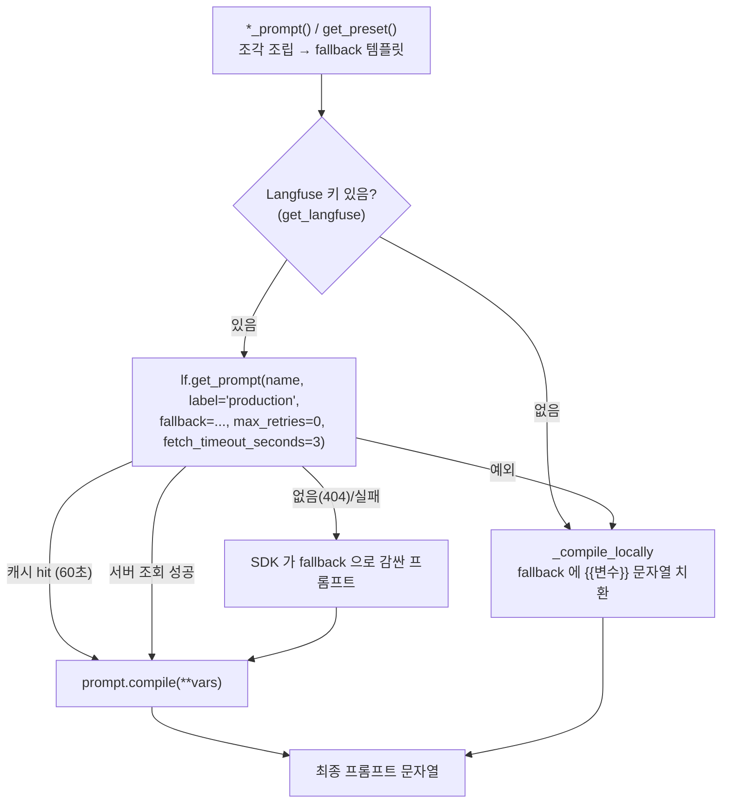

# 2026-09-26 — 프롬프트 관리: 지금 어떻게 유지되고 있나

> 한 줄 요약: **프롬프트 원본은 코드(`fragments/*.md`, 파이썬 상수)에 있고,
> Langfuse 에 같은 이름의 `production` 버전이 있으면 그걸 우선 쓴다.
> 없거나 실패하면 코드 원본(fallback)을 쓴다.**
> 그리고 실행 중에 붙는 문구(글자 고정, 재시도 사유 등)는 Langfuse 밖에서 코드로 덧붙는다.

관련 노트: `2026-09-15-langfuse.md` (도입 당시 설계), `2026-09-26-langgraph-langfuse-syntax.md` (문법)

---

## 1. 3층 구조

| 층 | 위치 | 하는 일 |
|---|---|---|
| ① 원본 (소스) | `backend/app/prompts/fragments/*.md` (13개 조각), `presets.py` 의 `PRESETS`/`SECONDHAND_LOCK`, `judge.py`·`auto_feedback.py` 의 `_SYSTEM_TEMPLATE`, `rubric.py` 의 `RUBRIC` | 프롬프트 문구의 진짜 출처. git 으로 버전 관리 |
| ② 조립 | `backend/app/prompts/__init__.py` (`*_prompt()` 함수들), `presets.get_preset()` | 조각을 이어 붙여 템플릿 하나로 만들고, 변수 값을 준비 |
| ③ 조회 (레지스트리) | `backend/app/core/prompt_registry.py` → `get_prompt_text(name, fallback, **vars)` | Langfuse `production` 버전을 먼저 찾고, 없으면 ② 결과(fallback) 사용. `{{변수}}` 채워서 문자열 반환 |

모든 VLM/생성 프롬프트는 **반드시 `get_prompt_text()` 한 곳을 지난다** — 이게 이 설계의 핵심.

---

## 2. 조회 흐름



### 캐시 (SDK 기본값)
- `get_prompt` 는 성공한 프롬프트를 **60초** 캐시 (`LANGFUSE_PROMPT_CACHE_DEFAULT_TTL_SECONDS`, 기본 60).
  → 콘솔에서 production 을 바꾸면 **최대 약 1분 뒤** 반영.
- 60초가 지나면 일단 캐시 값을 돌려주고 백그라운드에서 갱신 (요청이 안 기다림).

### 변수 문법 `{{name}}`
- 이중 중괄호. 프롬프트 안 JSON 예시(`{"rating": 1-5}`)의 단일 중괄호와 안 겹치게.
- 로컬 fallback 은 `str.format()` 이 아니라 `"{{k}}"` **문자열 치환만** 한다 (JSON 깨짐 방지).

---

## 3. 프롬프트 목록 (Langfuse 이름 기준)

Langfuse 상태는 **2026-09-26 에 실제 조회해서 로컬 fallback 과 비교한 결과**.

| Langfuse 이름 | 로컬 원본 (fallback) | 조립 함수 | 변수 | 누가 부르나 | Langfuse |
|---|---|---|---|---|---|
| `classify` | `role_classify.md` | `classify_prompt()` | – | `classify` 노드 | v1 · 로컬과 동일 |
| `item_text` | `item_text.md` | `item_text_prompt()` | `item` | `read_text` 노드 | v1 · 동일 (09-26 등록) |
| `detect` | `role_detect` + hints + `categories` + `rules_detect` + `schema_detect` | `detect_prompt()` | `item`, `hints` | `detect` 노드 | v1 · 동일 |
| `preset_studio_white` 외 2개 | `PRESETS[key]["fallback_prompt"]` (+ `SECONDHAND_LOCK`) | `get_preset()` | – | `load` 노드 → `generate` | v1 · 동일 |
| `check_photo` | `role_check_photo` + `schema_check_photo` | `check_photo_prompt()` | – | `validate_result` 노드 | v1 · 동일 (09-26 등록) |
| `verify` | `role_verify` + `rules_verify` + `schema_verify` | `verify_prompt()` | `item`, `checklist`, `lines` | `verify` 노드 | v2 · 동일 |
| `judge_system` | `judge._SYSTEM_TEMPLATE` | `judge._system_prompt()` | `rubric` (`rubric_text()`) | `run_judge` 노드 | v1 · 동일 |
| `detect_box` | `detect_box.md` | `detect_box_prompt()` | – | `util/evaluator.py` (평가용) | v1 · 동일 |
| `match` | `match.md` | `match_prompt()` | `orig`, `result` | `util/evaluator.py` (평가용) | v1 · 동일 |
| `auto_feedback_system` | `auto_feedback._SYSTEM_TEMPLATE` | `auto_feedback._system_prompt()` | – | `ingest.py` (자동 피드백) | v1 · 동일 (09-26 등록) |

> 조각 파일(`fragments/*.md`)은 `frag()` 가 프로세스당 1번 읽고 `_cache` 에 보관 →
> **md 파일을 고치면 서버 재시작해야** fallback 에 반영된다.

---

## 4. Langfuse 밖에서 덧붙는 문구 (런타임 조립)

Langfuse 에 저장된 건 "기본 템플릿"뿐이다. 실행 중에 코드가 아래를 **뒤에 이어 붙인다**
— 이 부분은 콘솔에서 안 보이고 못 고친다. 실제로 모델에 들어간 최종본은
State 의 `prompt_used` / Langfuse generation 의 `input` 에서 확인.

### 이미지 생성 (`pipeline.generate`) — 붙는 순서
```
preset_<key>                      ← Langfuse / fallback (SECONDHAND_LOCK 포함)
+ text_lock(item_texts)           ← presets.text_lock: 원본 물건 위 글자 "letter for letter" 고정
+ gate_note                       ← mark_gate_retry: 게이트에서 사라진 하자 목록 (재생성 때만)
+ "IMPORTANT: a previous attempt was rejected ..."  ← photo_check 반려 사유 (재생성 때만)
```
- 사진/VLM 에서 온 글자는 `prompt_safe()` 로 정리 후 삽입:
  개행·제어문자 제거, `"` → `'`, 80자 제한 (사진에 적힌 문장이 지시문처럼 읽히는 것 방지).
- `text_lock` 은 최대 30줄, 같은 (글자, 위치) 중복 제거, 위치는 `top-left` 같은 9분할.

### VLM 호출의 user 쪽 문구
- `judge()`, `generate_feedback()` 의 `user_prompt` ("Image1: ORIGINAL, Image2: RESULT ...") 는
  **코드 하드코딩** — Langfuse 관리 대상 아님.
- `verify_prompt()` 의 `lines`(앵커 목록), `detect_prompt()` 의 `hints`(classify 의 considered) 는
  변수로 들어가므로 템플릿은 Langfuse, 값은 런타임.

### 프롬프트 외 설정
- thinking(생각 토큰) 켜기/끄기는 프롬프트가 아니라 `core/vlm.py::thinking(name)` 에서 **호출 이름별**로 결정.
- `temperature=0`, JSON 모드도 `detector._call` 코드에 고정.

---

## 5. 운영 흐름 (어떻게 바꾸나)

### 최초 등록 — 시딩
```bash
cd backend && python scripts/seed_langfuse_prompts.py
```
- `prompts_to_seed()` 의 모든 항목을 `create_prompt(..., labels=["production"])` 로 등록.
- **다시 돌리면 모든 프롬프트에 새 버전이 하나씩 생기고 production 이 그쪽으로 옮겨감**
  → "코드 fallback 상태로 전부 되돌리기" 용도로만.

### 문구를 바꾸고 싶을 때 — 두 갈래
| 방법 | 절차 | 반영 |
|---|---|---|
| A. 콘솔에서 | Langfuse → Prompts → 새 버전 작성 → `production` 라벨 이동 | 배포 없이 ~1분 내 |
| B. 코드에서 | `fragments/*.md` 등 수정 → 커밋/배포 → **Langfuse 에도 동기화** (시딩 재실행 또는 콘솔에 붙여넣기) | 동기화해야 반영 |

⚠️ **B 의 함정: 코드만 고치면 반영이 안 된다.** Langfuse 에 production 버전이
있으면 그게 이기고, fallback(코드)은 Langfuse 가 없거나 실패할 때만 쓰이기 때문.
(`verify` 가 v2 인 건 09-24 `rules_verify`/`schema_verify` 수정 뒤 누군가 동기화했다는 뜻 — 현재는 전부 동일.)

⚠️ **A 의 함정: 코드와 어긋난다.** 콘솔에서만 고치면 git 에는 옛 문구가 남아서,
Langfuse 가 꺼진 환경(로컬 테스트·CI)과 운영이 **다른 프롬프트로 돈다.**
콘솔에서 좋은 버전을 찾으면 코드 fallback 에도 옮겨 적기.

---

## 6. 오늘 조회하며 발견한 것 → 수정 완료 (브랜치 `fix/prompt-registry-gaps`)

> **해결 요약**
> - 1·2 → 템플릿 조립을 `detect_template()`/`verify_template()`/`check_photo_template()` 로 공유,
>   시딩 목록에 `item_text`·`check_photo` 추가, 3개 등록 → 조회 170ms → 0ms(캐시).
>   시딩 기본 동작은 "없는 이름만", 덮어쓰기는 이름 지정 또는 `--all`.
>   `test_seed_prompts.py` 가 코드의 `get_prompt_text("이름")` 을 전부 찾아 시딩 목록과 대조 (드리프트 방지).
> - 3 → `SECONDHAND_LOCK` 을 fallback 에서 빼고 `get_preset()` → `with_secondhand_lock()` 이
>   항상 맨 끝에 1번 붙임 (기존 잠금은 떼고 다시 붙임).
>   ⚠️ Langfuse 의 preset v1 은 아직 잠금 포함 — **배포 후에** `seed_langfuse_prompts.py preset_studio_white preset_warm_wood preset_minimal_gray` 로 교체.

(아래는 발견 당시 기록)

1. **미등록 3개: `item_text`, `check_photo`, `auto_feedback_system`**
   - 시딩 스크립트 `prompts_to_seed()` 에 `item_text`, `check_photo` 가 **아예 빠져 있다** (09-24 에 새로 생긴 프롬프트).
     `auto_feedback_system` 은 목록엔 있지만 추가 이후 시딩을 다시 안 돌린 것으로 보임.
   - 동작은 문제없음 — 항상 코드 fallback 사용. 대신 콘솔에서 수정/버전 비교 불가.
2. **미등록 프롬프트는 호출마다 Langfuse 에 404 조회를 한다 (캐시 안 됨)**
   - 실측: 등록된 `classify` 는 첫 호출 이후 0ms (캐시), 미등록 `check_photo` 는 **매번 약 170ms**.
   - `item_text`·`check_photo` 는 변환 1회마다 호출되고 `check_photo` 는 재생성 루프마다 또 불린다
     → 요청당 수백 ms 가 그냥 더해진다.
   - 해결: 시딩 목록에 추가 후 등록하면 캐시로 사라짐.
3. **`SECONDHAND_LOCK`(물건 보정 금지 문구)이 Langfuse 프리셋 텍스트 안에 통째로 들어 있다**
   - 콘솔에서 프리셋 문구를 고치다 이 문장을 지우면 **정직성 잠금이 사라져도 코드로는 못 막는다.**
   - 대안: 잠금 문구는 `text_lock` 처럼 코드에서 항상 뒤에 붙이고, Langfuse 에는 배경 묘사만 두기.

---

## 7. 파일 지도 (빠르게 찾기)

```
backend/app/
├─ core/prompt_registry.py     get_prompt_text(), _compile_locally()   ← 유일한 조회 입구
├─ prompts/
│  ├─ __init__.py              frag(), classify/detect/verify/item_text/check_photo/detect_box/match_prompt()
│  ├─ presets.py               PRESETS, SECONDHAND_LOCK, get_preset(), text_lock(), prompt_safe()
│  ├─ rubric.py                RUBRIC → rubric_text() (judge_system 의 {{rubric}})
│  └─ fragments/*.md           13개 조각 (role_* / rules_* / schema_* / categories ...)
├─ services/ai/judge.py        _SYSTEM_TEMPLATE (judge_system) + user_prompt 하드코딩
├─ services/ai/auto_feedback.py _SYSTEM_TEMPLATE (auto_feedback_system)
└─ services/pipeline.py        generate(): preset + text_lock + gate_note + 반려 사유 조립
backend/scripts/seed_langfuse_prompts.py   코드 fallback → Langfuse production 등록
```
